# 第4章 网络层：数据平面 

本章深入探讨网络层的数据平面 (Data Plane)，这是网络层在本地路由器层面执行的功能。数据平面的核心任务是转发 (Forwarding) 分组：将到达路由器输入端口的分组，根据转发表（也称为转发信息库 FIB - Forwarding Information Base），快速有效地引导至合适的输出端口。与数据平面相对应的是控制平面 (Control Plane)，它负责计算和分发这些转发表，决定了分组在网络中的端到端路径（路由选择 Routing）。本章将聚焦于路由器内部的数据平面转发机制。

## 4.1 网络层概述

### 4.1.1 转发和路由选择：数据平面和控制平面

- **转发 (Forwarding)**：发生在单个路由器上的本地动作。当一个数据分组到达路由器的输入端口时，路由器的数据平面会检查分组首部中的特定字段（最常见的是目的 IP 地址），并根据预先确定的转发表（FIB），将分组导向相应的输出端口。这个过程必须非常迅速，通常在硬件中实现，以便以线路速率处理分组。可以类比为高速公路上的交通路口，根据路牌（转发表）指示，将车辆（分组）引导到正确的出口车道（输出端口）。

- **路由选择 (Routing)**：这是一个网络范围的全局过程。它涉及使用路由选择算法（例如 RIP, OSPF, BGP 等）来计算从源主机到目的主机的最佳路径。路由选择算法运行在路由器中的控制平面，通过路由器之间的信息交换来构建和维护网络拓扑信息，并最终生成用于数据平面转发的转发表。这可以类比为规划整个驾车路线，确定从出发地到目的地的所有经过的路段。

- **数据平面 (Data Plane)**：也称为转发平面，负责执行转发功能。它包括路由器的输入端口、交换结构和输出端口。数据平面根据控制平面计算好的转发表来决定分组的出路。其关键特征是速度和效率，通常在专用的硬件（ASIC - Application-Specific Integrated Circuit）中实现。

- **控制平面 (Control Plane)**：负责运行路由选择协议，维护网络拓扑信息，计算路由路径，并生成或更新数据平面使用的转发表。控制平面可以是传统的分布式方式（路由器之间通过路由协议直接交互），也可以是集中式方式，如软件定义网络 (SDN) 中由一个中央控制器负责计算路由并分发流表到交换机。

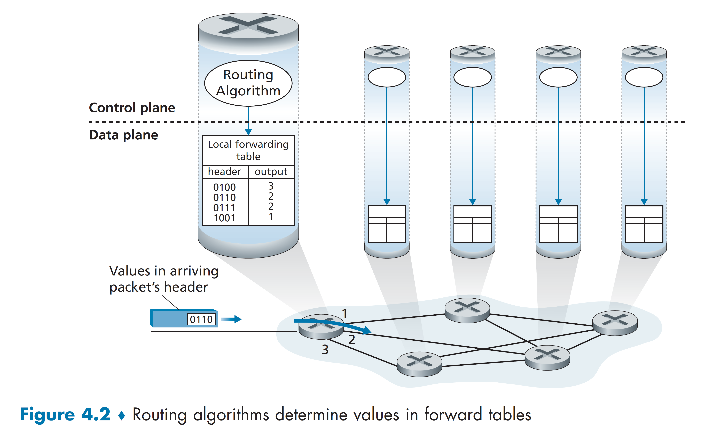

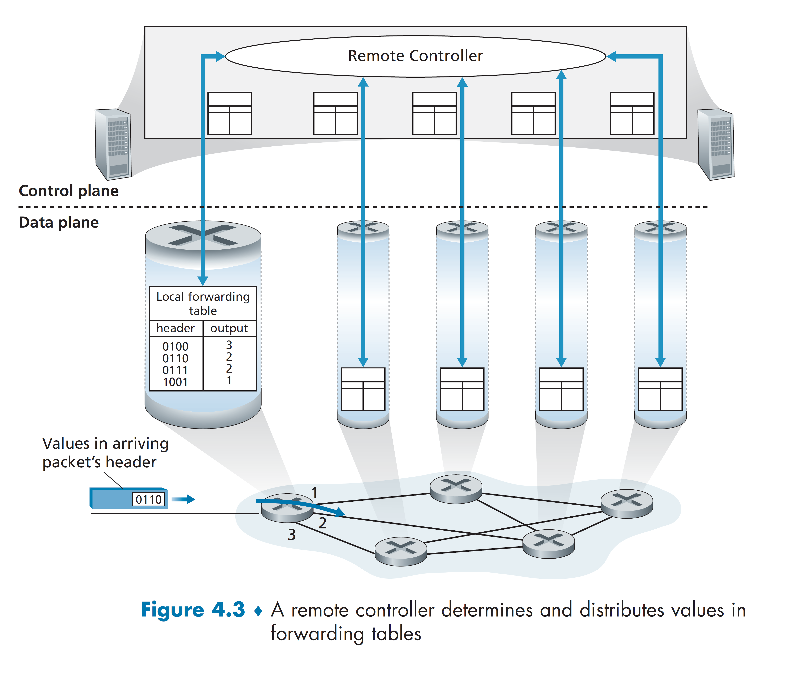

**总结**：路由选择确定路径，转发沿着路径将分组从输入转发到输出。控制平面计算路径和转发表，数据平面根据转发表执行转发。

### 4.1.2 网络服务模型

网络层服务模型定义了网络层向上层（运输层）提供的服务质量和特性。不同的网络可能提供不同的服务模型。

- **尽力而为服务 (Best-Effort Service)**：这是互联网 IP 层当前提供的服务模型。意味着网络尽最大努力发送分组，但不提供任何保证。分组可能丢失、乱序、延迟或重复。这种模型的优点是简单、灵活且易于实现，适合多种应用。然而，对于需要可靠性或实时性的应用（如视频会议、在线游戏），则需要在上层协议（如 TCP）或应用层进行补偿。

- **服务质量 (Quality of Service, QoS)**：一些网络和服务模型试图提供比尽力而为更好的服务，例如：
  - **保证交付 (Guaranteed Delivery)**：保证分组最终会到达目的地。
  - **有时保证交付 (Guaranteed Delivery with Bounded Delay)**：保证分组在特定最大时延内到达。
  - **有序分组交付 (Ordered Packet Delivery)**：保证分组按照发送顺序到达。
  - **最小带宽保证 (Guaranteed Minimum Bandwidth)**：为特定的流量流预留一定的带宽。
  - **安全性 (Security)**：如提供数据加密和完整性检查。

实现这些高级服务模型通常需要更复杂的机制，如资源预留、流量整形、拥塞控制等，并且可能需要网络中的所有路由器协同工作。IP 协议本身并不直接提供这些保证，但可以通过上层协议或网络层之上的机制（如 DiffServ, IntServ）来尝试实现。

## 4.2 路由器工作原理

路由器是网络层的核心设备，其主要功能是在数据平面接收、处理和转发分组。

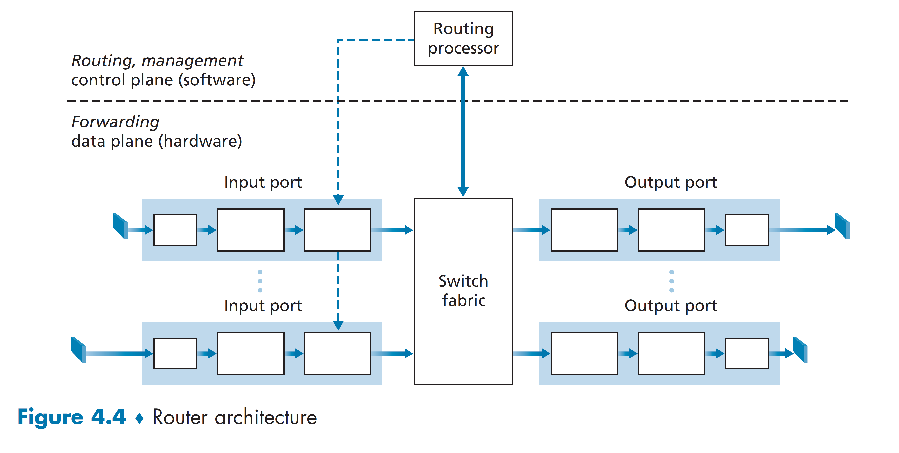

### 4.2.1 输入端口处理和基于目的地转发

路由器的输入端口是分组进入的地方。输入端口处理涉及多个步骤：

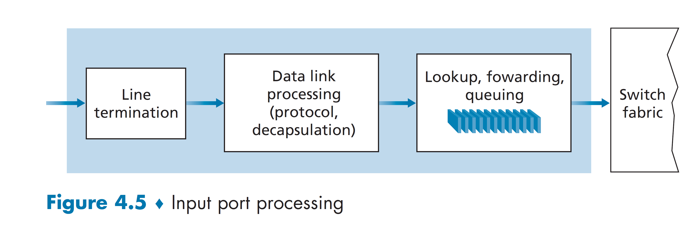

- **物理层处理**：接收来自物理链路（如光纤、铜线）的原始比特流信号，并将其转换为数字信号。

- **数据链路层处理**：对接收到的数据链路层帧进行解封装。检查帧首部（如以太网首部）进行差错检测、帧同步等，提取出其中的网络层分组（如 IP 数据报）。

- **查找/转发决策 (Lookup/Forwarding Decision)**：这是输入端口处理的核心。路由器检查 IP 数据报的首部字段，最重要的是目的 IP 地址。根据目的 IP 地址，路由器查询其转发表 (FIB) 来确定该分组应该被转发到哪个输出端口。转发表是由控制平面通过路由选择算法构建和维护的。
  - **最长前缀匹配 (Longest Prefix Matching)**：转发表中的条目通常是网络地址前缀（例如，192.168.1.0/24）。当一个分组的目的 IP 地址与多个转发表条目匹配时，路由器必须选择匹配前缀最长的那一个。例如，如果转发表中有 192.168.1.0/24 和 192.168.1.128/25 两个条目，而分组的目的 IP 地址是 192.168.1.130，则路由器会选择匹配前缀更长的 192.168.1.128/25 对应的输出端口。这是因为更长的前缀对应更具体的网络或子网。为了实现高速查找，现代路由器使用特殊的硬件结构，如 TCAM (Ternary Content Addressable Memory)。

- **排队 (Queueing)**：如果分组需要转发到的输出端口正忙或交换结构正在处理其他分组，则该分组可能需要在输入端口的缓存（队列）中等待。这称为输入排队 (Input Queueing)。

### 4.2.2 交换

交换结构 (Switching Fabric) 是路由器内部连接输入端口和输出端口的核心组件，负责在输入端口查找到出端口后，将分组从输入端口快速无阻塞地传输到正确的输出端口。主要有三种类型：

- **经内存交换 (Switching via Memory)**：这是早期路由器的实现方式。输入端口收到分组后，将其通过系统总线复制到处理器的内存中。处理器查看分组首部，查询转发表，然后将分组从内存通过总线复制到正确的输出端口的缓存中。这种方式简单，但交换速度受限于内存的读写速度和系统总线带宽，难以达到高线路速率。一次只能传输一个分组。

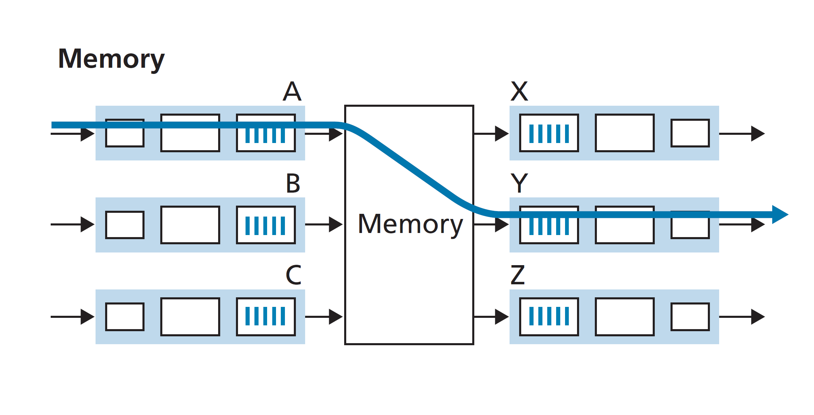

- **经总线交换 (Switching via a Bus)**：输入端口通过一个共享的总线将分组直接传输到目标输出端口。输入端口将分组放置在总线上，输出端口侦听总线并接收属于自己的分组。总线只能在某一时刻传输一个分组，所以交换速度受限于总线带宽。如果有多个输入端口同时向不同输出端口发送分组，它们必须排队等待总线的空闲。

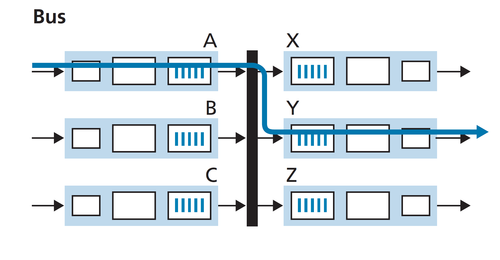

- **经互连网络交换 (Switching via an Interconnection Network)**：这是现代高速路由器普遍采用的方式。它使用一个复杂的网络结构（如多级交换单元组成的网络，例如交叉开关 Crossbar Switch）来并行地在多个输入端口和输出端口之间传输分组。交叉开关是一个 N × N 的网格，可以在 N 个输入和 N 个输出之间同时建立多条连接，只要这些连接不冲突（即不同的输入连接到不同的输出，或相同的输入连接到不同的输出，或不同的输入连接到相同的输出）。这种方式可以提供很高的总交换容量，允许多个分组同时被转发。

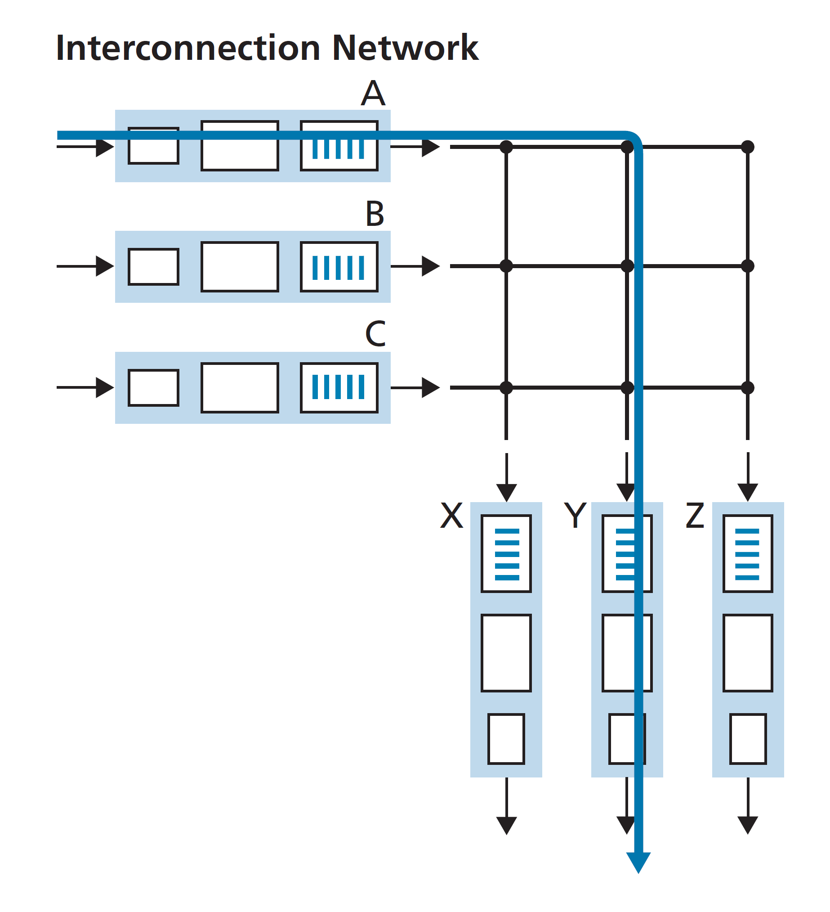

### 4.2.3 输出端口处理

分组通过交换结构到达输出端口后，还需要经过输出端口的处理才能发送到链路上。

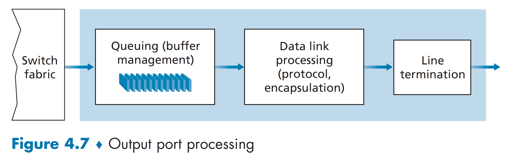

- **排队 (Queueing)**：如果分组到达输出端口的速率超过了输出链路的传输速率，或者有多个分组同时竞争同一输出链路，则分组必须在输出端口的缓存（队列）中等待。这称为输出排队 (Output Queueing)。这是路由器中最常见的排队位置。

- **调度 (Scheduling)**：当输出链路空闲时，需要决定从输出队列中选择哪个分组进行传输。这就是分组调度算法的作用。

- **数据链路层处理**：为分组添加数据链路层首部和尾部，形成帧。进行链路层特定的处理，如添加校验和。

- **物理层处理**：将数据链路层帧转换成物理信号，并通过输出链路传输出去。

### 4.2.4 何处出现排队

排队是路由器中不可避免的现象，主要发生在输入端口和输出端口的缓存中。

- **输入排队 (Input Queueing)**：当交换结构的处理速度慢于输入端口接收分组的总速度时，或者当多个输入端口的分组需要通过交换结构发送到同一个输出端口，而交换结构无法并行处理时，分组会在输入端口排队。输入排队可能导致线路前部阻塞 (Head-of-Line Blocking, HoL Blocking)：在一个输入队列中，队头分组（即最先到达的分组）因为要转发到的输出端口被占用而等待，即使队列中后续的分组要转发到的输出端口是空闲的，它们也被队头分组阻塞，无法通过交换结构。

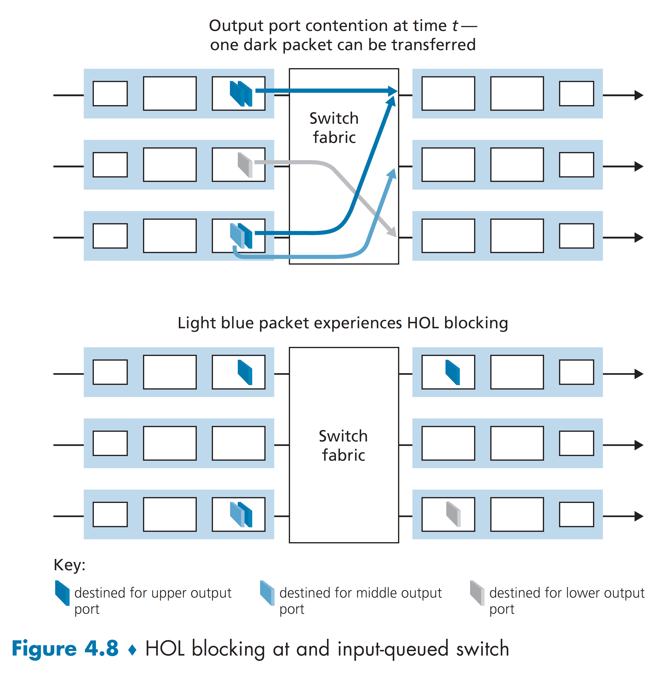

- **输出排队 (Output Queueing)**：当分组从交换结构到达输出端口的速率超过了输出链路的传输速率时，分组会在输出端口排队。这是更常见且通常设计上倾向的排队位置，因为适当的输出排队可以更好地利用链路带宽，并通过调度算法实现不同的服务质量。为了避免输出队列溢出导致分组丢失，输出端口的缓存大小是一个关键的设计参数。

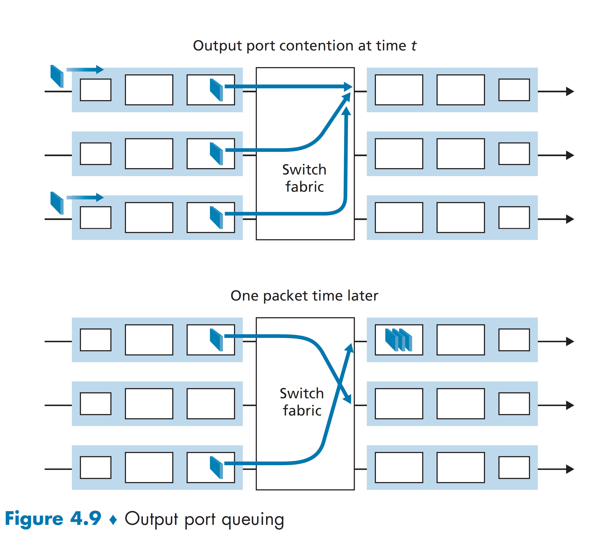

现代路由器通常设计有高速的交换结构，使得交换速度远高于输入线路速率，从而将排队主要集中在输出端口，避免 HoL 阻塞。

### 4.2.5 分组调度

当输出链路空闲时，输出端口的调度器 (Scheduler) 从输出队列中选择下一个要传输的分组。不同的调度算法会影响分组的发送顺序和时延。

- **先进先出 (First-In-First-Out, FIFO)** 或 **先来先服务 (First-Come-First-Served, FCFS)**：最简单的调度策略，按照分组到达输出队列的顺序进行传输。简单易实现，但无法区分不同类型的流量，高优先级分组可能被低优先级分组阻塞。

- **优先权排队 (Priority Queueing)**：分组根据其服务类型 (ToS) 或其他字段被划分到不同的优先级队列中。调度器总是优先传输高优先级队列中的分组。只有当高优先级队列为空时，才传输低优先级队列中的分组。这可以保证高优先级流量的优先传输，但低优先级流量可能会面临饥饿（长时间无法获得服务）。

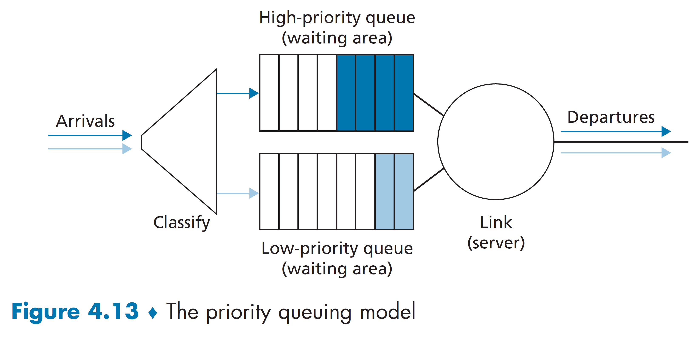

- **循环调度 (Round Robin, RR)**：适用于有多个分类队列的情况。调度器轮流从每个非空队列中取出一个分组进行传输。这提供了某种程度的公平性，避免了饥饿，但每个队列获得的带宽相同，无法满足不同流量对带宽的不同需求。

- **加权公平排队 (Weighted Fair Queueing, WFQ)**：是 RR 的泛化。每个队列被赋予一个权重，调度器根据权重比例为每个队列分配带宽或服务时间。例如，权重为 2 的队列会比权重为 1 的队列获得两倍的带宽。WFQ 可以在提供公平性的同时，根据权重为不同类型的流量提供不同的带宽保证。许多实际的 QoS 实现都基于 WFQ 或其变种。

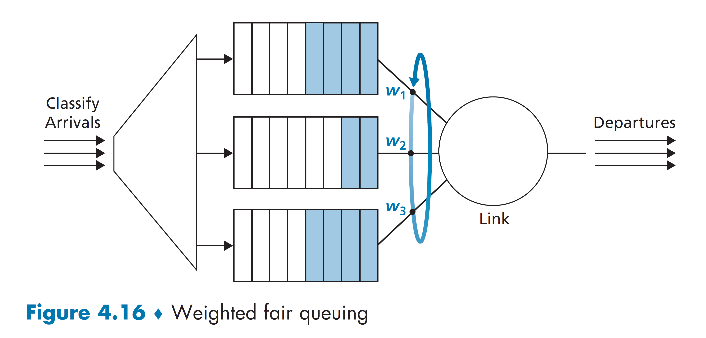

## 4.3 网际协议：IPv4、寻址、IPv6及其他

网际协议 (IP) 是互联网网络层的主导协议，负责在全球范围内的网络之间转发数据报。

### 4.3.1 IPv4数据报格式

IPv4 数据报是 IP 层传输的基本单元。它包含首部和数据载荷。IPv4 首部通常为 20 字节（不含选项字段），各字段含义如下：

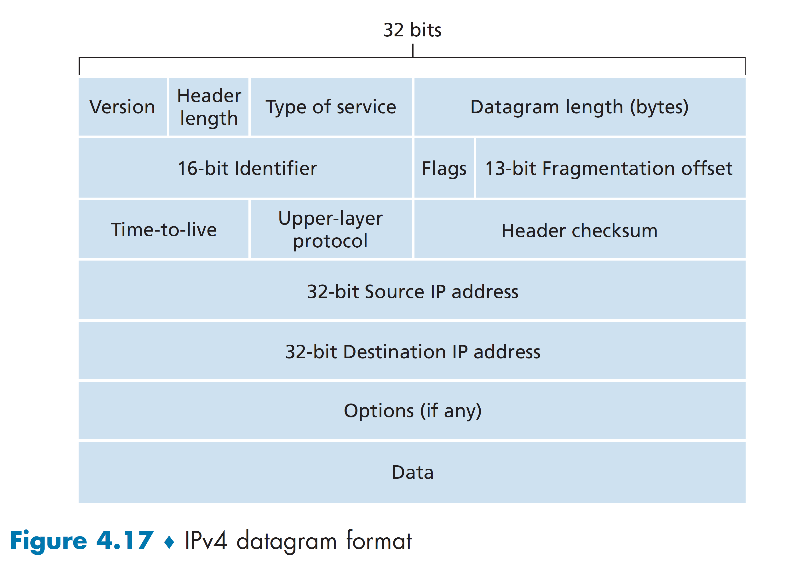

- **版本 (Version)**：4 位，表示 IP 协议版本，IPv4 固定为 4。

- **首部长度 (Header Length, IHL)**：4 位，表示 IP 首部长度，以 32 位字（4 字节）为单位。最小值是 5 (5 * 4 = 20 字节，无选项)。最大值是 15 (15 * 4 = 60 字节)。

- **服务类型 (Type of Service, ToS)**：8 位，用于指定数据报的服务类型，如优先级、延迟要求、吞吐量要求等。现在已被区分服务 (DiffServ) 字段（DS 字段和 ECN 字段）取代，用于实现 QoS。

- **总长度 (Total Length)**：16 位，表示整个 IP 数据报（首部 + 数据载荷）的长度，以字节为单位。最大长度为 2^{16} - 1 = 65535 字节。

- **标识 (Identification)**：16 位，由发送方设置，用于唯一标识一个 IP 数据报。当数据报需要分片时，同一原始数据报的所有分片都具有相同的标识符。

- **标志 (Flags)**：3 位，用于控制和标识分片。
  - 位 0 (保留位)：未使用。
  - 位 1 (DF - Don't Fragment)：如果设置为 1，表示数据报不能被分片。如果必须分片才能通过下一跳网络，数据报将被丢弃并返回一个 ICMP 错误消息。
  - 位 2 (MF - More Fragments)：如果设置为 1，表示这是分片的最后一个以外的片段；如果设置为 0，表示这是最后一个片段或者数据报未分片。

- **片偏移 (Fragment Offset)**：13 位，表示该分片在原始未分片数据报的数据载荷中的相对位置，以 8 字节为单位。第一个分片的片偏移为 0。

- **生存时间 (Time To Live, TTL)**：8 位，表示数据报可以经过的最大路由器跳数。数据报每经过一个路由器，TTL 值减 1。当 TTL 减到 0 时，路由器会丢弃该数据报，并通常向源发送一个 ICMP 错误消息（时间超出）。这可以防止数据报在网络中无限循环。

- **协议 (Protocol)**：8 位，指示数据载荷中封装的是哪个上层协议的数据。常见的协议号：TCP (6), UDP (17), ICMP (1), OSPF (89)。

- **首部校验和 (Header Checksum)**：16 位，用于检测 IP 首部在传输过程中是否发生差错。校验和只覆盖 IP 首部，不包括数据载荷。每经过一个路由器，TTL 会改变，所以校验和必须重新计算。这是 IPv6 移除校验和的原因之一，以提高处理速度。

- **源 IP 地址 (Source IP Address)**：32 位，发送该数据报的主机的 IP 地址。

- **目的 IP 地址 (Destination IP Address)**：32 位，接收该数据报的主机的 IP 地址。

- **选项 (Options)**：长度可变，用于支持一些可选功能，如记录路由、时间戳等。由于增加了处理开销，选项字段很少在互联网中使用。

- **填充 (Padding)**：填充 0，使得首部长度是 32 位字的整数倍。

- **数据 (Data)**：上层协议（如 TCP, UDP, ICMP 等）的数据载荷。

**IP 分片 (Fragmentation)**：当一个 IP 数据报的大小超过了下一跳链路的最大传输单元 (MTU - Maximum Transmission Unit) 时，路由器或发送主机需要将数据报分片**IP 分片 (Fragmentation)**：当一个 IP 数据报的大小超过了下一跳链路的最大传输单元 (MTU - Maximum Transmission Unit) 时，路由器或发送主机需要将数据报分片。每个分片都成为一个独立的 IP 数据报，拥有自己的 IP 首部（复制原始数据报的首部信息并修改标识、标志和片偏移字段）。分片可能在路径中的任何路由器上进行，但通常只在目的主机上进行重组。IPv6 不允许在路由器上进行分片，只能在发送主机上进行。

### 4.3.2 IPv4编址

IPv4 地址是 32 位的逻辑地址，用于唯一标识互联网上的一个接口。IP 地址被组织成网络和主机两部分。

- **点分十进制表示法**：将 32 位地址分成 4 个字节，每个字节转换为十进制数，之间用点隔开（例如，192.168.1.1）。

- **网络部分和主机部分**：IP 地址的网络部分标识设备所在的网络，主机部分标识该网络中的具体设备接口。区分这两部分需要使用子网掩码 (Subnet Mask)。子网掩码也是 32 位，网络部分的位全为 1，主机部分的位全为 0。将 IP 地址和子网掩码进行按位与操作，即可得到网络地址。

- **子网 (Subnet)**：相互之间不通过路由器就可以直接通信的一组设备接口。一个子网对应一个网络地址。例如，IP 地址在 192.168.1.1 到 192.168.1.254 之间，子网掩码是 255.255.255.0 (即 /24)，它们属于同一个子网，网络地址是 192.168.1.0。

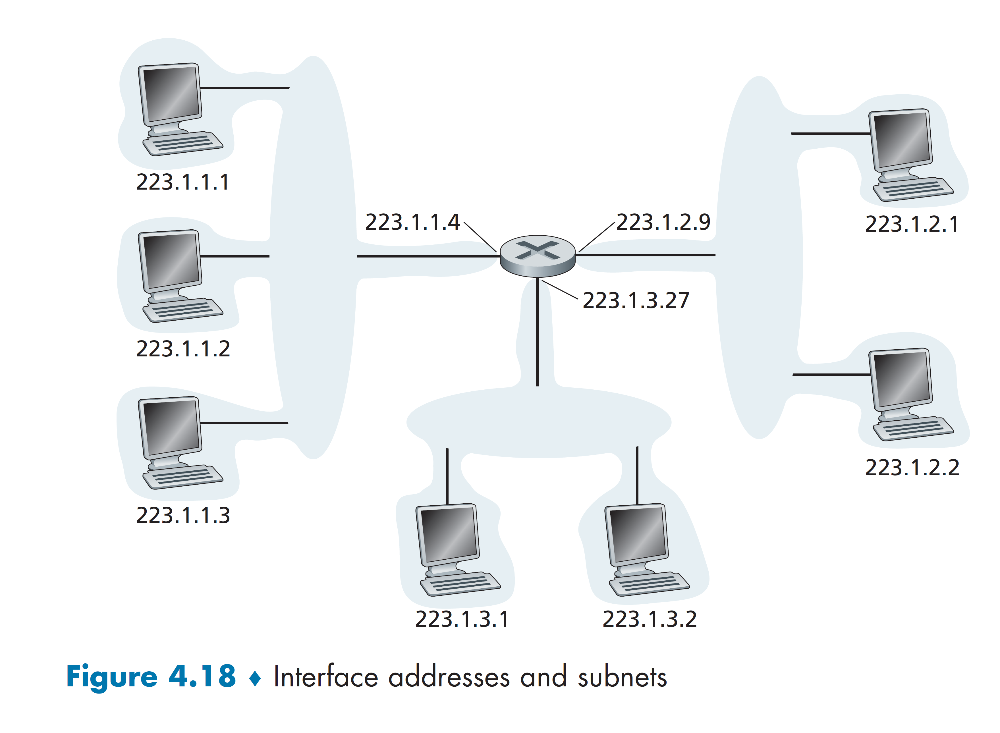

- **无类别域间路由选择 (Classless Inter-Domain Routing, CIDR)**：取代了早期的类别编址 (A, B, C 类)。CIDR 使用网络前缀的概念，用 IP 地址后跟一个斜线和前缀长度来表示，例如 192.168.1.0/24。/24 表示前 24 位是网络前缀，后 8 位是主机部分。这使得 IP 地址分配更加灵活和高效。

- **特殊 IP 地址**：
  - **网络地址**：主机部分全为 0 的地址，表示整个网络。例如，192.168.1.0/24 的网络地址是 192.168.1.0。
  - **广播地址 (Broadcast Address)**：主机部分全为 1 的地址，向该地址发送的分组会被发送到该网络中的所有设备。例如，192.168.1.0/24 的广播地址是 192.168.1.255。
  - **环回地址 (Loopback Address)**：127.0.0.1，用于测试本地网络栈。
  - **私有 IP 地址**：在组织内部网络中使用，不能在互联网上直接路由。包括 10.0.0.0/8, 172.16.0.0/12, 192.168.0.0/16 这几个地址段。

- **IP 地址获取**：
  - **静态分配**：管理员手动为设备配置固定的 IP 地址、子网掩码、默认网关和 DNS 服务器地址。
  - **动态主机配置协议 (Dynamic Host Configuration Protocol, DHCP)**：一种网络协议，允许设备（客户端）在加入网络时自动从 DHCP 服务器获取 IP 地址和其他网络配置信息。DHCP 过程通常包括四个步骤：DHCP Discover (客户端查找服务器)、DHCP Offer (服务器提供配置)、DHCP Request (客户端请求配置)、DHCP ACK (服务器确认配置)。

  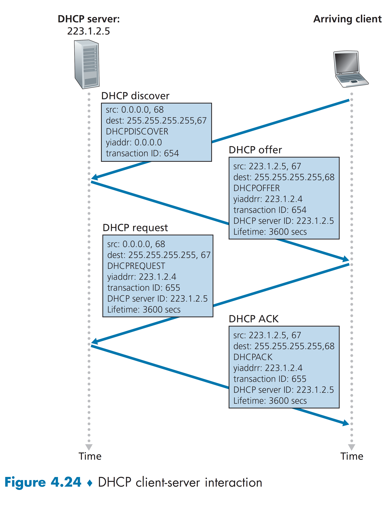

### 4.3.3 网络地址转换（NAT）

网络地址转换 (NAT) 是一种解决 IPv4 地址空间不足的技术，尤其是在家庭网络和小型办公室中。它允许多个设备共享一个或少数几个公共 IP 地址访问互联网。

- **工作原理**：NAT 路由器位于私有网络和公共网络（互联网）之间。私有网络中的设备使用私有 IP 地址。当私有网络中的主机向公共网络发送分组时，NAT 路由器会拦截该分组。它会修改分组的源 IP 地址（替换为 NAT 路由器的公共 IP 地址）和源端口号（分配一个新的端口号）。然后，NAT 路由器在内部维护一个NAT 转换表 (NAT Translation Table)，记录原始的私有 IP/端口到新的公共 IP/端口的映射关系。修改后的分组被发送到公共网络。当外部主机回复分组到达 NAT 路由器时，路由器检查分组的目的 IP 地址（即 NAT 路由器的公共 IP 地址）和目的端口号。它根据 NAT 转换表查找匹配的条目，找到对应的私有 IP/端口。然后，路由器修改分组的目的 IP 地址和目的端口号为私有网络的地址，并将分组转发到私有网络中的相应主机。

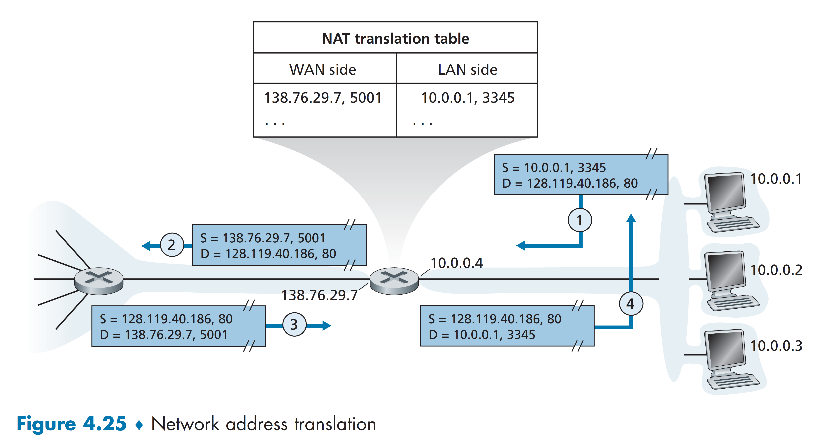

- **优点**：
  - 缓解了 IPv4 地址空间不足的问题，可以用少量的公共 IP 地址支持大量的私有设备。
  - 增强了内部网络的安全性，外部网络看不到内部主机的真实 IP 地址。

- **缺点**：
  - 违反了端到端原则（End-to-End Principle），因为网络层中间设备（NAT 路由器）修改了分组的首部信息，而不是只在端系统进行处理。这使得一些依赖于端到端连接和特定端口的应用（如某些 P2P 应用、VoIP）难以穿透 NAT。
  - 增加了 NAT 路由器的复杂性，需要维护转换表。
  - 使得追踪连接的源变得困难，因为多个内部主机看起来都来自同一个公共 IP 地址。

### 4.3.4 IPv6

IPv6 是为了解决 IPv4 地址耗尽问题而设计的下一代互联网协议，并改进了 IPv4 的一些设计。

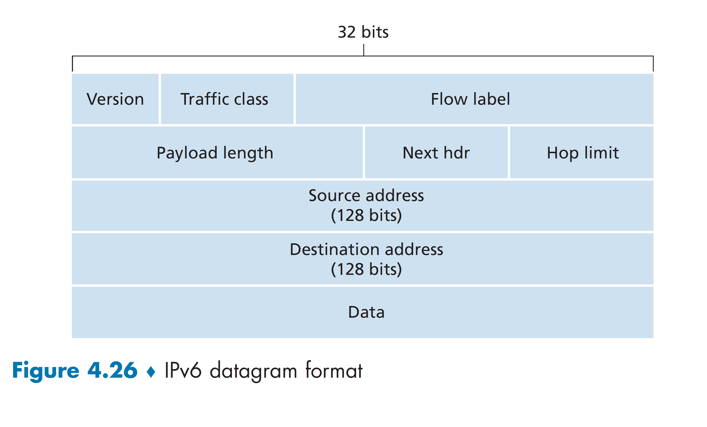

- **IPv6 地址格式**：IPv6 地址长度为 128 位，是 IPv4 地址的四倍。通常用冒号分隔的 8 组 16 进制数表示，每组 16 位（例如，2001:0db8:85a3:0000:0000:8a2e:0370:7334）。IPv6 提供了巨大的地址空间（约 3.4 × 10^{38} 个地址），足够未来互联网设备的需求。
  - **地址简化规则**：可以省略每组前导的零（0db8 可以写成 db8）。可以省略连续的零组（0000:0000 可以用 :: 代替，但一个地址中只能使用一次 ::）。

- **IPv6 数据报格式**：IPv6 设计简化了首部，固定长度为 40 字节（不包含扩展首部）。一些 IPv4 字段被移除或移到扩展首部中，以加快路由器处理速度。
  - **移除的字段**：首部校验和（由数据链路层和运输层负责）、标识、标志、片偏移（分片只能由源主机完成，不再在路由器进行）、首部长度（首部长度固定）。
  - **新增或修改的字段**：
    - **版本 (Version)**：4 位，固定为 6。
    - **流量类别 (Traffic Class)**：8 位，类似 IPv4 的 ToS 字段，用于区分服务。
    - **流标签 (Flow Label)**：20 位，用于标记属于同一流的分组，以便路由器可以对这些分组进行统一处理（例如，提供 QoS）。
    - **有效载荷长度 (Payload Length)**：16 位，表示数据报中数据载荷的长度（包括扩展首部）。
    - **下一首部 (Next Header)**：8 位，指示紧跟在当前首部后面的首部类型（可以是上层协议，如 TCP 或 UDP，也可以是 IPv6 扩展首部）。
    - **跳限制 (Hop Limit)**：8 位，类似 IPv4 的 TTL，表示分组可以经过的最大跳数。
    - **源地址 (Source Address)**：128 位。
    - **目的地址 (Destination Address)**：128 位。
    - **扩展首部 (Extension Headers)**：IPv6 使用可选的扩展首部来提供 IPv4 选项字段的功能，例如分片、路由、目的地选项等。扩展首部不包含在基本首部中，只有当需要时才添加。路由器在处理分组时，通常只需要检查基本首部，除非需要处理特定的扩展首部。

- **IPv4 到 IPv6 的过渡**：由于互联网不可能一夜之间从 IPv4 完全切换到 IPv6，需要过渡机制：
  - **双栈 (Dual Stack)**：主机和路由器同时运行 IPv4 和 IPv6 协议栈。设备可以同时拥有 IPv4 和 IPv6 地址，并根据目的地是 IPv4 地址还是 IPv6 地址来选择使用哪个协议发送分组。
  - **隧道技术 (Tunneling)**：将 IPv6 数据报完整地封装在 IPv4 数据报的数据载荷中，使其能够穿越只支持 IPv4 的网络。在隧道入口处，将 IPv6 数据报封装到 IPv4 数据报中；在隧道出口处，解封装取出 IPv6 数据报。反之亦然，也可以在 IPv6 网络中隧道传输 IPv4 数据报。
  
  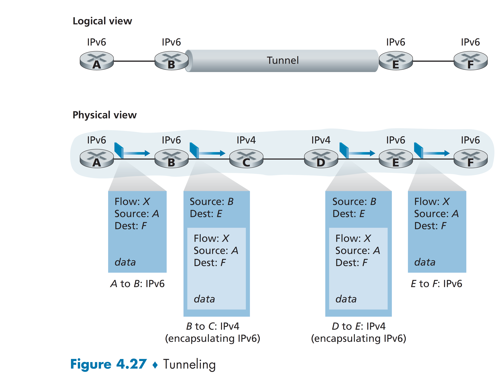

## 4.4 泛化转发和SDN

传统的路由器数据平面主要基于目的地 IP 地址进行转发。泛化转发 (Generalized Forwarding) 扩展了这一概念，允许根据分组首部的更多字段进行匹配和操作，从而实现了更灵活和可编程的网络行为。这是软件定义网络 (SDN) 的核心理念之一。

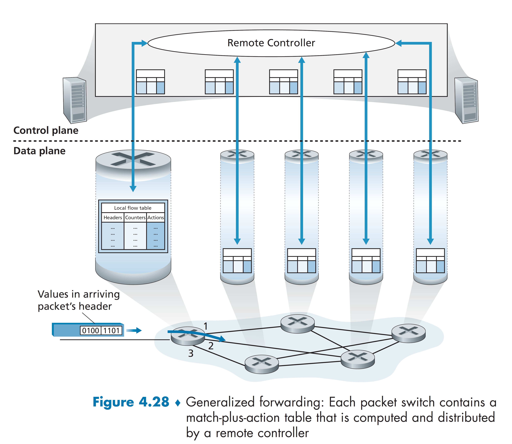

### 4.4.1 匹配

泛化转发的关键在于灵活的匹配规则。数据平面设备（如支持 SDN 的交换机/路由器）使用流表 (Flow Table) 来存储转发规则。流表中的每个条目都包含一个匹配字段集合，用于与到达分组的首部字段进行比较。匹配字段可以涵盖 OSI 模型第 2 层到第 4 层甚至更高层的首部信息，例如：
- **入端口 (In Port)**
- **源/目的 MAC 地址 (Source/Destination MAC Address)**
- **VLAN ID**
- **以太网类型 (EtherType)**
- **源/目的 IP 地址 (Source/Destination IP Address)**
- **IP 协议字段 (IP Protocol)**
- **源/目的 TCP/UDP 端口号 (Source/Destination TCP/UDP Port Number)**
- **其他字段（如 MPLS 标签）**

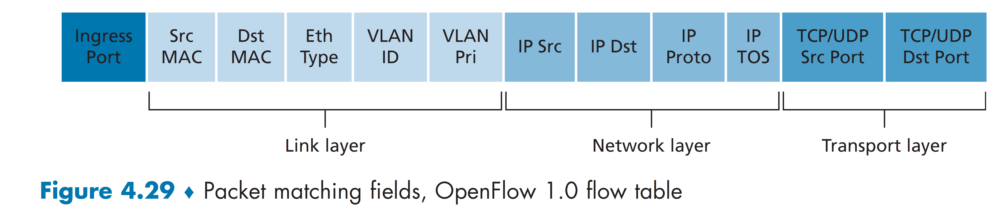

一个分组到达后，会根据这些字段与流表中的条目进行匹配。

### 4.4.2 操作

当分组匹配到流表中的某个条目后，数据平面设备会执行该条目关联的操作集合 (Set of Actions)。这些操作远比传统的“转发到某个输出端口”要丰富：
- **转发 (Forward)**：将分组发送到一个或多个特定的输出端口、发送到一组端口（组播/广播）、泛洪、或者通过隧道发送。
- **丢弃 (Drop)**：丢弃分组。
- **修改字段 (Modify Field)**：修改分组首部或载荷中的字段值，例如：重写源/目的 MAC 地址、重写源/目的 IP 地址、重写源/目的端口号、修改 VLAN ID、修改 TTL/跳限制。
- **发送到控制器 (Send to Controller)**：将分组发送给 SDN 控制器。这通常用于处理第一次遇到的流（未知流），或者需要控制器进行特殊处理的情况。
- **添加到操作集并继续处理 (Add to Action Set and Continue)**：将某些操作添加到待执行的操作列表中，然后继续处理（例如，跳转到流表中的下一个表进行进一步匹配和处理）。

### 4.4.3 运行中的匹配加操作的OpenFlow例子

OpenFlow 是一个被广泛采用的南向接口协议，它定义了 SDN 控制器如何与 OpenFlow 交换机进行通信和控制。OpenFlow 交换机是支持泛化转发的数据平面设备。

OpenFlow 交换机内部维护一个或多个流表 (Flow Table)。每个流表包含一系列流条目 (Flow Entry)。每个流条目由以下组成部分：

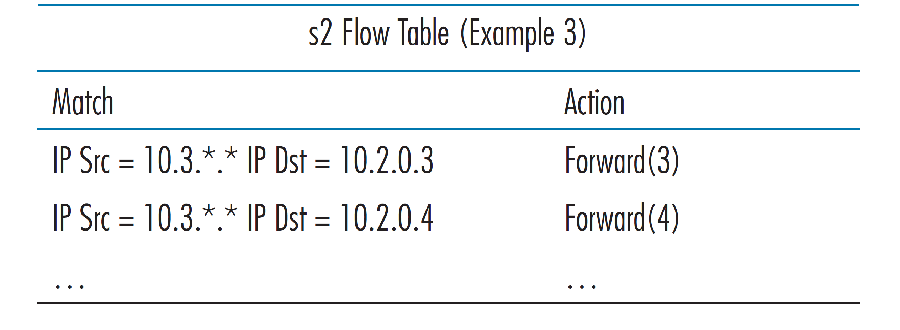

- **匹配字段 (Match Fields)**：如 4.4.1 所述，用于匹配分组的首部字段。
- **优先级 (Priority)**：当一个分组可能匹配多个流条目时，优先级最高的那个条目会被选中。
- **计数器 (Counters)**：记录匹配到该流条目的分组数量和总字节数，用于统计流量。
- **指令 (Instructions)**：匹配成功后要执行的操作集合。指令可以包括：
  - 将分组添加到动作集 (Action Set) 并继续处理流水线。动作集包含一组待执行的操作（如转发到端口、修改字段）。
  - 跳转到流水线中的下一个流表进行进一步处理（实现多阶段处理）。
  - 将分组发送到控制器。
- **超时 (Timeouts)**：流条目的有效期。可以设置为硬性超时（到达指定时间后删除）或空闲超时（在指定空闲时间后删除）。
- **Cookie**：控制器用于标识流条目的不透明数据。

**分组处理流水线 (Packet Processing Pipeline)**：OpenFlow 交换机通常以流水线的方式处理分组。分组首先进入第一个流表进行匹配。根据匹配到的流条目中的指令，分组可能会被执行一些操作，然后传递给下一个流表，直到处理完成或被转发出去。

**OpenFlow 工作流程示例**：
1. 一个分组到达 OpenFlow 交换机的某个端口。
2. 分组进入第一个流表，与其中的流条目进行匹配。
3. 如果分组匹配到一个流条目（优先级最高的那个）：
   - 更新该流条目的计数器。
   - 执行该流条目中的指令集。指令可能会导致分组被转发到某个端口、被修改、被丢弃，或者被发送到控制器。如果指令是跳转到下一个表，分组会进入下一个流表继续处理。
4. 如果分组不匹配任何流条目：
   - 根据交换机的配置，分组可能被发送到 SDN 控制器。
   - 或者，执行表末尾的默认规则（例如，丢弃分组或泛洪到所有端口）。
5. 如果分组被发送到控制器，控制器根据其策略决定如何处理该流。控制器可能会向交换机下发新的流条目，以便以后到达的属于同一流的分组可以直接在数据平面处理，而无需再发送给控制器。

这种基于流表和集中式控制器的泛化转发机制是实现网络可编程性、自动化和创新服务（如网络功能虚拟化 NFV）的关键技术。

## 4.5 中间盒

中间盒 (Middlebox) 是位于端系统之间，在数据路径上执行除了标准网络层转发之外的更高级功能的网络设备或软件。它们通常检查和/或修改分组的首部和/或载荷，并基于这些信息做出转发或其他处理决定。中间盒使得网络行为复杂化，不再仅仅是路由器之间的简单跳跃。

### 常见的中间盒类型包括：

- **防火墙 (Firewall)**：根据预先定义的规则集过滤网络流量。防火墙可以基于 IP 地址、端口号、协议类型，甚至应用层内容来允许或阻止分组通过，以增强网络的安全性。防火墙可以是无状态的（只检查单个分组的首部）或有状态的（跟踪连接的状态）。

- **入侵检测系统 (Intrusion Detection System, IDS) / 入侵防御系统 (Intrusion Prevention System, IPS)**：IDS/IPS 监控网络流量，检测是否有恶意活动、策略违规或入侵迹象。它们可以通过模式匹配、异常检测等技术来识别威胁。IPS 更进一步，可以主动阻止或中断恶意流量。

- **网络地址转换器 (NAT)**：如 4.3.3 所述，用于在私有和公共 IP 地址之间进行转换。

- **代理服务器 (Proxy Server)**：代表客户端向其他服务器发起请求。例如，Web 代理服务器可以缓存网页内容，减少对源服务器的访问和网络流量；或者用于访问控制和过滤。

- **负载均衡器 (Load Balancer)**：将入站网络流量分发到一组健康的服务器上，以提高应用的可用性、性能和可伸缩性。负载均衡器可以基于多种算法（如轮询、最少连接）来决定将新连接导向哪个服务器。

- **WAN 加速器 (WAN Accelerator)**：通过缓存、压缩、协议优化等技术来提高广域网上传输数据的速度和效率。

- **流量整形器/策略执行点 (Traffic Shaper/Policy Enforcement Point)**：用于控制流量速率、优先级，或根据策略对流量进行标记、限速或丢弃，以实现服务质量 (QoS) 或带宽管理。

中间盒部署在数据路径中，对分组进行处理，可能会修改分组，这会改变网络的端到端行为。虽然它们提供了重要的功能（如安全、性能优化），但也增加了网络的复杂性，可能引入额外的延迟，并对某些协议或应用造成兼容性问题。理解中间盒的功能和位置对于网络设计、故障排除和性能优化至关重要。

## 4.6 小结

本章详细阐述了网络层的数据平面功能，即路由器如何接收、处理和转发分组。我们区分了发生在单个路由器的转发（数据平面）和发生在网络范围的路由选择（控制平面）。探讨了不同的网络服务模型，重点是互联网的尽力而为服务。

深入研究了路由器的工作原理，包括：
- **输入端口处理**（查找、最长前缀匹配、输入排队）
- **交换结构**（内存、总线、互连网络三种类型）
- **输出端口处理**（输出排队、调度）以及排队可能发生的位置及其影响（特别是 HoL 阻塞）。

了解了常用的分组调度算法，如 FIFO、优先权排队、RR 和 WFQ。

详细介绍了互联网的核心协议 IPv4，包括其数据报格式、32 位编址（子网划分、CIDR、特殊地址、DHCP），以及缓解地址枯竭的 NAT 技术及其优缺点。随后，介绍了下一代协议 IPv6，包括其 128 位地址格式、简化的数据报首部以及从 IPv4 到 IPv6 的过渡机制（双栈、隧道）。

最后，引入了泛化转发的概念，它是 SDN 的基础，允许根据分组首部的多种字段进行匹配和执行多样的操作。通过 OpenFlow 的例子，我们了解了流表、流条目的组成以及分组在 OpenFlow 交换机中的处理流程。本章还讨论了位于数据路径上的中间盒（如防火墙、NAT、负载均衡器）及其功能和对网络的影响。

理解数据平面的高效工作是构建高性能网络的基础。控制平面负责智能地指导数据平面的行为，而数据平面则负责快速可靠地执行转发任务。

## 课后部分

### 课后习题和问题

这些部分提供了巩固本章知识的机会。

- **复习题**：用于回顾和检查对基本概念、定义和原理的掌握程度。
- **习题**：需要运用本章知识解决具体的计算或分析问题，例如：
  - 给定 IP 地址和子网掩码，计算网络地址和广播地址；
  - 分析路由器的转发过程；
  - 理解 NAT 的转换过程等。

### Wireshark实验

**IP**：通过使用网络协议分析工具 Wireshark 捕获和分析实际的 IP 数据报，学习如何识别 IPv4/IPv6 数据报的首部字段，观察它们的取值，理解分片、TTL 等概念在实际分组中的体现，从而加深对 IP 协议的实际运作的理解。

### 人物专访

通常会介绍对互联网或计算机网络领域做出重要贡献的科学家或工程师，帮助读者了解该领域的历史发展和创新过程。

---

以上是《计算机网络：自顶向下方法》第 8 版第四章“网络层：数据平面”的详细笔记。希望这些内容能够帮助你更好地理解网络层的工作原理和技术细节！如果有任何进一步的问题或者需要更深入的讨论，请随时告诉我！

