# **Operating Systems: Three Easy Pieces - CPU 虚拟化笔记（第 4-10 章）**

## **第 4 章 抽象：进程**

### **4.1 抽象：进程**
**定义**：进程是操作系统提供的核心抽象，表示一个正在运行的程序实例。它包含程序代码、数据、堆栈以及执行状态（如寄存器值）。通过进程抽象，操作系统让程序员感觉程序独占 CPU 和内存资源，而实际上支持多个进程并发运行。

**关键特性**：
- **独立的虚拟地址空间**：
  - **代码段**：存储可执行指令。
  - **数据段**：包含全局变量和静态变量。
  - **堆**：动态内存分配区域。
  - **栈**：存储函数调用信息和局部变量。
- **寄存器集合**：包括程序计数器（PC）、栈指针（SP）、通用寄存器等，在进程切换时保存和恢复。
- **隔离性**：进程之间通过虚拟内存隔离，防止相互干扰。

**目的**：进程抽象隐藏了底层硬件复杂性（如 CPU 调度和内存管理），提供了一个简洁的程序执行环境。

**示例**：在运行一个文本编辑器（如 Vim）时，操作系统为其创建一个进程，分配独立的内存空间和 CPU 时间片。

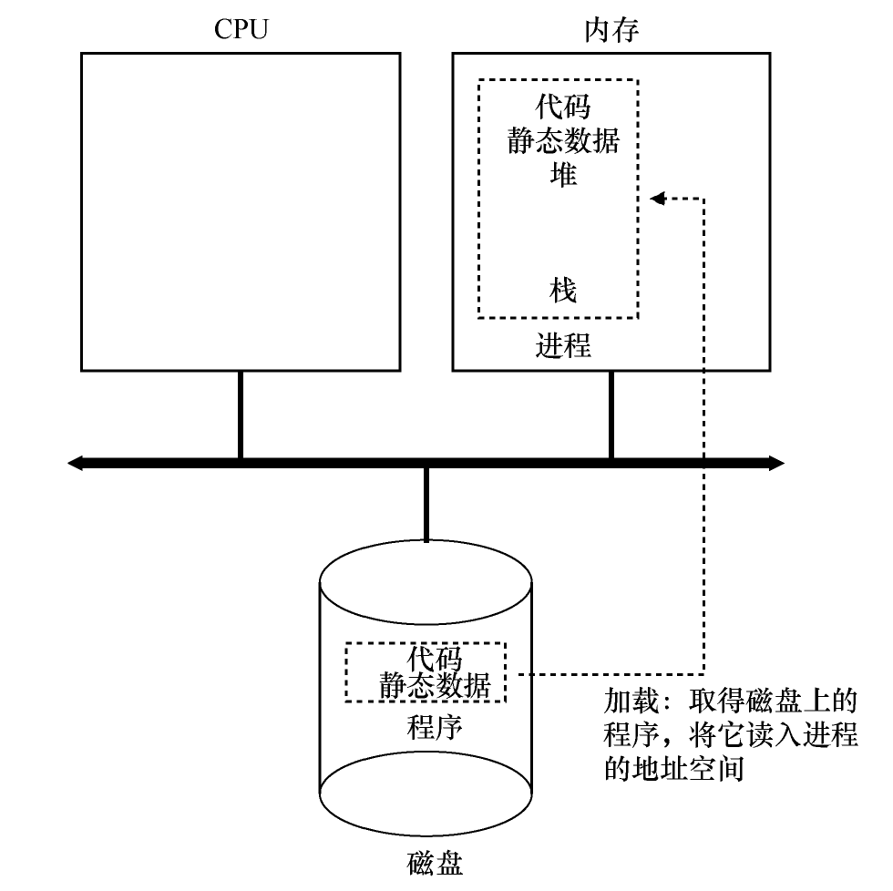

---

### **4.2 进程 API**
操作系统通过系统调用（API）支持进程管理。主要 API 包括：

- **`fork()`**：创建子进程，子进程是父进程的副本，拥有独立的地址空间。
- **`exit()`**：终止当前进程，释放其资源（如内存、文件描述符）。
- **`wait()`**：父进程等待子进程结束，回收资源。
- **`exec()`**：加载并运行新程序，替换当前进程的代码和数据。
- **其他**：如 `kill()`（发送信号）、`pipe()`（进程间通信）。

**功能**：这些 API 提供了进程创建、管理和通信的工具，是用户程序与操作系统交互的基础。

**示例**：
```c
#include <unistd.h>
#include <stdio.h>
int main() {
    pid_t pid = fork();
    if (pid == 0) {
        printf("子进程\n");
    } else {
        printf("父进程\n");
    }
    return 0;
}
```

---

### **4.3 进程创建：更多细节**
**创建过程**：
1. **分配进程控制块（PCB）**：PCB 是操作系统管理进程的元数据结构，包含：
   - 进程 ID（PID）、父进程 ID（PPID）。
   - 寄存器状态（PC、SP 等）。
   - 内存信息（页表指针）。
2. **初始化地址空间**：
   - 加载程序代码到代码段。
   - 分配堆和栈区域。
   - 在 Unix 中，`fork()` 复制父进程的页表，但通过**写时复制（Copy-On-Write, COW）**优化，只有在修改内存时才复制页面。
3. **设置初始状态**：将进程置于“新建”状态，准备调度。

**开销**：
- 进程创建涉及内存分配、页表复制和 PCB 初始化，成本较高。
- 写时复制减少了初始内存复制的开销，但仍需考虑调度和资源分配。

**示例**：在 Linux 中，`fork()` 调用会触发内核的 `do_fork()` 函数，复制父进程的内存结构并分配新 PID。

**挑战**：频繁创建进程可能导致性能瓶颈，现代系统通过线程或轻量级进程优化。

---

### **4.4 进程状态**
进程在其生命周期中经历以下状态：
- **新建（New）**：进程正在创建，分配资源。
- **就绪（Ready）**：进程准备运行，等待 CPU。
- **运行（Running）**：进程在 CPU 上执行。
- **阻塞（Blocked）**：进程等待外部事件（如 I/O 完成）。
- **终止（Terminated）**：进程结束，等待资源回收。

**状态转换**：
- 由调度器或事件触发，例如：
  - 运行 → 就绪：时间片用尽或被抢占。
  - 运行 → 阻塞：等待 I/O。
  - 阻塞 → 就绪：I/O 完成。

**图示**：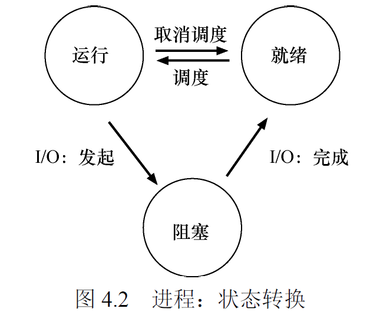

**实际应用**：Linux 内核使用 `task_struct` 结构跟踪进程状态，通过 `state` 字段表示（TASK_RUNNING、TASK_INTERRUPTIBLE 等）。

---

### **4.5 数据结构**
**进程表**：
- 操作系统维护一个全局进程表，存储所有活动进程的 PCB。
- 进程表支持快速查找和调度。

**PCB 内容**：
- **标识**：PID、PPID。
- **状态**：当前状态（运行、就绪等）。
- **寄存器快照**：PC、SP、通用寄存器。
- **内存信息**：页表指针、内存限制。
- **资源信息**：打开的文件描述符、信号处理程序。

**作用**：
- PCB 是进程管理的核心，支持调度、上下文切换和资源回收。
- 进程表通常以链表或数组实现，需高效访问。

**示例**：Linux 的 `task_struct` 是 PCB 的具体实现，包含数百个字段，涵盖进程的所有信息。

---

### **4.6 小结**
- 进程抽象是 CPU 虚拟化的基础，通过隔离和资源分配支持多程序并发。
- 进程 API 和 PCB 数据结构共同实现这一抽象。
- **思考问题**：进程创建的开销如何影响系统性能？现代系统如何优化？

**参考资料**：
- Unix 系统编程相关书籍。
- Linux 内核文档（`task_struct` 和进程管理）。

---

## **第 5 章 插叙：进程 API**

### **5.1 `fork()` 系统调用**
**功能**：
- 创建一个新进程（子进程），复制父进程的地址空间和状态。
- 子进程从 `fork()` 返回处继续执行。

**返回值**：
- 子进程：返回 0。
- 父进程：返回子进程的 PID。
- 错误：返回 -1。

**示例**：
```c
#include <unistd.h>
#include <stdio.h>
int main() {
    pid_t pid = fork();
    if (pid == 0) {
        printf("子进程，PID=%d\n", getpid());
    } else if (pid > 0) {
        printf("父进程，子进程 PID=%d\n", pid);
    } else {
        printf("fork 失败\n");
    }
    return 0;
}
```

**细节**：
- 复制包括页表、文件描述符和信号处理程序。
- 写时复制优化内存复制，子进程和父进程共享只读页面。

**挑战**：复制大量内存可能导致性能问题，需依赖 COW。

---

### **5.2 `wait()` 系统调用**
**功能**：
- 父进程等待子进程终止，回收资源，防止子进程成为僵尸进程。

**变体**：
- `wait(NULL)`：阻塞直到任一子进程结束。
- `waitpid(pid, &status, options)`：等待指定子进程，支持非阻塞选项。

**示例**：
```c
#include <sys/wait.h>
#include <unistd.h>
int main() {
    pid_t pid = fork();
    if (pid == 0) {
        printf("子进程退出\n");
        exit(0);
    } else {
        wait(NULL);
        printf("父进程：子进程已结束\n");
    }
    return 0;
}
```

**作用**：确保资源正确回收，维护系统稳定性。

---

### **5.3 `exec()` 系统调用**
**功能**：
- 在当前进程中加载并运行新程序，替换原有代码、数据和堆栈，但保留 PID 和某些资源（如文件描述符）。

**变体**：
- `execl()`, `execv()`, `execvp()` 等，支持不同参数传递方式。

**示例**：
```c
#include <unistd.h>
int main() {
    execl("/bin/ls", "ls", "-l", NULL);
    printf("此行不会执行\n"); // 被替换
    return 0;
}
```

**特点**：
- 不创建新进程，适合与 `fork()` 结合实现新程序运行。
- 常用于 shell 实现命令执行。

---

### **5.4 为什么这样设计 API**
**原因**：
- **灵活性**：`fork()` 和 `exec()` 分离允许在创建子进程后自定义行为（如重定向、管道）。
  - 例如，shell 使用 `fork()` 创建子进程，重定向 I/O 后调用 `exec()` 运行命令。
- **历史因素**：Unix 设计哲学强调简单和模块化。
- **优势**：子进程继承父进程资源，便于通信和协作。

**挑战**：API 设计复杂，可能导致初学者误用（如未处理 `fork()` 失败）。

---

### **5.5 其他 API**
- **`kill(pid, sig)`**：向进程发送信号（如 SIGTERM 终止）。
- **`pipe(fd)`**：创建进程间通信管道。
- **`dup()`, `dup2()`**：复制或重定向文件描述符。
- **信号处理**：`signal()`, `sigaction()` 设置信号处理程序。

**作用**：扩展进程控制和通信能力，支持复杂应用程序（如 shell 管道）。

---

### **5.6 小结**
- 进程 API 是操作系统与用户交互的关键接口，支持进程生命周期管理和通信。
- Unix 的 `fork()`-`exec()` 模型灵活但复杂，需理解其设计意图。
- **思考问题**：如何优化 `fork()` 的性能？现代系统是否需要替代方案？

**参考资料**：
- 《UNIX Programming Environment》。

---

## **第 6 章 机制：受限直接执行**

### **6.1 基本技巧**
**定义**：
- 受限直接执行（Limited Direct Execution, LDE）允许用户进程直接在 CPU 上运行，但通过硬件和软件限制其权限，确保安全性和隔离性。

**实现**：
- **用户模式 vs 内核模式**：
  - 用户模式：运行受限指令集，防止直接访问硬件。
  - 内核模式：执行特权操作（如 I/O、内存管理）。
- **硬件支持**：
  - 模式位：区分用户和内核模式。
  - 陷阱指令（trap）：用户模式调用系统调用时切换到内核模式。

**目标**：
- **性能**：直接执行减少开销。
- **安全性**：限制用户进程权限。

**示例**：运行一个用户程序时，CPU 在用户模式执行，调用 `write()` 系统调用时通过陷阱进入内核模式。

---

### **6.2 问题 1：受限制的操作**
**挑战**：
- 用户进程可能尝试特权操作（如访问硬件或修改页表），需限制。

**解决方案**：

- **系统调用**：用户进程通过 `syscall` 指令请求内核执行特权操作。
- **硬件支持**：
  - 陷阱表：映射系统调用号到内核处理函数。
  - 保护机制：硬件阻止用户模式直接访问关键资源。

**示例**：Linux 的 `int 0x80` 或 `syscall` 指令触发系统调用，内核检查权限后执行。

---

### **6.3 问题 2：在进程之间切换**
**上下文切换**：
- **定义**：暂停当前进程，保存其状态，加载新进程状态。
- **步骤**：
  1. 保存当前进程的寄存器（PC、SP 等）到 PCB。
  2. 更新进程状态（运行 → 就绪）。
  3. 选择新进程，加载其 PCB 中的寄存器和页表。
  4. 切换到新进程的地址空间（更新 TLB）。

**触发**：
- 时钟中断：时间片用尽。
- 进程阻塞：等待 I/O。
- 优先级调度：更高优先级进程就绪。

**开销**：

- 涉及 TLB 刷新、缓存失效，需优化。
- 现代 CPU 提供硬件支持（如快速上下文切换指令）。

**示例**：Linux 的 `schedule()` 函数处理上下文切换，调用 `context_switch()` 更新寄存器和内存状态。

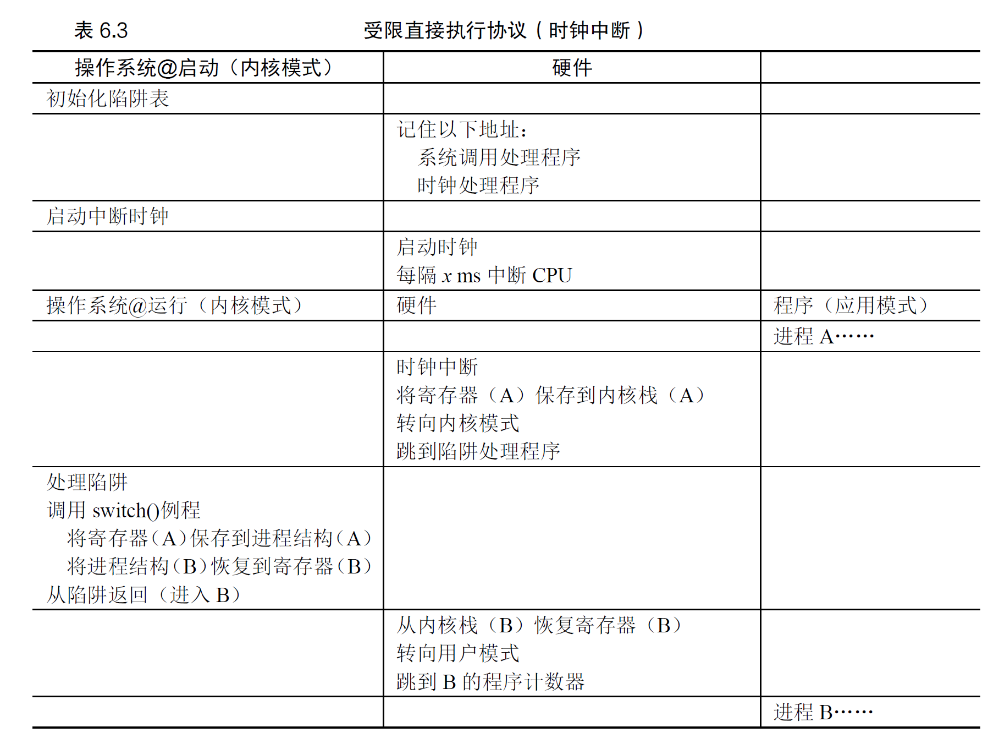

---

### **6.4 担心并发吗**
**单核系统**：
- 上下文切换和中断可能引入并发问题，需保护共享数据（如进程表）。

**多核系统**：
- 多个进程同时运行，需同步机制（如锁、信号量）保护共享资源。
- 调度器可能面临竞争条件。

**解决方案**：
- 使用原子指令或锁保护关键代码段。
- 设计无锁数据结构优化性能。

**示例**：Linux 调度器使用自旋锁保护进程表。

---

### **6.5 小结**
- LDE 通过用户/内核模式切换和上下文切换实现高效、安全的 CPU 虚拟化。
- 硬件支持（如陷阱和保护机制）是关键。
- **思考问题**：上下文切换的开销如何影响实时系统？如何优化？

**参考资料**：
- Intel/AMD 体系结构手册（系统调用和中断）。
- Linux 内核调度器代码。

---

## **第 7 章 进程调度：介绍**

### **7.1 工作负载假设**
**假设**：
- 进程运行时间长短不一（短任务 vs 长任务）。
- 进程可能涉及 I/O 操作，频繁阻塞。
- 到达时间可能不同（非同时到达）。

**影响**：
- 调度算法需根据负载特性优化性能指标（如周转时间、响应时间）。

---

### **7.2 调度指标**
- **周转时间**：从进程到达至完成的时间（完成时间 - 到达时间）。

​	$$T_{周转时间}= T_{完成时间}-T_{到达时间}$$

- **响应时间**：从进程就绪至首次运行的时间。

​	$$T_{响应时间}=T_{首次运行}-T_{到达时间}$$

- **公平性**：确保资源分配均衡，避免某些进程长期等待。
- **吞吐量**：单位时间内完成的进程数。

**权衡**：
- 优化周转时间可能牺牲响应时间（如长任务优先）。
- 需根据应用场景选择指标（如批处理 vs 交互系统）。

---

### **7.3 先进先出（FIFO）**
**原理**：
- 按到达顺序执行，简单且非抢占式。

**优点**：
- 实现简单，适合简单批处理系统。

**缺点**：

- **护航效应**：短任务可能等待长任务，导致高周转时间。
- 不适合交互系统。

**示例**：
- 任务 A（10ms）、B（20ms）、C（5ms）按顺序到达，FIFO 执行顺序为 A→B→C，周转时间较高。

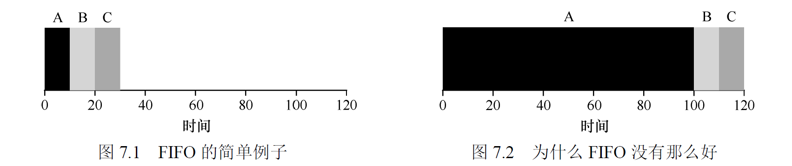

---

### **7.4 最短任务优先（SJF）**
**原理**：
- 优先运行运行时间最短的进程，非抢占式。

**优点**：
- 最小化平均周转时间（理论上最优）。
- 适合批处理系统。

**缺点**：
- 需预知运行时间（实际难以实现）。
- 长任务可能饥饿。

**示例**：
- 任务 A（10ms）、B（5ms）、C（20ms）同时到达，SJF 顺序为 B→A→C，优化周转时间。

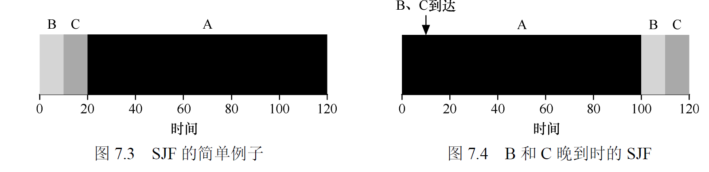

---

### **7.5 最短完成时间优先（STCF）**
**原理**：
- SJF 的抢占式版本，新到达的短任务可中断当前进程。

**优点**：

- 动态优化周转时间，适应非同时到达的负载。

**缺点**：
- 仍需预知运行时间。
- 抢占增加上下文切换开销。

**示例**：
- A（10ms）运行中，B（5ms）到达，STCF 暂停 A，运行 B。

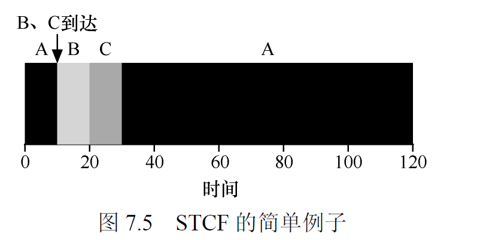

---

### **7.6 新度量指标：响应时间**
**问题**：
- SJF 和 STCF 优化周转时间，但响应时间可能较差（长任务等待时间长）。

**改进方向**：
- 引入时间共享（分时间片运行）。
- 交互系统更关注响应时间。

---

### **7.7 轮转（Round-Robin, RR）**
**原理**：
- 每个进程分配固定时间片，轮流运行，抢占式。

**优点**：
- 改善响应时间，适合交互系统。
- 公平性高。

**缺点**：
- 周转时间可能较差（频繁切换）。
- 时间片长度需调优：
  - 太短：上下文切换开销大。
  - 太长：接近 FIFO。

**示例**：
- 时间片 5ms，任务 A（10ms）、B（10ms），RR 顺序为 A(5)→B(5)→A(5)→B(5)。

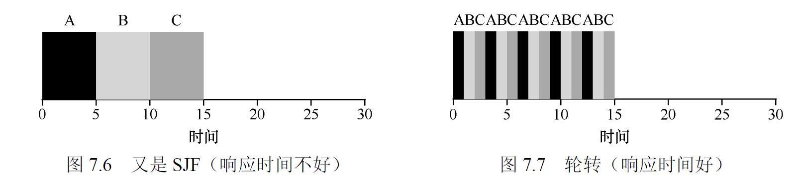

---

### **7.8 结合 I/O**
**策略**：
- I/O 阻塞的进程让出 CPU，调度器运行其他就绪进程。
- 提高 CPU 利用率，优化吞吐量。

**示例**：
- 任务 A 执行 I/O，调度器切换到任务 B，避免 CPU 空闲。

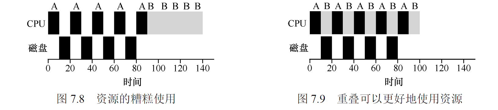

---

### **7.9 无法预知**
**挑战**：
- 实际系统中运行时间未知，SJF/STCF 难以直接应用。

**解决方案**：
- **历史估计**：根据进程过去行为预测（如指数平均）。
- **反馈机制**：动态调整优先级（如 MLFQ）。

---

### **7.10 小结**
- 调度算法的选择取决于负载和目标：
  - FIFO：简单但效率低。
  - SJF/STCF：优化周转时间。
  - RR：优化响应时间。
- 实际系统需结合多种策略。
- **思考问题**：如何在交互系统中平衡响应时间和吞吐量？

**参考资料**：
- 调度算法理论研究。
- Linux CFS（Completely Fair Scheduler）文档。

---

## **第 8 章 调度：多级反馈队列（MLFQ）**

### **8.1 MLFQ：基本规则**
**结构**：
- 多个优先级队列，高优先级进程优先运行。
- 每个队列采用轮转调度。

**基本规则**：
1. 若队列 A 的优先级高于 B，则运行 A 中的进程。
2. 若 A 和 B 优先级相同，采用 RR 调度。
3. 新进程进入最高优先级队列。
4. 进程用完时间片后，降低一级优先级。
5. 定期提升所有进程优先级，防止饥饿。

**目标**：
- 自适应调度，优化短任务的响应时间，同时保证长任务公平性。

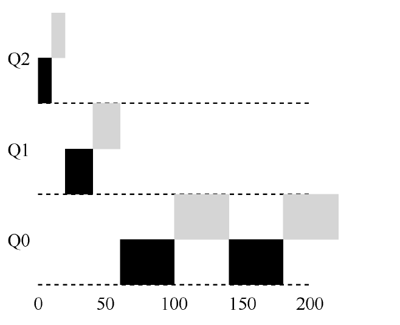

---

### **8.2 尝试 1：如何改变优先级**
**策略**：
- **CPU 密集型进程**：频繁使用 CPU，降低优先级。
- **I/O 密集型进程**：频繁阻塞，保持高优先级。

**问题**：
- 长任务可能长期占据低优先级，导致饥饿。

---

### **8.3 尝试 2：提升优先级**
**改进**：
- 定期（每隔固定时间）将所有进程提升到最高优先级。
- 防止低优先级进程长期等待。

**挑战**：
- 频繁提升可能导致 CPU 密集型进程重新抢占资源。

---

### **8.4 尝试 3：更好的计时方式**
**改进**：
- 跟踪进程的累计 CPU 使用时间（而非单一时间片）。
- 根据使用情况动态调整优先级。

**示例**：
- 进程 A 使用 100ms CPU 后降级，B 因 I/O 保持高优先级。

---

### **8.5 MLFQ 调优及其他问题**
**参数**：
- 队列数量：过多增加复杂性，过少降低灵活性。
- 时间片长度：高优先级短时间片，低优先级长时间片。
- 提升频率：需平衡公平性和性能。

**挑战**：
- 复杂性高，调优困难。
- 可能被恶意进程利用（如频繁 I/O 保持高优先级）。

**解决方案**：
- 限制进程行为（如 CPU 使用上限）。
- 动态调整参数。

---

### **8.6 MLFQ：小结**
- MLFQ 是一种自适应调度算法，广泛应用于 Unix 系统（如 Solaris、BSD）。
- 优点：平衡响应时间和周转时间。
- 缺点：复杂性高，需仔细调优。
- **思考问题**：MLFQ 如何应对恶意进程？现代系统如何改进？

**参考资料**：
- Unix 调度器实现。
- Linux CFS 与 MLFQ 的对比。

---

## **第 9 章 调度：比例份额**

### **9.1 基本概念：彩票数表示份额**
**定义**：
- 比例份额调度按进程的“份额”分配 CPU 时间。
- **彩票调度**：用彩票数表示份额，随机抽取决定运行进程。

**目标**：
- 确保长期公平的资源分配。

**示例**：
- 进程 A 有 70 张彩票，B 有 30 张，A 的 CPU 分配概率为 70%。

---

### **9.2 彩票机制**
**原理**：
- 每个进程分配一定数量的彩票。
- 调度器随机抽取彩票，持有彩票的进程运行一个时间片。

**优点**：
- 简单易实现。
- 概率上公平。

**缺点**：
- 短期可能不公平（随机性）。
- 需调优彩票分配。

---

### **9.3 实现**
**方法**：
- 使用随机数生成器抽取彩票。
- 维护彩票表，记录每个进程的彩票数。

**优化**：
- 快速随机数生成。
- 动态调整彩票数。

**示例代码**：
```c
int lottery = rand() % total_tickets;
for (process in process_list) {
    if (lottery < process.tickets) {
        run(process);
        break;
    }
    lottery -= process.tickets;
}
```

---

### **9.4 一个例子**
- 进程 A（70 票）、B（30 票），总计 100 票。
- 随机数 0-99：
  - 0-69：运行 A。
  - 70-99：运行 B。
- 长期运行，A 占 70% CPU 时间。

---

### **9.5 如何分配彩票**
**依据**：
- 用户指定的优先级。
- 进程的资源需求（如 CPU 密集型 vs I/O 密集型）。
- 系统策略（如公平性 vs 性能）。

**挑战**：
- 动态负载下彩票分配复杂。
- 需防止滥用（如请求过多彩票）。

---

### **9.6 为什么不是确定的**
**特性**：
- 随机性导致短期分配不均，但长期趋于公平。
- 避免复杂确定性算法，降低实现成本。

**对比**：
- 确定性调度（如 RR）短期公平，但开销高。
- 彩票调度简单，但需权衡随机性。

---

### **9.7 小结**
- 彩票调度适合需要资源公平分配的场景（如云计算）。
- 优点：简单、灵活。
- 缺点：短期不公平，需调优。
- **思考问题**：彩票调度如何应用于多核系统？

**参考资料**：
- 《Lottery Scheduling: Flexible Proportional-Share Resource Management》。

---

## **第 10 章 多处理器调度（高级）**

### **10.1 背景：多处理器架构**
**特点**：
- 多核 CPU 并行运行多个进程。
- 共享内存或缓存一致性协议。

**挑战**：
- **负载均衡**：确保各核负载均匀。
- **同步**：保护共享数据结构。
- **缓存亲和度**：减少进程迁移的缓存失效。

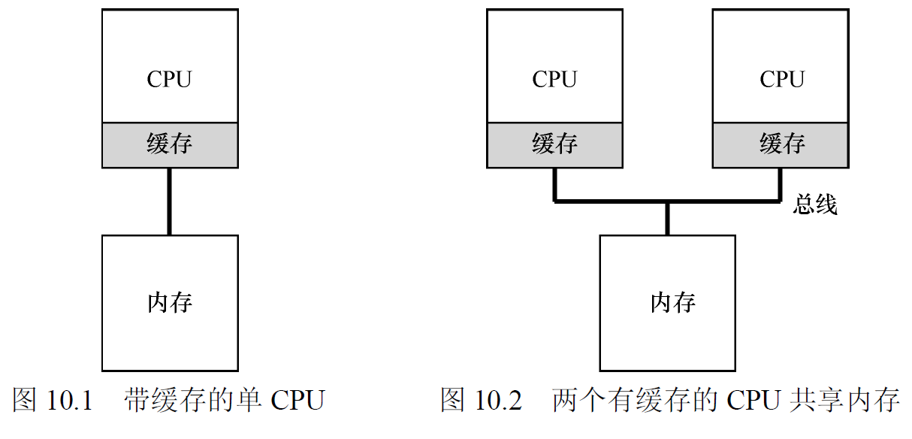

---

### **10.2 别忘了同步**
**问题**：
- 多核访问共享调度队列（如进程表）可能导致竞争。

**解决方案**：
- **锁**：保护队列访问（如自旋锁、互斥锁）。
- **无锁数据结构**：减少锁竞争。

**开销**：
- 锁可能导致性能瓶颈，尤其在高并发下。

**示例**：Linux 使用 percpu 变量减少全局锁。

---

### **10.3 最后一个问题：缓存亲和度**
**定义**：
- 进程倾向在同一 CPU 运行，利用缓存中的数据。

**影响**：
- 频繁迁移导致缓存失效，降低性能。

**策略**：
- 尽量将进程绑定到特定 CPU。
- 迁移时考虑亲和度。

**示例**：Linux 的 `sched_setaffinity()` 允许绑定进程到特定核。

---

### **10.4 单队列调度（SQMS）**
**原理**：
- 所有 CPU 共享一个调度队列。

**优点**：
- 负载均衡好，自动分配任务。

**缺点**：
- 同步开销大（需锁保护队列）。
- 缓存亲和度差。

**示例**：早期 Linux 调度器使用单一队列。


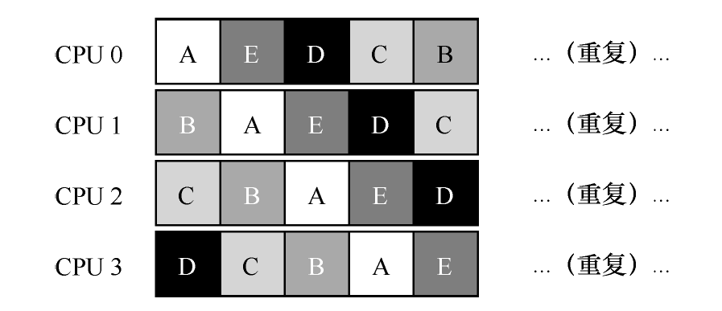

---

### **10.5 多队列调度（MQMS）**
**原理**：
- 每个 CPU 维护独立队列。

**优点**：
- 缓存亲和度高。
- 同步开销低。

**缺点**：

- 负载可能不均，需迁移进程。

**改进**：
- **负载平衡**：定期迁移进程。
- **工作窃取**：空闲 CPU 从其他队列“偷”任务。

**示例**：Linux CFS 使用多队列并结合负载平衡。


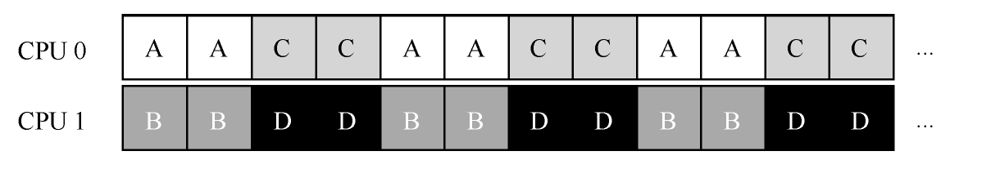

---

### **10.6 Linux 多处理器调度**
**实现**：
- **CFS（Completely Fair Scheduler）**：基于红黑树的多队列调度。
- **负载平衡**：动态迁移任务。
- **亲和度优化**：尽量保持进程在同一核。

**特点**：
- 结合 SQMS 和 MQMS 优点，适应复杂负载。

---

### **10.7 小结**
- 多处理器调度需权衡负载均衡、亲和度和同步。
- 现代系统（如 Linux）采用混合策略，动态优化。
- **思考问题**：多核调度如何支持实时任务？

**参考资料**：
- Linux 内核调度器文档。
- 多核调度研究论文。

---

## **总结**
第 4-10 章全面介绍了 CPU 虚拟化的核心概念，从进程抽象到多处理器调度：
- **进程抽象**：通过隔离和 API 提供简洁的执行环境。
- **受限直接执行**：兼顾性能和安全。
- **调度算法**：从简单 FIFO 到复杂 MLFQ 和彩票调度，适应不同负载。
- **多核调度**：解决负载均衡和亲和度挑战。

这些机制是现代操作系统的基石，广泛应用于 Linux、Windows 等系统。理解这些内容有助于深入掌握操作系统设计和优化。

**思考问题**：
- 如何设计一个适应云计算的调度器？
- 虚拟化技术（如容器）如何影响进程调度？

**参考资料**：
- 《Operating Systems: Three Easy Pieces》完整版。
- Linux 内核源代码（sched/ 目录）。
- Unix 系统编程和调度相关书籍。

---

