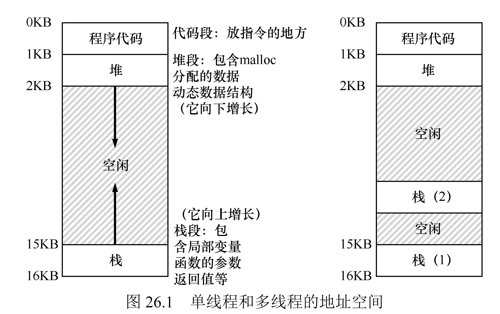

# 《操作系统导论》并发部分学习笔记 (基于 Version 1.1) 

## 第二部分：并发 (Concurrency)
这部分深入探讨了现代计算机系统中并发的概念、挑战、机制和常见模式。并发是指在一个系统中同时存在多个执行流，这些执行流可能是真正的并行执行（在多核处理器上），也可能是在单核处理器上通过快速切换来实现的宏观上的并行。

---

### 第25章 关于并发的对话
- **核心思想**: 本章以苏格拉底式的对话引导读者进入并发的世界。它强调了并发并非免费的午餐，虽然能带来性能提升和程序结构的改进（例如，GUI应用的响应性），但同时也引入了显著的复杂性。
  
- **并发的重要性**:
  - **多处理器利用**: 现代计算机普遍采用多核CPU，并发编程是充分利用这些核心的关键。
  - **I/O重叠**: 当一个任务等待I/O操作（如读写文件、网络请求）时，CPU可以切换到其他任务，提高整体效率。
  - **响应式用户界面**: 在桌面或移动应用中，后台任务的并发执行可以保持用户界面的流畅响应。

- **引入的复杂性**:
  - **竞态条件 (Race Conditions)**: 当多个线程访问共享资源，并且最终结果取决于它们执行的精确顺序时，就可能发生竞态条件。
  - **死锁 (Deadlocks)**: 两个或多个线程无限期地等待对方持有的资源。
  - **饥饿 (Starvation)**: 一个线程持续无法获得执行所需的资源。

- **目标**: 理解这些复杂性，并学习如何使用操作系统提供的工具和技术来正确、高效地管理并发。

---

### 第26章 并发：介绍



- **26.1 实例：线程创建**:
  - **线程 (Thread)**: 一个进程内执行的独立序列。同一进程内的线程共享相同的地址空间（代码段、数据段、堆），但有各自独立的程序计数器（PC）、寄存器集合和栈。
  
  ```c
  #include <stdio.h>
  #include <pthread.h>
  #include <unistd.h> // For sleep()
  
  void *my_thread_func(void *arg) {
      char *thread_name = (char *)arg;
      for (int i = 0; i < 3; i++) {
          printf("%s: iteration %d\n", thread_name, i);
          sleep(1); // Simulate work
      }
      return NULL;
  }
  
  int main() {
      pthread_t t1, t2;
      printf("Main: Starting threads...\n");
  
      pthread_create(&t1, NULL, my_thread_func, "Thread A");
      pthread_create(&t2, NULL, my_thread_func, "Thread B");
  
      // Wait for threads to finish (discussed later)
      pthread_join(t1, NULL);
      pthread_join(t2, NULL);
  
      printf("Main: Threads finished.\n");
      return 0;
  }
  // Compile: gcc example.c -o example -pthread
  // Output will show interleaved printing from Thread A and Thread B.
  ```
  
  - **示例解读**: OSTEP中通常会展示一个简单的C程序，使用 `pthread_create` (POSIX threads) 或类似的API创建新线程。主线程和新创建的线程会并发执行指定的函数。观察不同运行次序下输出的变化，直观感受并发调度的不确定性。
  
- **26.2 为什么更糟糕：共享数据**:
  - **问题本质**: 当线程共享可变数据时，并发访问可能导致数据损坏。例如，经典的 `balance++` 操作，在机器指令层面可能分解为：
    - load balance from memory to register
    - increment register
    - store register to memory balance
  - **交错执行的风险**: 如果两个线程同时执行 `balance++`，它们的指令可能交错执行（例如，线程A执行1、2，然后被切换，线程B执行1、2、3，然后线程A再执行3），导致最终 `balance` 的值不是预期的 `balance+2`，而是 `balance+1`。这就是一个竞态条件 (race condition)。

  ```c
  #include <stdio.h>
  #include <pthread.h>
  
  // Shared data
  long long shared_counter = 0;
  
  void *increment_counter(void *arg) {
      for (int i = 0; i < 1000000; i++) {
          // Race condition here!
          shared_counter++;
      }
      return NULL;
  }
  
  int main() {
      pthread_t t1, t2;
  
      pthread_create(&t1, NULL, increment_counter, NULL);
      pthread_create(&t2, NULL, increment_counter, NULL);
  
      pthread_join(t1, NULL);
      pthread_join(t2, NULL);
  
      // Expected: 2000000, Actual: likely less due to race condition
      printf("Shared counter value: %lld\n", shared_counter);
      return 0;
  }
  // Compile: gcc race_example.c -o race_example -pthread
  // Run multiple times, you might see different (incorrect) results.
  ```
  
- **26.3 核心问题：不可控的调度**:
  - **调度器 (Scheduler)**: 操作系统内核的一部分，负责决定哪个线程在何时运行多长时间。
  - **抢占式多任务 (Preemptive Multitasking)**: 调度器可以在任何时刻中断一个正在运行的线程，并将CPU分配给另一个线程。程序员通常无法精确控制这种切换发生的时机。
  - **不确定性来源**: 线程的执行顺序和切换点依赖于调度算法、系统负载、硬件中断等多种因素，使得并发程序的行为难以预测和调试。

- **26.4 原子性愿望**:
  - **原子操作 (Atomic Operation)**: 一个或一系列不可被中断的操作。它要么完整执行，要么完全不执行，其执行期间的中间状态对其他线程是不可见的。
  - **临界区 (Critical Section)**: 代码中访问共享资源的部分。我们希望临界区的执行是原子的，以避免竞态条件。
  - **需求**: 需要一种机制来确保对共享资源的访问是互斥的，即一次只有一个线程能进入临界区。

- **26.5 还有一个问题：等待另一个线程**:
  - **线程同步 (Thread Synchronization)**: 某些情况下，一个线程需要等待另一个线程完成特定任务或达到某个状态后才能继续执行。例如，主线程可能需要等待所有子线程完成后才能汇总结果并退出。
  - **生产者-消费者问题**: 一个线程（生产者）产生数据放入缓冲区，另一个线程（消费者）从缓冲区取出数据处理。需要协调它们对缓冲区的访问。

- **26.6 小结：为什么操作系统要研究并发**:
  - **性能提升**: 通过并行化和I/O重叠。
  - **程序结构**: 某些问题天然适合并发模型。
  - **挑战**: 竞态条件、死锁、复杂性。
  - **OS的责任**: 提供创建和管理线程的机制（如线程API），以及用于同步线程和保护共享数据的原语（如锁、条件变量）。OS本身也是一个高度并发的系统。

---

### 第27章 插叙：线程API
- **本章通常以 Pthreads (POSIX Threads) 为例，它是UNIX-like系统中线程编程的标准API。**

- **27.1 线程创建 (pthread_create)**:
  
  - **函数原型**: `int pthread_create(pthread_t *thread, const pthread_attr_t *attr, void *(*start_routine)(void *), void *arg);`
  
  ```c
  #include <stdio.h>
  #include <stdlib.h>
  #include <pthread.h>
  
  typedef struct {
      int id;
      char *message;
  } thread_arg_t;
  
  void *thread_with_args_retval(void *arg) {
      thread_arg_t *my_arg = (thread_arg_t *)arg;
      printf("Thread %d: Message is '%s'\n", my_arg->id, my_arg->message);
  
      long *return_value = malloc(sizeof(long));
      if (return_value) {
          *return_value = my_arg->id * 10; // Example return value
      }
      return (void *)return_value;
  }
  
  int main() {
      pthread_t t1;
      thread_arg_t arg1 = {1, "Hello from Thread 1"};
      void *thread_return;
  
      pthread_create(&t1, NULL, thread_with_args_retval, &arg1);
      pthread_join(t1, &thread_return); // Wait and get return value
  
      if (thread_return) {
          printf("Main: Thread 1 returned %ld\n", *(long *)thread_return);
          free(thread_return); // Important to free dynamically allocated return value
      }
      return 0;
  }
  ```
  
  - **参数说明**:
    - `thread`: 指向 `pthread_t` 类型变量的指针，用于存储新线程的ID。
    - `attr`: 线程属性（通常设为 NULL 使用默认属性）。
    - `start_routine`: 线程启动后执行的函数指针。该函数接受一个 `void*` 参数并返回一个 `void*`。
    - `arg`: 传递给 `start_routine` 的参数。
  
- **27.2 线程完成 (pthread_join)**:
  - **函数原型**: `int pthread_join(pthread_t thread, void **retval);`
  - **作用**: 调用 `pthread_join` 的线程会阻塞，直到指定的 `thread` 终止。
  - **retval**: 如果不为 NULL，它会指向一个位置，用于存储被等待线程的返回值（即其 `start_routine` 的返回值）。
  - **意义**: 确保子线程任务完成、回收线程资源、获取子线程结果。类似于进程中的 `wait()`。

- **27.3 锁 (Locks - Mutexes)**:
  - **互斥锁 (Mutex)**: `pthread_mutex_t` 类型。
  - **初始化**: `pthread_mutex_init(pthread_mutex_t *mutex, const pthread_mutexattr_t *attr);` 或静态初始化 `PTHREAD_MUTEX_INITIALIZER`。
  
  ```c
  #include <stdio.h>
  #include <pthread.h>
  
  long long shared_counter_locked = 0;
  pthread_mutex_t lock; // Mutex declaration
  
  void *increment_counter_locked(void *arg) {
      for (int i = 0; i < 1000000; i++) {
          pthread_mutex_lock(&lock);   // Acquire lock
          shared_counter_locked++;     // Critical section
          pthread_mutex_unlock(&lock); // Release lock
      }
      return NULL;
  }
  
  int main() {
      pthread_t t1, t2;
      pthread_mutex_init(&lock, NULL); // Initialize mutex
  
      pthread_create(&t1, NULL, increment_counter_locked, NULL);
      pthread_create(&t2, NULL, increment_counter_locked, NULL);
  
      pthread_join(t1, NULL);
      pthread_join(t2, NULL);
  
      pthread_mutex_destroy(&lock); // Destroy mutex
  
      // Expected: 2000000, Actual: 2000000 (with lock)
      printf("Shared counter value (locked): %lld\n", shared_counter_locked);
      return 0;
  }
  // Compile: gcc locked_example.c -o locked_example -pthread
  ```
  
  - **加锁**: `pthread_mutex_lock(pthread_mutex_t *mutex);`
    - 如果锁未被持有，当前线程获取锁并继续执行。
    - 如果锁已被其他线程持有，当前线程阻塞，直到锁被释放。
  - **尝试加锁**: `pthread_mutex_trylock(pthread_mutex_t *mutex);` 立即返回，如果锁已被持有则返回错误码，不阻塞。
  - **解锁**: `pthread_mutex_unlock(pthread_mutex_t *mutex);` 释放锁，允许其他等待的线程获取它。
  - **销毁**: `pthread_mutex_destroy(pthread_mutex_t *mutex);`
  - **使用模式**: 在访问临界区前加锁，访问完毕后立即解锁。必须成对使用。
  
- **27.4 条件变量 (Condition Variables)**:
  - **pthread_cond_t** 类型。
  - **目的**: 允许线程在某个条件不满足时阻塞等待，直到其他线程改变了该条件并显式通知它。总是与互斥锁配合使用。
  - **初始化**: `pthread_cond_init(pthread_cond_t *cond, const pthread_condattr_t *attr);` 或静态初始化 `PTHREAD_COND_INITIALIZER`。
  
  ```c
  #include <stdio.h>
  #include <pthread.h>
  #include <unistd.h>
  
  pthread_mutex_t cv_lock = PTHREAD_MUTEX_INITIALIZER;
  pthread_cond_t cond_var = PTHREAD_COND_INITIALIZER;
  int work_done = 0; // Shared condition predicate
  
  void *worker_thread(void *arg) {
      sleep(2); // Simulate doing work
      pthread_mutex_lock(&cv_lock);
      work_done = 1;
      printf("Worker: Work done. Signaling condition.\n");
      pthread_cond_signal(&cond_var); // Signal that the condition might be met
      pthread_mutex_unlock(&cv_lock);
      return NULL;
  }
  
  void *waiter_thread(void *arg) {
      pthread_mutex_lock(&cv_lock);
      printf("Waiter: Waiting for work to be done...\n");
      while (work_done == 0) { // Loop to handle spurious wakeups
          pthread_cond_wait(&cond_var, &cv_lock); // Waits, atomically releases lock
      }                                          // Upon wakeup, re-acquires lock
      printf("Waiter: Work is done! Proceeding.\n");
      pthread_mutex_unlock(&cv_lock);
      return NULL;
  }
  
  int main() {
      pthread_t worker, waiter;
      pthread_create(&worker, NULL, worker_thread, NULL);
      pthread_create(&waiter, NULL, waiter_thread, NULL);
  
      pthread_join(worker, NULL);
      pthread_join(waiter, NULL);
  
      pthread_mutex_destroy(&cv_lock);
      pthread_cond_destroy(&cond_var);
      return 0;
  }
  ```
  
  - **等待**: `int pthread_cond_wait(pthread_cond_t *cond, pthread_mutex_t *mutex);`
    - 原子地释放 `mutex` 并使当前线程阻塞在 `cond` 上。
    - 当被唤醒时，它会重新获取 `mutex` 然后返回。
    - 通常在 while 循环中调用，以处理虚假唤醒并重新检查条件。
  - **通知一个**: `int pthread_cond_signal(pthread_cond_t *cond);` 唤醒至少一个（通常是一个）等待在 `cond` 上的线程。
  - **通知所有**: `int pthread_cond_broadcast(pthread_cond_t *cond);` 唤醒所有等待在 `cond` 上的线程。
  - **销毁**: `pthread_cond_destroy(pthread_cond_t *cond);`
  
- **27.5 编译和运行**:
  - 通常需要在编译命令中链接Pthreads库，例如在GCC中：`gcc my_threaded_program.c -o my_threaded_program -pthread`。

- **27.6 小结**: 正确使用这些API是构建可靠并发程序的基础。误用（如忘记解锁、错误地使用条件变量）很容易导致bug。

---

### 第28章 锁 (Locks)
- **28.1 锁的基本思想**:
  - **互斥 (Mutual Exclusion)**: 确保临界区在同一时刻只有一个线程能进入。
  - **获取锁 (Acquire Lock)**: 线程在进入临界区前尝试获取锁。
  - **释放锁 (Release Lock)**: 线程在离开临界区后释放锁。
  - **锁的状态**: 通常是二进制的（锁定/未锁定，或可用/不可用）。

- **28.2 Pthread 锁**: 如27.3所述，`pthread_mutex_lock()` 和 `pthread_mutex_unlock()`。

- **28.3 实现一个锁**: 探讨如何从更底层的原语构建锁。这是理解锁的性能和正确性保证的关键。

- **28.4 评价锁**:
  - **正确性 (Correctness)**: 是否能真正实现互斥？
  - **公平性 (Fairness)**: 是否会饿死某些线程（即它们一直得不到锁）？例如，先请求锁的线程是否能先得到锁（FIFO）？
  - **性能 (Performance)**:
    - 无竞争时的开销（单个线程获取和释放锁的时间）。
    - 高竞争时的开销（多个线程争抢锁时的表现，如吞吐量、延迟）。

- **28.5 控制中断**:
  - **单处理器系统**: 早期实现原子性的简单方法。在进入临界区前禁用中断，离开后启用中断。这样可以防止线程切换，确保临界区代码不被打断。
  - **多处理器系统中的局限性**:
    - 禁用一个CPU的中断，并不能阻止其他CPU上的线程访问共享数据。
    - 开销大，且给予用户程序过高权限（禁用中断可能导致系统无响应）。
    - 现代OS通常不允许用户态程序直接禁用中断。

- **28.6 测试并设置指令（原子交换）(Test-and-Set / Atomic Exchange)**:
  - **硬件原子指令**: `test_and_set(mem_addr, new_val)` 原子地将 `mem_addr` 处的值设置为 `new_val`，并返回 `mem_addr` 处的旧值。
  - **示例**:
    ```c
    int test_and_set(int *old_ptr, int new_val) {
        // Pseudocode for atomic hardware instruction
        int old = *old_ptr;
        *old_ptr = new_val;
        return old;
    }
    ```
  - 这是构建自旋锁的基础。

- **28.7 实现可用的自旋锁 (Spin Locks)**:
  - 使用 `test_and_set` 实现：
    ```c
    // flag is initialized to 0 (unlocked)
    void lock(int *flag) {
        while (test_and_set(flag, 1) == 1)
            ; // spin (do nothing, just loop)
    }
    
    void unlock(int *flag) {
        *flag = 0;
    }
    ```
  - **自旋 (Spinning)**: 当锁不可用时，线程在一个循环中不断尝试获取锁，而不放弃CPU。

- **28.8 评价自旋锁**:
  
  - **优点**:
    - 锁持有时间极短且竞争不激烈时，避免了上下文切换的开销，效率高。
  - **缺点**:
    - 锁竞争激烈或锁持有时间长时，自旋会浪费大量CPU周期，降低系统整体性能。
    - 在单CPU系统上，如果持有锁的线程被抢占，自旋的线程会无意义地空转，直到持有锁的线程被重新调度并释放锁。
  
- **28.9 比较并交换 (Compare-and-Swap - CAS)**:
  - **硬件原子指令**: `int CAS(type *mem_addr, type expected_val, type new_val)`
    ```c
    // Pseudocode for atomic hardware instruction
    if (*mem_addr == expected_val) {
        *mem_addr = new_val;
        return 1; // or true, indicates success
    } else {
        return 0; // or false, indicates failure
    }
    ```
  - 原子地比较 `*mem_addr` 的内容与 `expected_val`，如果相等，则将 `*mem_addr` 更新为 `new_val`，并返回成功；否则不做任何事并返回失败。
  - 比 `test_and_set` 更强大，是实现许多无锁数据结构 (lock-free data structures) 和更复杂锁机制（如乐观锁）的基础。

- **28.10 链接的加载和条件式存储指令 (Load-Linked and Store-Conditional - LL/SC)**:
  - **一对原子指令**:
    - **Load-Linked (LL)**: 从内存加载一个值。
    - **Store-Conditional (SC)**: 尝试将一个值存储回之前通过 LL 加载的内存地址。只有在该地址的内容自 LL 以来没有被其他处理器修改过的情况下，SC 才会成功。
  - **优点**: 避免了CAS中的ABA问题（一个值从A变为B再变回A，CAS会误认为没有变化）。LL/SC通过监视内存位置的修改来实现更强的原子性。
  - **常用于**: MIPS、PowerPC、ARM等架构。

- **28.11 获取并增加 (Fetch-and-Add)**:
  - **硬件原子指令**: `int fetch_and_add(int *mem_addr, int increment_val)`
    ```c
    // Pseudocode for atomic hardware instruction
    int old_val = *mem_addr;
    *mem_addr = old_val + increment_val;
    return old_val;
    ```
  - 原子地读取 `*mem_addr` 的当前值，将其增加 `increment_val`，并返回旧值。
  - 非常适合实现原子计数器等。

- **28.12 自旋过多：怎么办**: 当自旋锁的自旋成为性能瓶颈时，需要更优的策略。

- **28.13 简单方法：让出来吧，宝贝 (Yield)**:
  
  - **思想**: 在自旋锁的循环中，如果尝试获取锁失败，线程主动调用 `yield()` 放弃CPU，让调度器选择其他线程运行。

  ```c
  #define _GNU_SOURCE // For sched_yield() on some systems
  #include <sched.h>  // For sched_yield()
  
  // Inside spin_lock's while loop:
  // while (test_and_set_hardware(&lock_var) == 1) {
  //     sched_yield(); // Give up CPU slice
  // }
  ```
  
  - **改进**: 比纯粹自旋好一些，尤其是在单CPU或锁持有者可能在其他CPU上运行时。但如果等待队列很长，`yield()` 后的线程可能很快又被调度回来继续自旋，效果有限。
  
- **28.14 使用队列：休眠替代自旋 (Queues for Sleeping Instead of Spinning)**:
  - 现代操作系统中锁的常见实现方式:
    - 当线程尝试获取锁失败时，不进行自旋（或只短暂自旋）。
    - 将该线程加入一个与该锁关联的等待队列，并使其进入休眠状态（阻塞）。
    - 当锁被释放时，从等待队列中唤醒一个（或多个）线程，使其尝试获取锁。
  - **OS支持**: 通常需要操作系统内核的支持，例如Linux中的 `futex` (Fast Userspace Mutex)。`futex` 是一种高效的机制，允许在无竞争时完全在用户空间操作锁，仅在发生竞争时才陷入内核进行线程排队和唤醒。

- **28.15 不同操作系统，不同实现**: Windows有 `CriticalSection` 对象、`Mutex` 对象；Linux有 `futex`；macOS和iOS有 `os_unfair_lock` 等。它们在实现细节、性能特性和公平性保证上可能有所不同。

- **28.16 两阶段锁 (Two-Phase Locking - 2PL)**:
  - 主要用于数据库事务管理: 确保事务的可串行化。
  - **阶段一 (Growing Phase)**: 事务可以获取锁，但不能释放任何锁。
  - **阶段- **阶段二 (Shrinking Phase)**: 事务可以释放锁，但不能获取任何新锁。
  - 在操作系统并发原语的上下文中，这个术语可能指一种特定的锁使用模式，或者是一个更广义的概念，即锁的获取和释放是明确分开的阶段。OSTEP在此处的具体含义需结合上下文判断，但数据库中的2PL是标准定义。

- **28.17 小结**: 锁是实现并发控制的基础。从简单的自旋锁到复杂的、基于队列的休眠锁，每种都有其适用场景和性能权衡。硬件原子指令是构建这些锁的基石。

---

### 第29章 基于锁的并发数据结构
- **本章探讨如何使用前面介绍的锁来设计和实现线程安全的数据结构。**

- **核心挑战**: 如何在保证数据结构一致性的同时，最大限度地提高并发访问的性能（即允许多个线程尽可能多地同时操作数据结构的不同部分）。

- **29.1 并发计数器 (Concurrent Counters)**:
  - **简单实现**: 使用一个互斥锁保护一个普通的整数计数器。
    ```c
    typedef struct {
        int value;
        pthread_mutex_t lock;
    } concurrent_counter_t;
    
    void init_counter(concurrent_counter_t *c) {
        c->value = 0;
        pthread_mutex_init(&c->lock, NULL);
    }
    
    void increment(concurrent_counter_t *c) {
        pthread_mutex_lock(&c->lock);
        c->value++;
        pthread_mutex_unlock(&c->lock);
    }
    ```
  - **性能问题**: 这种简单锁（也称粗粒度锁）在高并发下会成为瓶颈，因为所有对计数器的操作都必须串行执行。
  - **近似计数器 (Approximate Counter)**: OSTEP中可能会提到Sloppy Counter。它允许多个CPU核心有本地计数器，并周期性地将本地计数值汇总到全局计数器。这减少了对全局锁的竞争，但代价是计数值不是完全精确的（是近似的），但最终会一致。
  - **可扩展计数器**: 更高级的技术，如基于Workspace-and-Add的无锁计数器，或分片锁（sharded lock），将计数器分散到多个锁保护的部分。

- **29.2 并发链表 (Concurrent Linked Lists)**:
  - **粗粒度锁**: 一个锁保护整个链表。简单，但并发度低，任何操作（插入、删除、查找）都会锁住整个链表。
  
  - **细粒度锁 (Hand-over-Hand Locking / Lock Coupling)**:
    - 每个节点都有自己的锁。
    - 当遍历链表时，线程在访问下一个节点前，先锁住当前节点 (curr) 和下一个节点 (next)，然后释放前一个节点 (prev) 的锁。
    - 例如，删除节点 X：需要锁住 X 的前驱节点和 X 本身。
    - 实现复杂，容易出错（特别是死锁），但允许更高的并发度。
  
  ```c
  #include <pthread.h>
  #include <stdlib.h>
  #include <stdio.h>
  
  typedef struct node {
      int data;
      struct node *next;
  } node_t;
  
  typedef struct {
      node_t *head;
      pthread_mutex_t list_lock;
  } concurrent_list_t;
  
  void init_list(concurrent_list_t *list) {
      list->head = NULL;
      pthread_mutex_init(&list->list_lock, NULL);
  }
  
  void insert_value(concurrent_list_t *list, int value) {
      node_t *new_node = malloc(sizeof(node_t));
      if (!new_node) return; // Handle allocation failure
      new_node->data = value;
  
      pthread_mutex_lock(&list->list_lock);
      new_node->next = list->head;
      list->head = new_node;
      pthread_mutex_unlock(&list->list_lock);
  }
  
  // lookup_value, delete_value would similarly lock/unlock the whole list.
  // Hand-over-hand locking is much more complex.
  // For delete: need to lock current and previous node.
  // For insert: need to lock previous and current (where new node goes after prev).
  
  void print_list(concurrent_list_t *list) {
      pthread_mutex_lock(&list->list_lock);
      node_t *curr = list->head;
      printf("List: ");
      while (curr) {
          printf("%d -> ", curr->data);
          curr = curr->next;
      }
      printf("NULL\n");
      pthread_mutex_unlock(&list->list_lock);
  }
  // ... destroy_list function to free nodes and destroy mutex
  ```
  
  - **乐观并发控制**: 不加锁直接查找，找到后加锁验证节点是否仍然存在且未改变，然后执行操作。如果验证失败，则重试。
  - **无锁链表**: 使用 CAS 等原子操作实现，非常复杂。
  
- **29.3 并发队列 (Concurrent Queues)**:
  - **应用场景**: 任务分发、生产者-消费者模型。
  
  ```c
  #include <pthread.h>
  #include <stdlib.h>
  #include <stdio.h> // For NULL if not using stdlib.h
  
  // Using the node_t from linked list example
  // typedef struct node { int data; struct node *next; } node_t;
  
  typedef struct {
      node_t *head;
      node_t *tail;
      pthread_mutex_t lock;
      // For a bounded queue with condition variables:
      // pthread_cond_t not_empty;
      // pthread_cond_t not_full;
      // unsigned int count;
      // unsigned int capacity;
  } concurrent_queue_t;
  
  void init_queue(concurrent_queue_t *q) {
      q->head = q->tail = NULL;
      pthread_mutex_init(&q->lock, NULL);
  }
  
  void enqueue(concurrent_queue_t *q, int value) {
      node_t *new_node = malloc(sizeof(node_t));
      if (!new_node) return;
      new_node->data = value;
      new_node->next = NULL;
  
      pthread_mutex_lock(&q->lock);
      if (q->tail == NULL) { // Queue is empty
          q->head = q->tail = new_node;
      } else {
          q->tail->next = new_node;
          q->tail = new_node;
      }
      pthread_mutex_unlock(&q->lock);
  }
  
  int dequeue(concurrent_queue_t *q, int *value_ptr) {
      pthread_mutex_lock(&q->lock);
      if (q->head == NULL) { // Queue is empty
          pthread_mutex_unlock(&q->lock);
          return -1; // Failure
      }
      node_t *temp = q->head;
      *value_ptr = temp->data;
      q->head = q->head->next;
      if (q->head == NULL) { // Queue became empty
          q->tail = NULL;
      }
      pthread_mutex_unlock(&q->lock);
      free(temp);
      return 0; // Success
  }
  // ... destroy_queue ...
  ```
  
  - **简单实现 (双锁队列)**:
    - 一个锁保护队头 (head_lock)，用于出队操作。
    - 一个锁保护队尾 (tail_lock)，用于入队操作。
    - 允许入队和出队操作在一定程度上并发进行。
    - 需要特别注意空队列和只有一个元素时的边界条件处理，避免 `head_lock` 和 `tail_lock` 之间的不当交互导致死锁或竞态条件。
  - **Michael-Scott 无锁队列**: OSTEP可能会提及，这是一个经典的基于 CAS 的高性能并发队列实现。
  
- **29.4 并发哈希表 / 映射 (Concurrent Hash Tables / Maps)**:
  - **策略1**：单锁保护整个表: 实现简单，但伸缩性差，成为瓶颈。
  - **策略2**：每个桶一个锁 (Lock Striping / Per-Bucket Lock):
    - 哈希表由多个桶（通常是链表）组成。为每个桶分配一个独立的锁。
    - 不同桶的操作可以完全并发。同一桶的操作仍需串行。
    - 显著提高并发性，是常见的实用方法。
  - **调整大小 (Resizing)**: 并发哈希表的一个主要难点。当表需要扩展或缩小时，如何安全地移动元素并更新锁结构，同时不长时间阻塞所有操作，是一个复杂的问题。可能需要锁住所有桶，或者采用更复杂的增量式调整大小策略。

- **29.5 小结**:
  - **锁的粒度 (Lock Granularity)** 是核心设计决策。
    - **粗粒度锁 (Coarse-grained)**: 简单，开销小，但并发度低。
    - **细粒度锁 (Fine-grained)**: 并发度高，但实现复杂，锁开销可能增加，死锁风险增大。
  - **目标**: 在正确性和性能之间找到平衡。
  - **理解数据结构的操作特性**: 以确定最佳的加锁策略。

---

### 第30章 条件变量 (Condition Variables)
- **30.1 定义和程序**:
  - **作用**: 弥补了互斥锁只能提供互斥、不能提供等待/通知机制的不足。允许线程等待某个特定条件成立。
  - **核心API (Pthreads)**: `pthread_cond_t`, `pthread_cond_wait()`, `pthread_cond_signal()`, `pthread_cond_broadcast()`.
  - **关键协同**: 条件变量必须与一个互斥锁一起使用。
    - 线程在检查条件之前，必须先获得该互斥锁。
    - 如果条件不满足，线程调用 `pthread_cond_wait(&cv, &mutex)`。此调用会：
      - 原子地释放 `mutex`。
      - 将线程置于等待 `cv` 的队列中并使其休眠。
    - 当其他线程修改了共享数据，使得条件可能满足时，它会调用 `pthread_cond_signal(&cv)` (唤醒一个等待者) 或 `pthread_cond_broadcast(&cv)` (唤醒所有等待者)。
    - 被唤醒的线程从 `pthread_cond_wait()` 返回前，会自动重新获取 `mutex`。

- **30.2 生产者/消费者（有界缓冲区）问题 (Producer/Consumer (Bounded Buffer) Problem)**:
  - **经典同步问题**:
    - 一个或多个生产者线程产生数据项，放入一个固定大小的缓冲区。
    - 一个或多个消费者线程从缓冲区取出数据项进行处理。
  - **同步要求**:
    - 生产者在缓冲区满时必须等待，直到有空位。
    - 消费者在缓冲区空时必须等待，直到有数据。
    - 对缓冲区的访问（如更新计数器、指针）必须互斥。
  - **解决方案 (使用一个互斥锁和两个条件变量)**:
    ```c
    pthread_mutex_t mutex; // 保护缓冲区和相关计数
    pthread_cond_t not_full; // 当缓冲区不满时，生产者在此等待后被唤醒
    pthread_cond_t not_empty; // 当缓冲区不空时，消费者在此等待后被唤醒
    
    // 生产者逻辑:
    pthread_mutex_lock(&mutex);
    while (buffer_is_full()) { // 必须用while循环检查条件
        pthread_cond_wait(&not_full, &mutex);
    }
    add_item_to_buffer();
    pthread_cond_signal(&not_empty); // 通知可能等待的消费者
    pthread_mutex_unlock(&mutex);
    
    // 消费者逻辑:
    pthread_mutex_lock(&mutex);
    while (buffer_is_empty()) { // 必须用while循环检查条件
        pthread_cond_wait(&not_empty, &mutex);
    }
    remove_item_from_buffer();
    pthread_cond_signal(&not_full); // 通知可能等待的生产者
    pthread_mutex_unlock(&mutex);
    ```

- **30.3 覆盖条件 (Covering Conditions / Spurious Wakeups)**:
  - **为什么 `pthread_cond_wait()` 必须在 while 循环中调用?**
    ```c
    while (!condition_is_true) { pthread_cond_wait(&cv, &mutex); }
    ```
  - **1. 虚假唤醒 (Spurious Wakeups)**: 某些操作系统实现中，线程可能在没有被显式 signal 或 broadcast 的情况下从 wait 中被唤醒。虽然罕见，但必须处理。循环确保条件被重新检查。
  - **2. 条件被其他线程改变**: 一个线程被 signal 唤醒后，到它实际运行并重新获取互斥锁之间，可能有其他线程先运行，并再次改变了条件（例如，另一个消费者取走了刚被放入的数据）。
  - **3. `pthread_cond_broadcast`**: 如果多个线程因同一条件等待，broadcast 会唤醒它们全部。但通常只有一个线程能成功满足条件并继续执行，其他线程需要重新等待。
  - **因此**: 从 wait 返回后，必须重新检查条件是否真正满足。

- **30.4 小结**: 条件变量是实现复杂线程同步逻辑的强大工具，尤其适用于线程需要等待某个由其他线程触发的状态变化。正确使用（与互斥锁配合、在循环中等待）至关重要。

---

### 第31章 信号量 (Semaphores)
- **31.1 信号量的定义**:
  - **由 Edsger Dijkstra 在1960年代提出**。
  - **是一个广义的同步原语**，本质上是一个非负整数计数器，并配有两个原子操作：
    - **P(sem) (或 wait(sem), sem_wait(sem))**:
      - 尝试将信号量的值减1。
      - 如果减1后的值变为负数（或者说，如果原始值为0），则调用 P 的线程阻塞，直到信号量的值大于0。
      - 如果原始值大于0，则减1成功，线程继续执行。
    - **V(sem) (或 signal(sem), sem_post(sem))**:
      - 原子地将信号量的值加1。
      - 如果因为此操作使得信号量的值从0变为1（或者说，如果之前有线程阻塞在 P(sem) 上），则唤醒一个等待的线程。
  
- **Pthreads API**: `sem_t`, `sem_init()`, `sem_destroy()`, `sem_wait()`, `sem_post()`.

```c
#include <semaphore.h> // For sem_t, sem_init, sem_wait, sem_post, sem_destroy
#include <stdio.h>
#include <pthread.h>

sem_t my_semaphore;

// In main:
// sem_init(&my_semaphore, 0, initial_value); // 0 for thread-shared, initial_value
// For example, initial_value = 1 for a binary semaphore (mutex like)
// initial_value = N for a counting semaphore allowing N concurrent accesses.

// In thread function:
// sem_wait(&my_semaphore); // P() operation - decrement or wait
// /* Critical section or resource access */
// sem_post(&my_semaphore); // V() operation - increment and signal

// In main, after threads join:
// sem_destroy(&my_semaphore);
```

- **31.2 二值信号量（锁）(Binary Semaphores as Locks)**:
  - **将信号量初始化为1**。
  - **P(sem)** 相当于 `lock()`。
  - **V(sem)** 相当于 `unlock()`。

  ```c
  sem_t binary_sem; // Declare
  // In main: sem_init(&binary_sem, 0, 1); // Initialize to 1
  
  // Thread function:
  // sem_wait(&binary_sem);
  // // Critical section
  // sem_post(&binary_sem);
  
  // In main, after join: sem_destroy(&binary_sem);
  ```

  - **可以实现互斥**，但通常不如专门的互斥锁高效或功能丰富（如递归锁、错误检查锁）。

- **31.3 信号量用作条件变量 (Semaphores for Condition Variables)**:
  - **可以模拟条件变量的行为**，但通常更复杂且不直观。
  - 例如，一个线程可以等待一个初始化为0的信号量（P(sem_cond)），另一个线程在条件满足时 V(sem_cond) 来唤醒它。
  - 然而，信号量没有与互斥锁的原子释放/获取的直接关联，需要程序员手动管理互斥。

- **31.4 生产者/消费者（有界缓冲区）问题 (使用信号量)**:
  - **通常需要三个信号量**:
    - `mutex`: 二值信号量，初始化为1，用于保护对缓冲区的互斥访问。
    - `empty_slots`: 计数信号量，初始化为缓冲区大小N，表示空槽位的数量。
    - `filled_slots`: 计数信号量，初始化为0，表示已填充槽位的数量。
  - **生产者逻辑**:
    ```c
    P(empty_slots);     // 等待并获取一个空槽位
    P(mutex);           // 进入临界区
    add_item_to_buffer();
    V(mutex);           // 离开临界区
    V(filled_slots);    // 通知有一个新的填充槽位
    ```

  - **消费者逻辑**:
    ```c
    P(filled_slots);    // 等待并获取一个填充槽位
    P(mutex);           // 进入临界区
    remove_item_from_buffer();
    V(mutex);           // 离开临界区
    V(empty_slots);     // 通知有一个新的空槽位
    ```

  - **这种方式比使用条件变量更简洁**，因为信号量本身就包含了计数功能。

- **31.5 读者—写者锁 (Reader-Writer Locks)**:
  - **允许多个读者并发访问**: 当没有写者时，任意数量的读者可以同时读取共享数据。
  - **写者互斥访问**: 当一个写者正在写入时，其他所有读者和写者都必须等待。写者之间也必须互斥。
  - **实现**: 可以使用信号量和互斥锁实现。通常涉及一个计数器来跟踪活动读者的数量，并使用信号量来控制读者和写者的进入。
    - `rw_mutex`: 控制对共享数据写访问的信号量 (或写者之间，以及写者与第一/最后一个读者之间的同步)。
    - `mutex`: 保护读者计数器的互斥锁。
    - `read_count`: 当前读者数量。
  - **复杂性**: 需要处理读者优先或写者优先的策略，以避免饥饿。

- **31.6 哲学家就餐问题 (Dining Philosophers Problem)**:
  - **经典死锁和饥饿问题**: N个哲学家围坐圆桌，每人面前一盘意大利面，每两个哲学家之间放一把叉子（共N把）。哲学家要么思考，要么进餐。进餐需要同时拿起左右两边的叉子。
  - **问题**: 如果所有哲学家同时拿起左手边的叉子，然后等待右手边的叉子，就会发生死锁——每个人都持有部分资源并等待其他人持有的资源。
  - **信号量解决方案**:
    - 每把叉子是一个信号量，初始化为1: `fork[N]`
    - **朴素（错误）方法**: 
      ```c
      P(fork[i]); 
      P(fork[(i+1)%N]); 
      ...eat...; 
      V(fork[i]); 
      V(fork[(i+1)%N]); 
      ```
      (会导致死锁)
    - **解决方案之一**:
      - 只允许N-1个哲学家同时尝试拿起叉子。
      - 奇数号哲学家先拿左叉再拿右叉，偶数号哲学家先拿右叉再拿左叉（破坏循环等待）。
      - 使用一个全局互斥锁保护拿叉子的整个过程。

- **31.7 如何实现信号量**:
  - **信号量本身通常由一个整数值、一个互斥锁和一个条件变量（或等待线程队列）构成**。
  - **P(sem)**:
    - 获取内部互斥锁。
    - `while (sem->value == 0)`: 在内部条件变量上等待，并释放互斥锁。
    - 当被唤醒或 `sem->value > 0` 时，`sem->value--`。
    - 释放内部互斥锁。
  - **V(sem)**:
    - 获取内部互斥锁。
    - `sem->value++`。
    - 通知（signal）内部条件变量上的一个等待线程。
    - 释放内部互斥锁。

- **31.8 小结**: 信号量是一种强大且通用的同步工具。它可以用于实现互斥、条件同步、资源计数等。虽然功能强大，但如果误用，也容易导致复杂的同步问题。某些情况下，使用更专门的锁和条件变量可能更清晰。

---

### 第32章 常见并发问题
- **本章对并发编程中常见的bug进行分类和讨论，这些bug通常难以复现和调试。**

- **32.1 有哪些类型的缺陷**:
  - **非死锁缺陷 (Non-Deadlock Bugs)**: 通常是由于对共享数据的不正确同步导致的，使得程序结果不确定或数据损坏。
  - **死锁缺陷 (Deadlock Bugs)**: 线程相互等待对方持有的资源，导致所有相关线程都无法继续执行。

- **32.2 非死锁缺陷 (Non-Deadlock Bugs)**:
  - **原子性违背 (Atomicity Violation Bugs)**:
    - **定义**: 一个本应被视为单个原子操作的代码序列，在执行过程中被其他线程中断，导致了不期望的结果。
    - **示例**:
      ```c
      // Thread 1
      if (ptr != NULL) { // Check
          ... // Interruption by Thread 2, which```c
          sets ptr to NULL
          result = ptr->field; // Dereference: CRASH!
      }
      ```
      这里，check 和 dereference 应该是一个原子单元。
    - **修复**: 使用锁保护这个复合操作。

  - **顺序违背 (Order Violation Bugs)**:
    - **定义**: 两个（或多个）内存访问的预期执行顺序在并发执行时被打乱。
    - **示例**:
      ```c
      // Thread 1 (Producer)
      data = produce_data();
      is_ready = 1;
      
      // Thread 2 (Consumer)
      while (!is_ready) ; // Spin
      consume_data(data);
      ```
      如果编译器或硬件重排了 Thread 1 中的赋值顺序（例如，`is_ready = 1` 在 `data = produce_data()` 之前执行），Thread 2 可能会消费未初始化的 data。
    - **修复**: 使用条件变量、信号量或内存屏障 (memory barriers/fences) 来强制执行顺序。

- **32.3 死锁缺陷 (Deadlock Bugs)**:
  
  - **死锁的四个必要条件 (Coffman Conditions)**: 当这四个条件同时满足时，才可能发生死锁。
    
    ```c
    #include <stdio.h>
    #include <pthread.h>
    #include <unistd.h>
    
    pthread_mutex_t lock1 = PTHREAD_MUTEX_INITIALIZER;
    pthread_mutex_t lock2 = PTHREAD_MUTEX_INITIALIZER;
    
    void *thread_func_A(void *arg) {
        printf("Thread A: trying to get lock1...\n");
        pthread_mutex_lock(&lock1);
        printf("Thread A: got lock1. Trying to get lock2...\n");
        sleep(1); // Encourage deadlock by giving Thread B time to grab lock2
        pthread_mutex_lock(&lock2);
        printf("Thread A: got lock2.\n"); // Will not reach here if deadlocked
        // ... do work ...
        pthread_mutex_unlock(&lock2);
        pthread_mutex_unlock(&lock1);
        printf("Thread A: released locks.\n");
        return NULL;
    }
    
    void *thread_func_B(void *arg) {
        printf("Thread B: trying to get lock2...\n");
        pthread_mutex_lock(&lock2);
        printf("Thread B: got lock2. Trying to get lock1...\n");
        sleep(1); // Encourage deadlock
        pthread_mutex_lock(&lock1);
        printf("Thread B: got lock1.\n"); // Will not reach here if deadlocked
        // ... do work ...
        pthread_mutex_unlock(&lock1);
        pthread_mutex_unlock(&lock2);
        printf("Thread B: released locks.\n");
        return NULL;
    }
    
    int main_deadlock() { // Renamed
        pthread_t tA, tB;
        pthread_create(&tA, NULL, thread_func_A, NULL);
        pthread_create(&tB, NULL, thread_func_B, NULL);
    
        pthread_join(tA, NULL);
        pthread_join(tB, NULL);
        printf("Main Deadlock: Threads finished (or deadlocked and program was killed).\n");
        // To prevent: enforce lock ordering (e.g., always lock1 then lock2).
        // Thread B should also try lock1 then lock2.
        return 0;
    }
    ```
    
    - **互斥 (Mutual Exclusion)**: 资源一次只能被一个线程持有。
    - **持有并等待 (Hold and Wait)**: 线程持有至少一个资源，并正在请求其他线程持有的额外资源。
    - **非抢占 (No Preemption)**: 资源不能被强制从持有它的线程中抢占；只能由持有线程自愿释放。
    - **循环等待 (Circular Wait)**: 存在一个线程等待队列 {T0, T1, ..., Tn}，使得 T0 等待 T1 持有的资源，T1 等待 T2 持有的资源，...，Tn 等待 T0 持有的资源。
    
  - **死锁预防 (Deadlock Prevention)**: 通过破坏上述四个条件之一来从设计上防止死锁。
    - **破坏互斥**: 不适用于本质上需要互斥的资源。
    - **破坏持有并等待**:
      - 一次性请求所有资源：如果不能全部获得则不持有任何资源。可能导致资源利用率低。
      - 在请求新资源前释放已持有资源：可能不切实际。
    - **破坏非抢占**: 允许系统抢占资源。复杂，可能只适用于某些类型的资源。
    - **破坏循环等待**:
      - **锁排序 (Lock Ordering / Resource Hierarchy)**: 对所有锁（或资源）进行全局排序，要求所有线程都按照这个顺序来获取锁。例如，如果系统中有锁L1, L2，规定必须先获取L1再获取L2。这是最常用且有效的死锁预防策略。
  
  - **死锁避免 (Deadlock Avoidance)**:
    - 系统在分配资源前，会检查这次分配是否会导致系统进入不安全状态（可能导致死锁的状态）。如果会，则不分配。
    - **银行家算法 (Banker's Algorithm)**: 线程声明其最大资源需求。系统跟踪已分配资源和可用资源。仅当分配后系统仍处于安全状态（即存在一个线程执行序列，使得所有线程都能完成）时，才批准请求。
    - **缺点**: 需要预知最大资源需求，计算开销大，在通用操作系统中不常用。
  
  - **死锁检测与恢复 (Deadlock Detection and Recovery)**:
    - **检测**: 允许死锁发生，但系统有机制来检测它们。例如，通过维护资源分配图并周期性地检测图中的环。
    - **恢复**:
      - **终止进程/线程**: 终止死锁环中的一个或多个线程。
      - **资源抢占**: 从一个或多个死锁线程中抢占资源，分配给其他线程以打破死锁环。需要考虑如何安全地回滚被抢占线程的状态。
  
- **32.4 小结**:
  - 并发缺陷（尤其是死锁）通常是间歇性的、难以复现的，并且对时间敏感。
  - 理解这些缺陷模式，并采用良好的设计原则（如锁排序、小心处理共享数据）和工具（如静态分析器、线程调试器、压力测试）对于构建健壮的并发程序至关重要。

---

### 第33章 基于事件的并发（进阶）(Event-based Concurrency - Advanced)
- **本章介绍一种与传统基于线程的并发模型不同的方法，尤其适用于I/O密集型应用。**

- **33.1 基本想法：事件循环 (Event Loop)**:
  - **核心**: 通常使用单个主线程（或少量工作线程）来管理多个连接或任务。
  - **工作流程**:
    - 程序进入一个循环（事件循环）。
    - 在循环中，程序等待事件发生（例如，新的网络连接、数据到达、定时器超时）。
    - 当一个或多个事件发生时，事件循环被唤醒。
    - 事件循环将每个事件分派给相应的事件处理器 (event handler) 或回调函数 (callback function)。
    - 事件处理器执行一小段非阻塞的代码来处理事件，然后将控制权交还给事件循环。
  - **代表技术**: Node.js, Nginx, Redis, GUI框架（如Qt, GTK+）。

- **33.2 重要API：select()（或 poll(), epoll(), kqueue()）**:
  - **这些是I/O多路复用 (I/O Multiplexing) 系统调用**。
  - **select()**: 允许程序监视多个文件描述符（FDs），看它们中是否有任何一个变为“就绪”（例如，可读、可写、或发生错误）。
    - **参数**: 三个 `fd_set`（读、写、异常），一个超时值。
    - **缺点**: `fd_set` 大小有限制 (FD_SETSIZE)，每次调用都需要重新设置 `fd_set`，检查所有FD效率不高。
  - **poll()**: 类似于 `select()`，但使用 `struct pollfd` 数组，没有FD数量的硬限制，更灵活。
  - **epoll() (Linux) / kqueue() (BSD/macOS)**: 更高级、更高效的事件通知机制。
    - 内核维护一个兴趣列表，只返回就绪的FD。
    - 支持边缘触发 (edge-triggered) 和水平触发 (level-triggered) 模式。
    - 性能远超 `select()` 和 `poll()`，尤其是在监视大量FD时。

- **33.3 使用 select() (或类似API) 构建事件驱动服务器**:
  - **步骤**:
    - 初始化服务器监听套接字。
    - 将监听套接字加入 `select()` 的监视列表。
    - 进入事件循环:
      a. 调用 `select()` 等待事件。
      b. 如果监听套接字就绪（有新连接），接受连接，将新的客户端套接字加入监视列表。
      c. 如果客户端套接字可读（有数据到达），读取数据，处理请求，可能准备响应。
      d. 如果客户端套接字可写（可以发送数据），发送响应数据。

- **33.4 为何更简单？无须锁 (Mostly)**:
  - **单线程执行模型**: 由于通常只有一个主事件处理线程，事件处理器是一个接一个串行执行的。因此，在单个事件处理器内部，不需要担心对共享数据的并发访问，从而避免了复杂的锁和同步问题。
  - **"Mostly"的含义**:
    - 如果事件处理器将任务分派给工作线程池处理（例如CPU密集型计算），那么工作线程之间以及工作线程与主事件循环之间仍然需要同步。
    - 如果数据需要在不同的事件回调之间共享和维护状态，也需要小心管理。

- **33.5 一个问题：阻塞系统调用 (Blocking System Calls)**:
  - **致命缺陷**: 如果事件处理器调用了一个长时间阻塞的系统调用（如传统的同步磁盘I/O、某些DNS查询、长时间计算），整个事件循环都会被阻塞，无法响应任何其他事件，导致系统“卡死”。
  - **事件驱动模型要求事件处理器快速完成，不能阻塞**。

- **33.6 解决方案：异步I/O (Asynchronous I/O - AIO)**:
  - **AIO操作**: 发起一个I/O请求（如 `aio_read()`），该调用立即返回，不会阻塞事件循环。
  - **完成通知**: 当I/O操作完成时，系统通过某种机制（如信号、回调、或使其对应的FD在 epoll 中就绪）通知事件循环。然后事件循环可以调用相应的处理器来处理完成的I/O。
  - **其他策略**: 将阻塞操作交给一个独立的线程池去执行，完成后通过事件通知主循环。

- **33.7 另一个问题：状态管理 (Another Problem: State Management)**:
  - **回调地狱 (Callback Hell)**: 在复杂的事件驱动程序中，一个操作可能依赖于前一个异步操作的结果，导致回调函数层层嵌套，代码难以阅读和维护。
  - **状态分散**: 一个逻辑上的“会话”或“任务”的状态可能分散在多个事件处理器的闭包中或需要显式地存储和传递。
  - **现代解决方案**: 语言层面的支持，如 JavaScript 中的 Promises 和 async/await，Python 中的 asyncio，有助于更清晰地组织异步代码流。

- **33.8 什么事情仍然很难**:
  - **调试**: 异步代码的控制流不像同步代码那样直观，调试可能更困难。
  - **错误处理**: 错误可能在回调链的任何地方发生，需要一致的错误传递和处理机制。
  - **CPU密集型任务**: 事件驱动模型天然不适合长时间的CPU密集型计算，因为这会阻塞事件循环。这类任务通常需要交给工作线程池。

- **33.9 小结**:
  - **优点**:
    - 在高并发I/O密集型场景下，伸缩性好，能用较少线程处理大量连接。
    - 避免了多线程编程中锁的复杂性和开销（在单主线程模型下）。
  - **缺点**:
    - 阻塞调用是天敌。
    - 状态管理可能复杂（回调地狱）。
    - 不适合CPU密集型任务。
  - **适用场景**: 网络服务器 (Web服务器, 代理服务器)、聊天应用、GUI应用等I/O操作远多于CPU计算的场景。

---

### 第34章 并发的总结对话
- **本章通常以对话形式，回顾并发部分学习到的核心概念、权衡和设计原则。**

- **核心权衡**:
  - **简单性 vs. 性能**: 例如，粗粒度锁简单但性能可能差；细粒度锁或无锁结构性能好但极复杂。
  - **线程 vs. 事件**: 线程模型更通用，但同步复杂；事件模型在I/O密集型下高效，但有其局限性。
  - **正确性是首要**: 无论选择哪种并发模型或同步原语，保证程序的正确性（没有竞态条件、死锁等）是第一位的。

- **没有银弹 (No Silver Bullet)**:
  - 没有一种并发方法或同步原语是万能的。
  - 选择合适的并发策略取决于具体的应用需求、预期的负载特性、开发团队的经验以及目标平台的特性。

- **持续学习和实践**: 并发编程充满挑战，需要不断学习和实践来掌握其精髓，并警惕各种潜在的陷阱。理解底层硬件和操作系统的行为对于编写高效且正确的并发程序至关重要。

---

希望这份更详细的笔记能帮助您更深入地理解《操作系统导论》的并发部分！这是一个非常核心且有挑战性的领域。