# **Operating Systems: Three Easy Pieces - 内存虚拟化笔记（第 12-24 章）**

## **第 12 章 关于内存虚拟化的对话**

### **内容概述**
本章通过对话形式介绍了内存虚拟化的基本概念和重要性。内存虚拟化是现代操作系统的核心特性，为每个进程提供一个独立的虚拟地址空间，使其感觉独占整个物理内存。这种抽象通过硬件（内存管理单元 MMU）和软件（操作系统）的协作实现，带来了隔离性、高效性和灵活性。

### **详细说明**
- **隔离性**：虚拟内存确保进程间内存操作互不干扰。例如，进程 A 无法访问进程 B 的内存区域，防止数据损坏或安全漏洞。硬件通过权限检查（如读/写保护）实现隔离。
- **高效性**：虚拟内存支持多道程序设计（多个程序同时驻留内存）和时分共享（快速切换进程），提高 CPU 和内存利用率。例如，通过分页和交换技术，系统可以在物理内存不足时将数据移到磁盘，支持运行超出物理内存的程序。
- **灵活性**：程序员无需关心物理内存的分配细节。例如，程序使用连续的虚拟地址（如 0x1000 到 0x2000），操作系统自动映射到分散的物理内存位置。这种透明性简化了开发，提高了代码可移植性。
- **实际应用**：虚拟内存广泛应用于 Linux、Windows 等系统。例如，运行多个应用程序（如浏览器和文本编辑器）时，每个应用程序认为自己拥有独立的内存空间，而操作系统在后台管理资源分配。
- **挑战**：虚拟内存引入了性能开销（如页表查询和页面交换），需要优化硬件（如 TLB）和算法（如页面替换）来平衡效率和功能。

---

## **第 13 章 抽象：地址空间**

### **13.1 早期系统**
#### **描述**
早期计算机没有虚拟内存，程序直接操作物理内存地址。

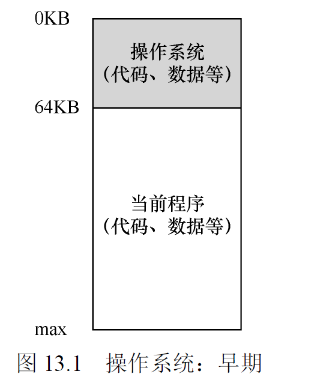

#### **详细说明**
- **机制**：程序加载到固定或动态分配的物理内存地址。例如，程序 A 可能加载到 0x1000，程序 B 加载到 0x2000。
- **问题**：
  - **内存碎片**：程序分配和释放内存后，物理内存出现不连续的空闲块。例如，释放 0x1500-0x2000 的内存后，剩余空闲块可能太小，无法满足新请求。
  - **缺乏保护**：进程之间没有隔离，一个进程可能意外或恶意地覆盖另一个进程的内存。例如，程序 A 写入 0x2000 会破坏程序 B 的数据，导致崩溃或安全漏洞。
- **挑战**：操作系统需手动管理内存分配和保护，例如通过记录每个程序的内存范围，但这种方法效率低且在多任务环境下容易出错。
- **实际应用**：早期批处理系统（如 IBM 360）使用这种直接访问方式，限制了并发能力。

### **13.2 多道程序和时分共享**
#### **描述**
- **多道程序**：允许多个程序同时驻留内存，当一个程序等待 I/O 时，CPU 执行其他程序。
- **时分共享**：通过快速切换进程，为用户 Polling (Round-Robin) 调度实现交互式体验。

#### **详细说明**
- **多道程序**：提高了 CPU 利用率。例如，程序 A 等待磁盘读取时，CPU 可以运行程序 B。这种机制需要内存管理来确保程序的内存区域不重叠。
- **时分共享**：通过调度算法（如轮转调度），操作系统在短时间内（例如 10 毫秒）切换进程，用户感觉独占机器。例如，多个用户通过终端登录服务器，共享 CPU。
- **挑战**：需要高效的内存隔离机制（如基址/界限寄存器）以防止进程干扰，同时优化内存分配以支持更多程序。
- **实际应用**：Unix 和早期 minicomputers（如 PDP-11）采用时分共享，支持多用户交互。

### **13.3 地址空间的目标**
#### **描述**
地址空间的目标包括：
- **透明性**：程序员无需了解物理内存布局。
- **效率**：最大化 CPU 和内存资源使用。
- **保护**：防止进程间非法访问。

#### **详细说明**
- **透明性**：程序使用虚拟地址（如 0x1000），操作系统通过页表或段表转换为物理地址（如 0x5000）。例如，C 程序的指针操作基于虚拟地址，无需关心物理内存。
- **效率**：虚拟内存通过分页（固定大小页面）和交换（将不活跃页面移到磁盘）支持运行超出物理内存的程序。例如，1GB 物理内存可运行 2GB 程序。
- **保护**：硬件（如 MMU）通过权限位（读、写、执行）确保进程只能访问自己的地址空间。例如，试图写入只读页面会触发异常。
- **实际 application**：Linux 使用独立的地址空间支持数百个进程，保护用户数据和系统稳定性。

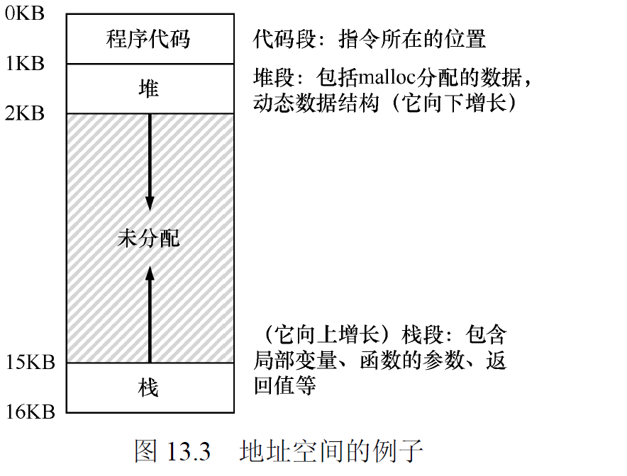

### **13.4 小结**
地址空间抽象为操作系统提供了实现透明性、效率和保护的基础。它简化了程序开发，提高了资源利用率。例如，现代操作系统通过地址空间支持复杂的多任务环境，而无需程序员手动管理内存。

---

## **第 14 章 插叙：内存操作 API**

### **14.1 内存类型**
#### **描述**
- **栈内存**：系统自动管理，用于局部变量和函数调用。
- **堆内存**：程序员手动管理，用于动态分配。

#### **详细说明**
- **栈内存**：遵循后进先出（LIFO）原则。函数调用时分配栈帧（局部变量、返回地址），返回时自动释放。栈大小有限（例如 Linux 默认 8MB）。
  - **示例**：
    ```c
    void func() {
        int x = 10; // 栈上分配
    }
    ```
- **堆内存**：通过 API（如 `malloc()` 和 `free()`）分配，生命周期由程序员控制。适合动态数据结构（如链表、数组）。
  
  - **示例**：
    ```c
    int *arr = malloc(10 * sizeof(int)); // 堆上分配
    ```
- **挑战**：栈溢出（递归过深）和堆内存泄漏是常见问题。

### **14.2 `malloc()` 调用**
#### **描述**
`malloc()` 从堆中分配指定大小的内存块。

#### **示例**
```c
void *ptr = malloc(10 * sizeof(int)); // 分配 40 字节（假设 int 为 4 字节）
```

#### **详细说明**
- **机制**：`malloc()` 返回虚拟地址，操作系统将其映射到物理内存。如果堆空间不足，操作系统通过 `sbrk` 或 `mmap` 系统调用扩展堆。
- **注意**：分配失败返回 `NULL`，需检查返回值。例如：
  
  ```c
  if (ptr == NULL) { printf("内存分配失败\n"); exit(1); }
  ```
- **实际应用**：`malloc()` 用于动态数组、结构体等。例如，Web 服务器动态分配请求缓冲区。
- **挑战**：频繁分配可能导致碎片，影响性能。

### **14.3 `free()` 调用**
#### **描述**
`free()` 释放通过 `malloc()` 分配的内存。

#### **示例**
```c
free(ptr); // 释放 ptr 指向的内存
```

#### **详细说明**
- **机制**：通知操作系统内存可重用，更新空闲列表。`ptr` 值不变，建议置为 `NULL` 避免野指针。
  ```c
  free(ptr);
  ptr = NULL;
  ```
- **错误**：
  - 重复释放（如 `free(ptr); free(ptr);`）导致未定义行为。
  - 使用已释放内存（如 `*ptr = 5`）可能崩溃。
- **实际应用**：服务器程序需及时释放内存以支持长时间运行。

### **14.4 常见错误**
#### **描述**
- **内存泄漏**：分配后未释放内存。
- **野指针**：使用已释放内存。
- **缓冲区溢出**：写入超出分配范围。

#### **详细说明**
- **内存泄漏**：
  ```c
  ptr = malloc(100);
  ptr = NULL; // 100 字节泄漏
  ```
  - **影响**：耗尽内存，长期运行程序（如服务器）受影响。
  - **工具**：Valgrind 可检测泄漏。
- **野指针**：
  ```c
  free(ptr);
  *ptr = 5; // 未定义行为
  ```
  - **后果**：可能崩溃或损坏数据。
- **缓冲区溢出**：
  ```c
  int *arr = malloc(4);
  arr[10] = 1; // 越界写入
  ```
  - **后果**：破坏堆结构或触发安全漏洞（如栈溢出攻击）。
- **实际应用**：现代语言（如 Java）通过垃圾回收避免这些错误，但 C/C++ 需手动管理。

### **14.5 底层操作系统支持**
#### **描述**
- **brk 和 sbrk**：调整堆大小。
- **mmap**：映射文件或匿名内存。

#### **详细说明**
- **brk**：设置堆结束地址。例如，`brk(new_end)` 扩展堆到 `new_end`。
- **sbrk**：增减堆大小。例如，`sbrk(4096)` 增加 4KB。
- **mmap**：分配大块内存或共享内存。例如：
  ```c
  void *ptr = mmap(NULL, 4096, PROT_READ|PROT_WRITE, MAP_ANON|MAP_PRIVATE, -1, 0);
  ```
- **实际应用**：Linux 内核使用 `mmap` 分配用户空间内存，`sbrk` 较少使用。

### **14.6 其他调用**
#### **描述**
- **calloc**：分配并初始化为零。
- **realloc**：调整已分配内存大小。

#### **详细说明**
- **calloc**：
  ```c
  void *ptr = calloc(10, sizeof(int)); // 分配并清零
  ```
  - **优势**：确保内存初始化，适合安全敏感场景。
- **realloc**：
  ```c
  ptr = realloc(ptr, 20 * sizeof(int)); // 扩展到 20 个整数
  ```
  - **机制**：可能移动内存块，需更新指针。
  - **注意**：失败返回 `NULL`，需检查。
- **实际应用**：`realloc` 用于动态数组扩展，如处理可变长度输入。

### **14.7 小结**
内存操作 API 是用户与虚拟内存交互的关键。正确使用（如检查返回值、避免泄漏）对程序稳定性至关重要。例如，数据库系统需高效管理内存以支持高并发。

**思考问题**：
- 如何检测和修复内存泄漏？
- 垃圾回收与手动内存管理相比有何优劣？

**参考资料**：
- 《C Programming Language》 by Kernighan & Ritchie。
- Valgrind 文档。

---

## **第 15 章 机制：地址转换**

### **15.1 假设**
#### **描述**
- **虚拟地址**：进程使用的逻辑地址。
- **物理地址**：实际硬件内存地址.
- **地址转换**：将虚拟地址映射到物理地址。

#### **详细说明**
- **虚拟地址**：由程序生成，如指针地址（`&x`）。例如，`0x1000` 是虚拟地址。
- **物理地址**：硬件访问的实际内存位置。例如，`0x5000` 是物理地址。
- **机制**：MMU（内存管理单元）通过页表或段表完成转换。
- **目的**：实现隔离（进程独立地址空间）和优化（非连续内存分配）。
- **实际 application**：Linux 使用分页，每个进程有独立虚拟地址空间。

### **15.2 一个例子**
#### **描述**
虚拟地址 `0x1000` 可能映射到物理地址 `0x2000`.

#### **详细说明**
- **机制**：假设页面大小 4KB，虚拟地址 `0x1000` 的页号为 1，偏移为 0。页表将虚拟页 1 映射到物理页 2（地址 `0x2000`）。
- **示例**：
  ```c
  int x; // 虚拟地址 0x1000
  x = 5; // MMU 转换为物理地址 0x2000
  ```
- **挑战**：每次内存访问需转换，增加延迟，需 TLB 优化。

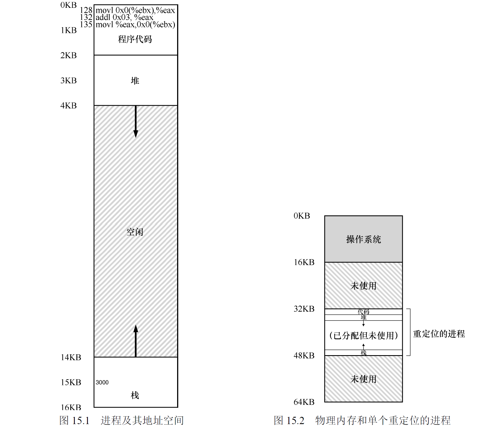

### **15.3 动态（基于硬件）重定位**
#### **描述**
通过基址寄存器和界限寄存器完成地址转换。

#### **公式**
```c
物理地址 = 虚拟地址 + 基址寄存器值（若 虚拟地址 < 界限寄存器值）
```

#### **详细说明**
- **基址寄存器**：存储进程地址空间在物理内存的起始地址。例如，基址 `0x4000`，虚拟地址 `0x1000` 转换为 `0x5000`.
- **界限寄存器**：限制访问范围。例如，界限 `0x2000`，虚拟地址 `0x3000` 触发越界异常。
- **硬件支持**：MMU 检查虚拟地址合法性，转换地址。
- **局限**：要求连续内存分配，易产生碎片，不适用于现代系统。
- **实际 application**：早期系统（如 PDP-8）使用重定位，现代系统用分页。

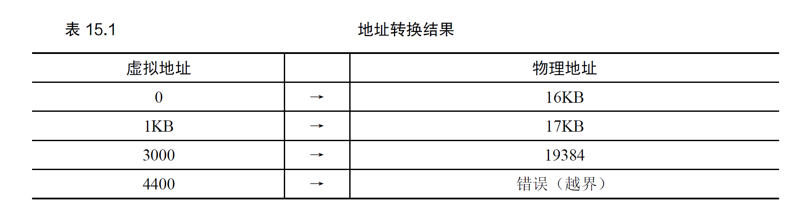

### **15.4 硬件支持：总结**
#### **描述**
- **MMU**：负责实时地址转换。
- **保护位**：限制非法访问。

#### **详细说明**
- **MMU**：集成在 CPU 中，解析虚拟地址，查页表。例如，Intel x86 MMU 使用 CR3 寄存器指向页表。
- **保护位**：包括读、写、执行权限。例如，试图写入只读页面触发异常。
- **实际 application**：ARM 和 x86 架构的 MMU 支持多级页表和权限检查。

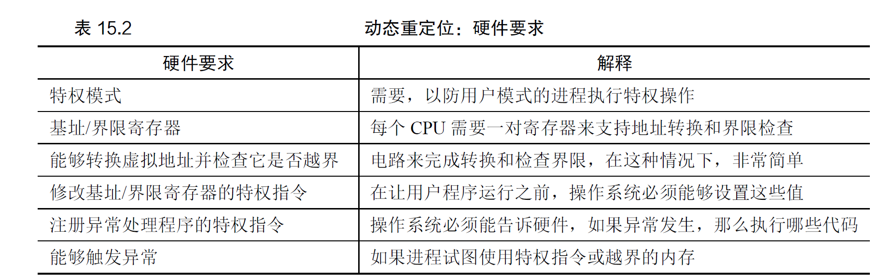

### **15.5 操作系统的问题**
#### **描述**
- **管理空闲空间**：跟踪和分配未使用内存。
- **保护进程**：确保隔离。

#### **详细说明**
- **空闲空间**：使用位图或空闲列表。例如，位图中 `1` 表示已分配，`0` 表示空闲。
- **保护**：通过页表权限和独立地址空间实现。例如，进程 A 和 B 的页表互不重叠。
- **挑战**：分配效率和碎片管理影响性能。

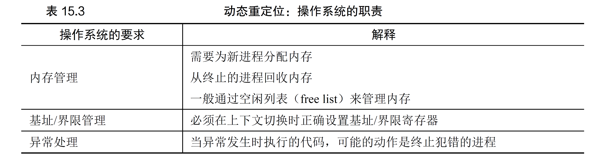

### **15.6 小结**
地址转换是虚拟内存的核心，依赖硬件（如 MMU）和操作系统协作。优化（如 TLB 和多级页表）显著提升性能。例如，现代 CPU 的 TLB 缓存减少了页表查询延迟。

**思考问题**：
- 基址/界限机制为何被分页取代？
- 地址转换如何影响实时系统？

**参考资料**：
- Intel x86 架构手册（MMU 和分页）。
- Linux 内核内存管理文档。

---

## **第 16 章 分段**

### **16.1 分段：泛化的基址/界限**
#### **描述**
分段将地址空间划分为逻辑段（如代码段、数据段、栈段），支持非连续内存分配。

#### **详细说明**
- **机制**：每个段有独立的基址和界限寄存器。例如，代码段基址 `0x1000`，界限 `0x1000`。
- **优势**：
  - 灵活性：段可独立分配和增长。
  - 减少外部碎片：非连续分配。
- **局限**：仍可能产生外部碎片，需内存整理。
- **实际 application**：x86 早期使用分段（如实模式），现多用分页。

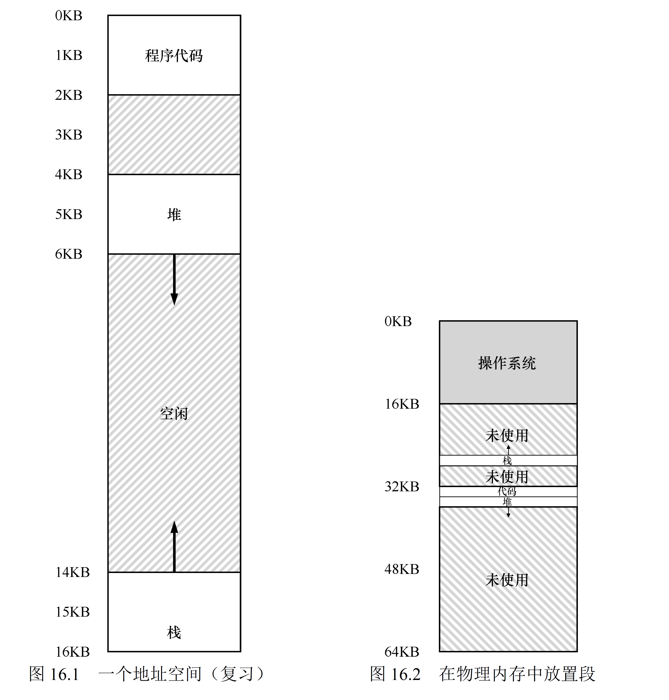

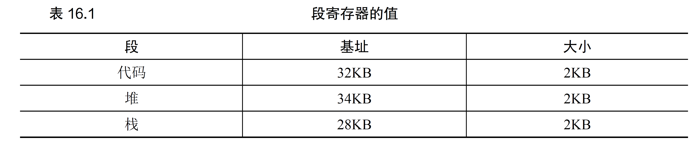

### **16.2 我们引用哪个段**

#### **描述**
- **段寄存器**：指示当前段。
- **地址格式**：`段号 + 偏移量`.

#### **详细说明**
- **机制**：虚拟地址分为段号和偏移。例如，`0x021000` 表示段 2 偏移 `0x1000`。
- **转换**：MMU 使用段号查找段表，计算物理地址：
  
  ```c
  物理地址 = 段基址 + 偏移（若 偏移 < 界限）
  ```
- **实际 application**：x86 的段寄存器（如 CS、DS）用于区分代码和数据段。

### **16.3 栈怎么办**
#### **描述**
栈段从高地址向低地址增长。

#### **详细说明**
- **机制**：栈基址为段末尾，界限为起始。例如，基址 `0xFFFF`，界限 `0xF000`，栈指针递减。
- **示例**：函数调用分配栈帧，栈指针减小：
  ```c
  void func() { int x; } // 栈指针减小分配 x
  ```
- **挑战**：栈溢出需检测（如 Linux 的栈保护）。


### **16.4 支持共享**
#### **描述**
共享段允许多个进程共享内存（如库代码）。

#### **详细说明**
- **机制**：共享段在物理内存中只有一份，多个进程的段表指向同一地址。例如，`libc` 代码共享于所有进程。
- **优势**：节省内存，提高效率。
- **实际 application**：Linux 使用动态链接库（如 `libc.so`）实现共享。

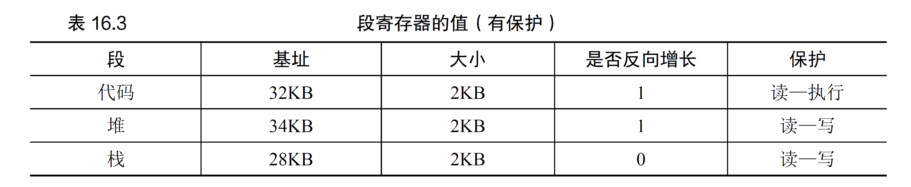

### **16.5 细粒度与粗粒度的分段**
#### **描述**
- **细粒度**：更多小段，灵活但复杂。
- **粗粒度**：较少大段，简单但灵活性低。

#### **详细说明**
- **细粒度**：适合动态需求，但段表开销大。例如，每个函数一个段。
- **粗粒度**：管理简单，但可能导致内部碎片。例如，单一数据段未完全使用。
- **实际 application**：现代系统倾向粗粒度（如代码、数据、栈三段）。

### **16.6 操作系统支持**
#### **描述**
- **段表**：记录段的基址和界限。
- **上下文切换**：保存和恢复段寄存器。

#### **详细说明**
- **段表**：存储在进程控制块（PCB）中。例如，段 0 基址 `0x1000`，界限 `0x2000`。
- **上下文切换**：切换进程时更新段寄存器。例如，进程 A 到 B 更新 CS、DS。
- **实际 application**：x86 的 GDT（全局描述符表）存储段信息。

### **16.7 小结**
分段提供灵活的内存管理，但外部碎片问题促使现代系统转向分页。例如，Linux 仅在特定场景（如内核态）使用分段。

**思考问题**：
- 分段与分页相比有何优劣？
- 如何优化分段的碎片问题？

**参考资料**：
- x86 架构手册（段机制）。
- 《Modern Operating Systems》 by Tanenbaum。

---

## **第 17 章 空闲空间管理**

### **17.1 假设**
#### **描述**
- **空闲列表**：记录未分配内存。
- **分配策略**：决定选择哪个内存块。

#### **详细说明**
- **空闲列表**：可用链表（记录块地址和大小）、位图（标记空闲状态）或树实现。
- **策略**：影响碎片和分配速度。例如，最佳适应减少碎片，但搜索慢。
- **实际 application**：Linux 内核使用位图和链表管理空闲页面。

### **17.2 底层机制**
#### **描述**
- **分裂**：分割大块内存。
- **合并**：合并相邻空闲块。

#### **详细说明**
- **分裂**：请求 10KB，空闲块 20KB，分割为 10KB（分配）和 10KB（空闲）。
- **合并**：释放一块内存，检查左右相邻块。例如，合并 `0x1000-0x2000` 和 `0x2000-0x3000` 为 `0x1000-0x3000`.
- **挑战**：频繁分裂合并增加管理开销。
- **实际 application**：Linux 的页面分配器自动合并空闲页面。

### **17.3 基本策略**
#### **描述**
- **最佳适应**：选择最小足够块。
- **最差适应**：选择最大块。
- **首次适应**：选择第一个足够块。
- **下次适应**：从上次结束处搜索。

#### **详细说明**
- **最佳适应**：减少碎片，需遍历列表。例如，请求 5KB，选择 6KB 而非 10KB。
- **最差适应**：快速分配大块，但易产生小碎片。例如，10KB 请求从 100KB 分配。
- **首次适应**：简单，但前部易碎片化。例如，从头找到第一个 10KB 块。
- **下次适应**：减少搜索时间，但可能错过最佳块。
- **实际 application**：Linux 内存分配器倾向首次适应，简单高效。

### **17.4 其他方式**
#### **描述**
- **伙伴系统**：按 2 的幂分割内存。
- **slab 分配器**：优化特定对象分配。

#### **详细说明**
- **伙伴系统**：内存分为 2^n 大小块，分配时找最近匹配。例如，8KB 请求分配 16KB 块，剩余 8KB 为伙伴。
  - **优势**：快速合并，减少碎片。
  - **实际 application**：Linux 内核使用伙伴系统分配页面。
  - 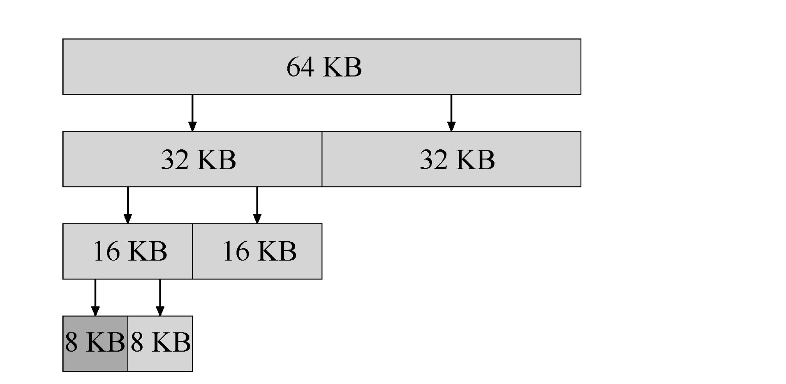
- **slab 分配器**：为内核对象（如进程描述符）预分配内存。例如，预分配 128 字节块，快速分配和释放。
  - **实际 application**：Linux 的 slab 层优化小对象分配。
- **挑战**：伙伴系统不适合非 2^n 大小请求，slab 需预分配空间。

### **17.5 小结**
空闲空间管理影响内存分配效率和碎片。现代系统结合伙伴系统和 slab 分配器，优化不同场景。例如，Linux 内核平衡通用性和性能。

**思考问题**：
- 如何权衡分配速度和碎片？
- 伙伴系统如何适应动态负载？

**参考资料**：
- Linux 内核源代码（mm/ 目录）。
- 《Understanding the Linux Kernel》 by Bovet & Cesati。

---

## **第 18 章 分页：介绍**

### **18.1 一个简单例子**
#### **描述**
分页将地址空间分为固定大小页面，页表记录虚拟页到物理页的映射。

#### **详细说明**
- **机制**：页面大小通常 4KB，虚拟地址分为页号和偏移。例如，`0x1234` 的页号为 `0x1`，偏移为 `0x234`.
- **页表**：存储映射关系。例如，虚拟页 1 映射到物理页 5（地址 `0x5000`）。
- **优势**：
  - 消除外部碎片：页面可任意分配。
  - 简化分配：固定大小页面。
- **局限**：页表查询开销和内部碎片（页面未完全使用）。
- **实际 application**：Linux 和 Windows 使用 4KB 页面分页。

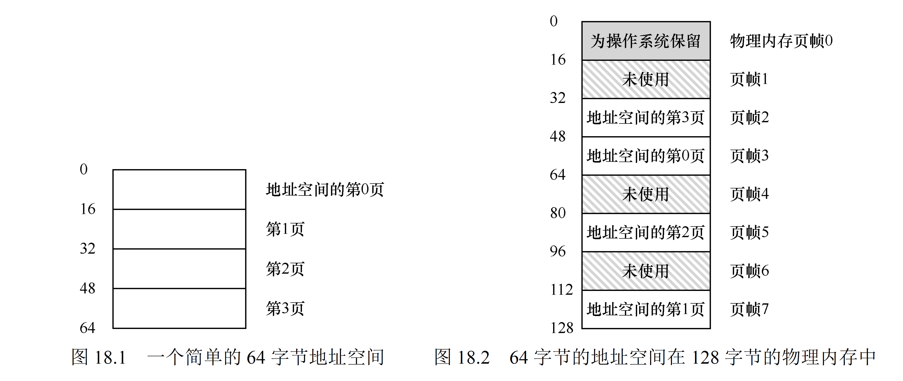

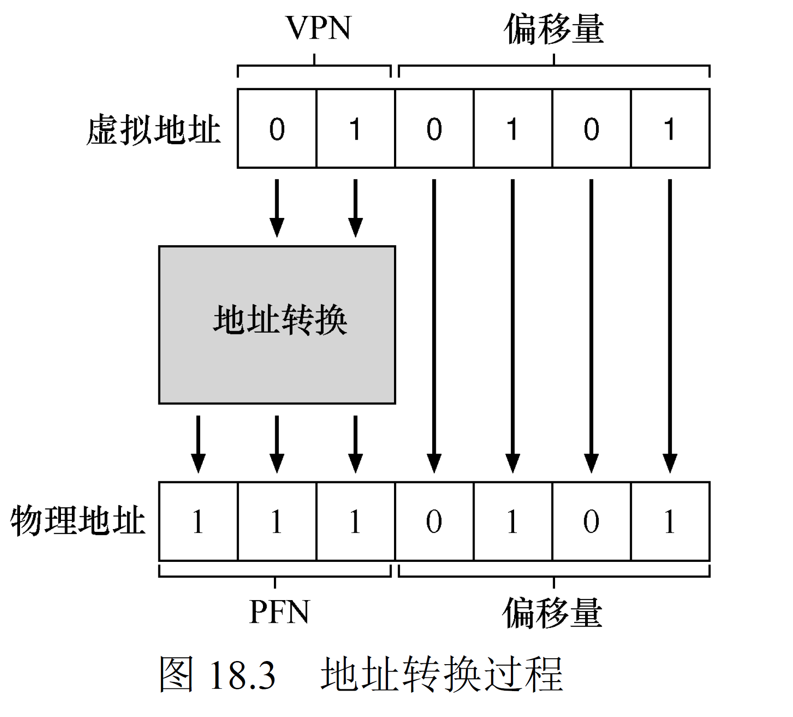

### **18.2 页表存在哪里**

#### **描述**
页表存储在内存中，由页表寄存器指向。

#### **详细说明**
- **管理**：每个进程有独立页表，上下文切换时更新页表寄存器（例如 x86 的 CR3）。
- **开销**：页表占用内存。例如，32 位系统、4KB 页面需 4MB 页表（2^20 页 × 4 字节/项）。
- **实际 application**：Linux 内核为每个进程分配页表，存储在内核空间。

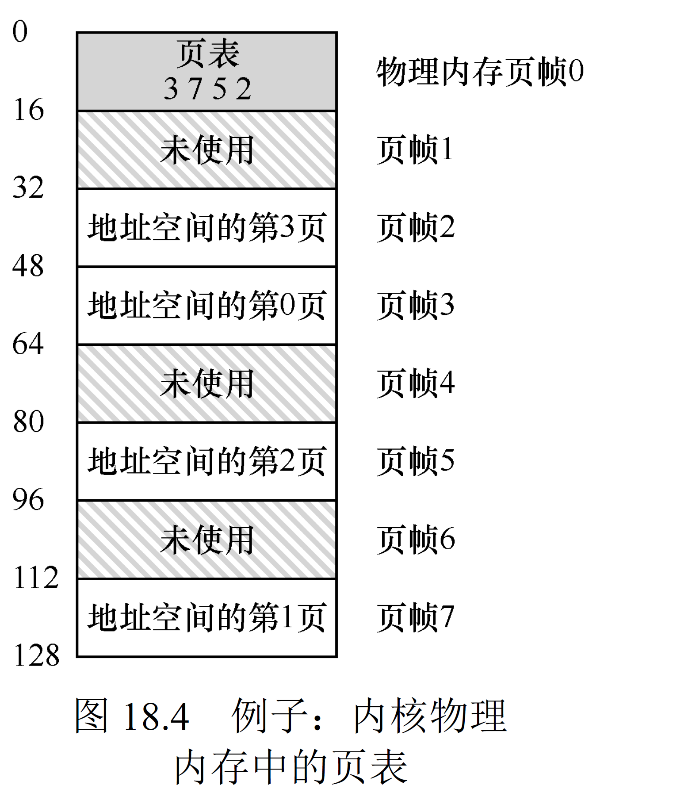

### **18.3 列表中究竟有什么**
#### **描述**
页表项（PTE）包括物理页框号和权限位。

#### **详细说明**
- **内容**：
  - 物理页框号(PFN)：目标物理页面地址。
  - 权限位(R/W)：读、写、执行。
  - 状态位：存在位(P)（页面是否在内存）、脏位(D)（是否修改）、访问位(A)（是否访问）。
  - 用户/超级用户位(U/S)：定用户模式进程是否可以访问该页面。
- **示例**：PTE 表示虚拟页 1 映射到物理页 10，权限为读写，存在位为 1。
- **实际 application**：x86 PTE 包含 20 位页框号和多位标志。

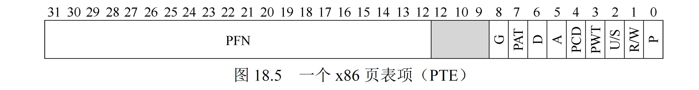

### **18.4 分页：也很慢**
#### **描述**
每次内存访问需查页表，增加延迟，TLB 缓存解决此问题。

#### **详细说明**
- **问题**：查页表需一次内存访问，延迟翻倍。例如，内存访问从 10ns 增至 20ns。
- **TLB**：缓存最近 PTE，命中时转换时间接近 1ns。
- **挑战**：TLB 容量有限，未命中仍需查页表。
- **实际 application**：现代 CPU 的 TLB 容量为 64-512 条目。

### **18.5 内存追踪**
#### **描述**
操作系统记录页面使用情况，支持替换策略。

- 追踪该程序

```c++
int array[1000];
...
for (i = 0; i < 1000; i++)
array[i] = 0;


0x1024 movl $0x0,(%edi,%eax,4)
0x1028 incl %eax
0x102c cmpl $0x03e8,%eax
0x1030 jne 0x1024
```

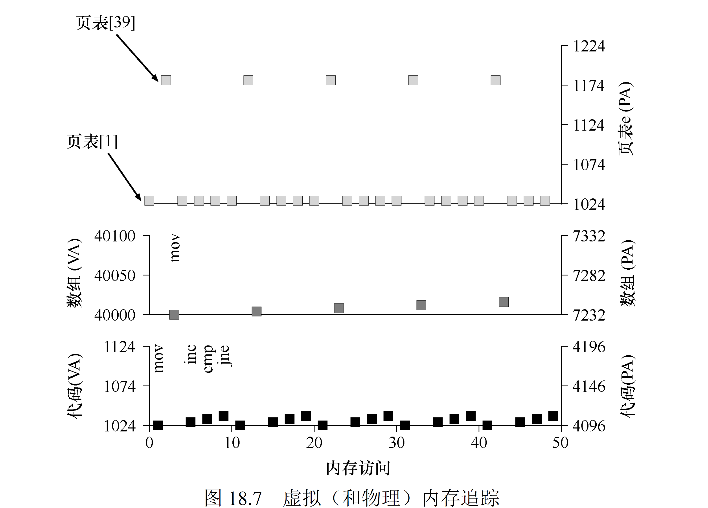

#### **详细说明**
- **机制**：PTE 的访问位和脏位记录页面状态。例如，访问位为 1 表示最近使用。
- **用途**：支持 LRU（最近最少使用）算法，选择替换页面。
- **实际 application**：Linux 使用页面引用计数优化替换。

### **18.6 小结**
分页消除外部碎片，但页表查询开销需优化。TLB 和多级页表是现代系统的关键。例如，Linux 的分页系统支持高效内存管理。

**思考问题**：
- 分页如何影响内存分配效率？
- 页面大小如何影响性能？

**参考资料**：
- Intel x86 分页文档。
- Linux 内核分页实现。

---

## **第 19 章 分页：快速地址转换 (TLB)**

### **19.1 TLB 的基本算法**
#### **描述**
TLB（Translation Lookaside Buffer）缓存最近使用的页表项，命中时直接转换，未命中时查页表。

#### **详细说明**
- **流程**：
  1. 解析虚拟地址（页号 + 偏移）。
  2. 查 TLB：
     - 命中：获取物理页框号，计算物理地址。
     - 未命中：查页表，更新 TLB。
- **结构**：TLB 为全关联或组关联缓存。例如，64 条目 TLB 缓存 64 个 PTE。
- **性能**：TLB 命中率高达 99%，显著降低延迟。
- **实际 application**：x86 CPU 的 L1 TLB 通常有 64 条目。

```c++
VPN = (VirtualAddress & VPN_MASK) >> SHIFT
(Success, TlbEntry) = TLB_Lookup(VPN)
if (Success == True) // TLB Hit
	if (CanAccess(TlbEntry.ProtectBits) == True)
		Offset = VirtualAddress & OFFSET_MASK
		PhysAddr = (TlbEntry.PFN << SHIFT) | Offset
		AccessMemory(PhysAddr)
	else
		RaiseException(PROTECTION_FAULT)
else // TLB Miss
	PTEAddr = PTBR + (VPN * sizeof(PTE))
	PTE = AccessMemory(PTEAddr)
    if (PTE.Valid == False)
		RaiseException(SEGMENTATION_FAULT)
	else if (CanAccess(PTE.ProtectBits) == False)
		RaiseException(PROTECTION_FAULT)
	else
		TLB_Insert(VPN, PTE.PFN, PTE.ProtectBits)
		RetryInstruction()
```


### **19.2 示例：访问数组**
#### **描述**
数组访问因空间局部性，TLB 命中率高。

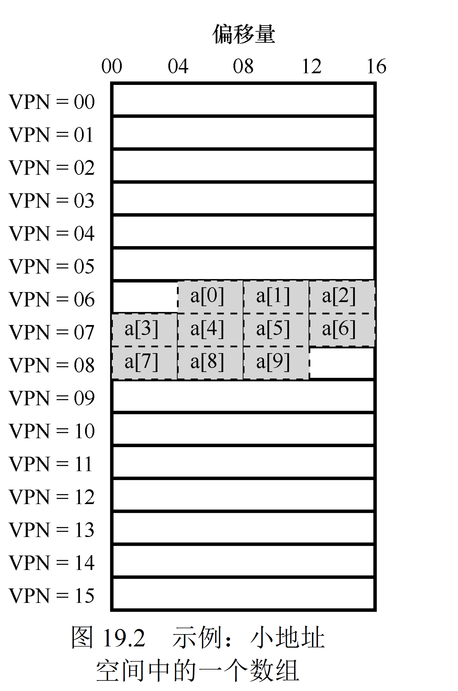

#### **详细说明**
- **局部性**：连续访问 `arr[0]` 到 `arr[10]` 可能在同一 4KB 页面，TLB 一次填充即可。
- **示例**：4KB 页面容纳 1024 个 int，顺序访问只需 1 次 TLB 填充。
- **挑战**：随机访问可能导致频繁未命中。
- **实际 application**：数据库查询优化数组访问以提高 TLB 命中率。

### **19.3 谁来处理 TLB 未命中**
#### **描述**
- **硬件处理**：简单系统由 MMU 完成。
- **软件处理**：操作系统介入。

#### **详细说明**
- **硬件**：MMU 直接查页表，适用于单级页表。例如，早期 RISC 系统。
- **软件**：操作系统处理复杂情况，如多级页表或页面不在内存。触发异常，内核更新 TLB。
- **实际 application**：x86 使用硬件处理，ARM 支持软件处理。

### **19.4 TLB 的内容**
#### **描述**
TLB 项包括虚拟页号、物理页框号、权限位等。


#### **详细说明**
- **内容**：
  - 虚拟页号：匹配虚拟地址。
  - 物理页框号：目标地址。
  - 权限：读、写、执行。
  - ASID（地址空间标识符）：区分进程。
- **示例**：TLB 项表示虚拟页 1（ASID=1）映射到物理页 10，读写权限。
- **实际 application**：ARM TLB 包含 ASID 字段，支持多进程缓存。

### **19.5 上下文切换时对 TLB 的处理**
#### **描述**
- **问题**：进程切换可能导致 TLB 冲突。（不同进程相同VPN映射到不同的PFN）
- **解决方案**：
  - 刷新 TLB。
  - 使用 ASID。

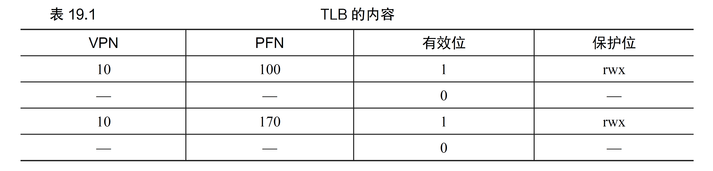

#### **详细说明**
- **刷新 TLB**：清空所有条目，开销大。例如，切换进程后重新填充 TLB。
- **ASID**：标记进程 ID，保留 TLB 项。例如，ASID=1 的条目属于进程 A。
- **实际 application**：x86 使用 PCID（类似 ASID），Linux 优化上下文切换。

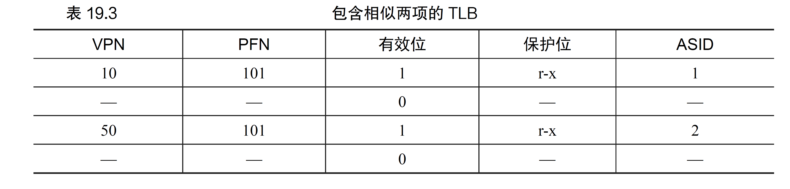

### **19.6 TLB 替换策略**
#### **描述**
- **LRU**：替换最近最少使用项。
- **随机**：随机替换。

#### **详细说明**
- **LRU(least-recently-used)**：记录访问顺序，命中率高，但硬件开销大。
- **随机**：简单，适用于小 TLB，效果较差。
- **实际 application**：现代 CPU 常使用近似 LRU（如伪 LRU）。

### **19.7 实际系统的 TLB 表项**
#### **描述**
支持大页、多级缓存等优化。

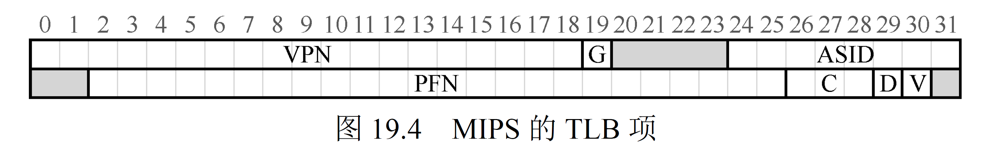

#### **详细说明**
- **大页**：2MB 或 1GB 页面减少 TLB 条目需求。
- **多级 TLB**：L1 TLB 快速（10-20 周期），L2 TLB 容量大（100 周期）。
- **实际 application**：Intel Skylake CPU 有 64 条目 L1 TLB 和 1536 条目 L2 TLB。

### **19.8 小结**
TLB 显著提升地址转换速度，是分页系统的核心。高命中率使内存访问延迟接近物理内存。例如，现代 CPU 的 TLB 优化支持高性能计算。

**思考问题**：
- TLB 命中率如何影响程序性能？
- 大页如何优化 TLB 使用？

**参考资料**：
- Intel 优化手册（TLB 部分）。
- ARM 架构参考手册。

---

## **第 20 章 分页：较小的表**

### **20.1 简单的解决方案：更大的页**
#### **描述**
大页减少页表项，但增加内部碎片。

#### **详细说明**
- **机制**：2MB 或 1GB 页面。例如，32 位系统 2MB 页面只需 2K 页表项（vs 4MB for 4KB 页面）。
- **优势**：减少页表大小，降低 TLB 压力。
- **问题**：内部碎片。例如，分配 2MB 页面仅用 1KB，浪费内存。
- **实际 application**：Linux 支持 HugeTLB，数据库使用大页优化性能。

### **20.2 多级页表**

#### **描述**
将页表分级，仅加载需要的部分。

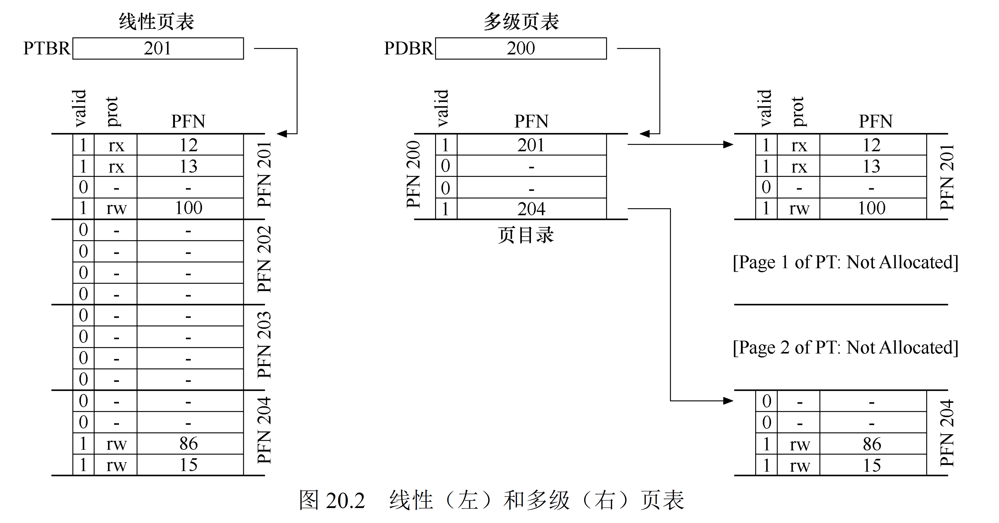

#### **详细说明**
- **结构**：两级页表含页目录和页表。例如，页目录指向多个页表，页表含 PTE。
- **优势**：未使用地址空间无需分配页表，节省内存。例如，稀疏地址空间只需少量页表。
- **示例**：x86 两级页表，32 位系统页目录含 1024 项，每项指向 4KB 页表。
- **挑战**：增加查询延迟（多次内存访问）。
- **实际 application**：Linux 和 Windows 使用 4 级页表（64 位系统）。

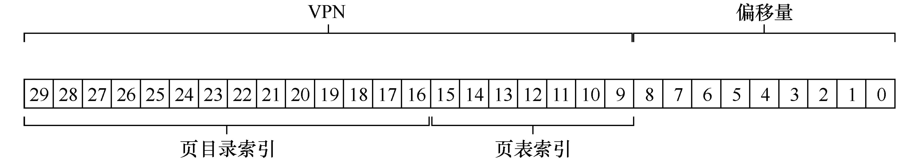

### **20.3 反向页表**
#### **描述**
以物理页为索引，记录虚拟页。

#### **详细说明**
- **机制**：页表大小与物理内存成正比。例如，1GB 内存、4KB 页面需 256K 项。
- **优势**：适合大地址空间，节省内存。
- **问题**：查找效率低，需搜索整个表（可用哈希表优化）。
- **实际 application**：PowerPC 和 SPARC 架构使用反向页表。

### **20.4 将页表交换到磁盘**
#### **描述**
不活跃页表项移到磁盘。

#### **详细说明**
- **机制**：内存压力大时交换页表。例如，进程休眠时其页表移出。
- **问题**：访问时需从磁盘加载，延迟高（毫秒级）。
- **实际 application**：Linux 支持页表交换，但谨慎使用以避免性能下降。

### **20.5 混合方法：分页和分段**
#### **描述**
结合分段灵活性和分页效率。

#### **详细说明**
- **机制**：虚拟地址先分段生成线性地址，再分页。例如，x86 段基址加偏移生成线性地址，分页映射到物理地址。
- **优势**：逻辑划分清晰，碎片少。
- **问题**：增加复杂性，需管理段表和页表。
- **实际 application**：x86 保护模式使用段页式管理。

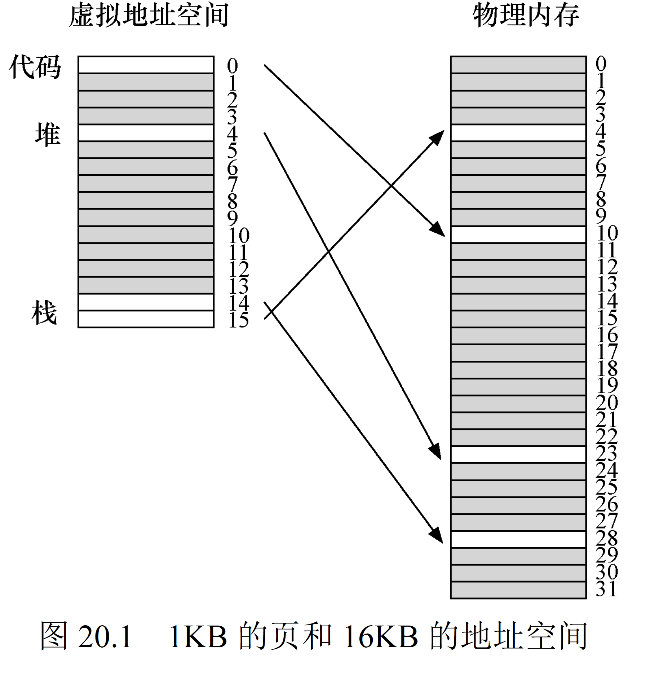

### **20.6 小结**
优化页表大小提升性能。多级页表和大页平衡内存和效率。例如，Linux 的 4 级页表支持 64 位地址空间的高效管理。

**思考问题**：
- 多级页表如何影响查询性能？
- 大页适合哪些应用场景？

**参考资料**：
- x86 64 位分页文档。
- Linux HugeTLB 实现。

---

## **第 21 章 超越物理内存：机制**

### **21.1 超越物理内存**
#### **描述**
虚拟内存支持超出物理内存的地址空间，通过交换实现。

#### **详细说明**
- **机制**：不活跃页面移到磁盘。例如，1GB 物理内存运行 2GB 程序。
- **优势**：支持大型程序和多任务。
- **问题**：磁盘 I/O 延迟高（毫秒级 vs 内存的纳秒级）。
- **实际 application**：Linux 使用交换分区支持内存扩展。

### **21.2 交换空间**
#### **描述**
磁盘上存储交换页的区域。

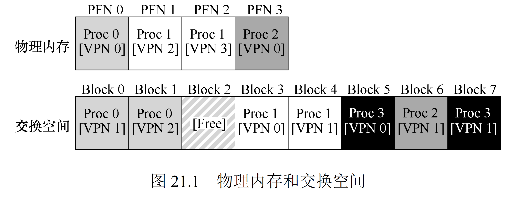

#### **详细说明**
- **管理**：可为分区或文件。例如，Linux 用 `swap` 分区。
- **大小**：通常设为物理内存的 1-2 倍。例如，4GB 内存配 4-8GB 交换空间。
- **挑战**：过度依赖交换降低性能。
- **实际 application**：Linux 的 `swapon` 命令启用交换分区。

### **21.3 存在位**
#### **描述**
指示页面是否在内存（1=内存，0=磁盘）。

#### **详细说明**
- **位置**：存储在 PTE 中。
- **作用**：存在位为 0 触发页错误。
- **示例**：PTE 存在位为 0，表示页面在磁盘，需加载。
- **实际 application**：Linux PTE 使用存在位管理页面状态。

### **21.4 页错误**
#### **描述**
访问不在内存的页面时触发。

#### **详细说明**
- **类型**：
  - **硬错误**：页面在磁盘，需加载。
  - **软错误**：页面未映射但在内存（如写时复制）。
- **触发**：存在位为 0 或权限不符。
- **实际 application**：Linux 的页错误处理优化内存分配。

### **21.5 页错误处理流程**
#### **描述**
1. 硬件检测页错误，陷入内核。
2. 定位页面（磁盘）。
3. 选择物理页框（可能替换页面）。
4. 从磁盘读取页面。
5. 更新页表，设置存在位。
6. 返回用户空间，重试指令。

```c++
VPN = (VirtualAddress & VPN_MASK) >> SHIFT
(Success, TlbEntry) = TLB_Lookup(VPN)
if (Success == True) // TLB Hit
	if (CanAccess(TlbEntry.ProtectBits) == True)
		Offset = VirtualAddress & OFFSET_MASK
		PhysAddr = (TlbEntry.PFN << SHIFT) | Offset
		Register = AccessMemory(PhysAddr)
	else
	RaiseException(PROTECTION_FAULT)
else // TLB Miss
	PTEAddr = PTBR + (VPN * sizeof(PTE))
	PTE = AccessMemory(PTEAddr)
	if (PTE.Valid == False)
		RaiseException(SEGMENTATION_FAULT)
	else
		if (CanAccess(PTE.ProtectBits) == False)
			RaiseException(PROTECTION_FAULT)
		else if (PTE.Present == True)
			// assuming hardware-managed TLB
			TLB_Insert(VPN, PTE.PFN, PTE.ProtectBits)
			RetryInstruction()
		else if (PTE.Present == False)
			RaiseException(PAGE_FAULT)
```


#### **详细说明**
- **步骤 **：替换页面使用 LRU 等策略。
- **瓶颈**：磁盘 I/O 耗时（例如，4KB 页面加载需数毫秒）。
- **示例**：访问虚拟地址 `0x1000`，存在位为 0，内核从磁盘加载页面。
- **实际 application**：Linux 的 `do_page_fault` 函数处理页错误。

### **21.6 内存满了怎么办**
#### **描述**
页面替换将页面交换到磁盘。

#### **详细说明**
- **策略**：LRU 选择最近最少使用页面。
- **示例**：替换未访问的后台进程页面。
- **挑战**：选择不当导致频繁页错误。
- **实际 application**：Linux 使用 kswapd 守护进程管理页面替换。

### **21.7 交换何时真正发生**
#### **描述**
- **懒惰策略**：内存不足时交换。
- **预取**：提前加载页面。

#### **详细说明**
- **懒惰**：减少不必要 I/O。例如，仅在内存满时交换。
- **预取**：加载相邻页面，利用局部性。例如，顺序访问时预取下一页面。
- **实际 application**：Linux 的 `vm.swappiness` 参数控制交换倾向。

### **21.8 小结**
交换扩展内存，但需避免性能瓶颈。过度交换导致“抖动”（频繁页面交换）。例如，Linux 优化交换策略以平衡性能和容量。

**思考问题**：
- 交换如何影响实时系统？
- 如何优化交换空间大小？

**参考资料**：
- Linux 交换机制文档。
- 《Operating System Concepts》 by Silberschatz。

---

## **第 22 章 超越物理内存：策略**

### **22.1 缓存管理**
#### **描述**
虚拟内存视为物理内存的缓存，决定保留哪些页面。

#### **详细说明**
- **目标**：最大化缓存命中率，减少页错误。
- **核心**：页面替换策略。
- **实际 application**：Linux 的页面缓存管理优化内存使用。

### **22.2 最优替换策略**
#### **描述**
替换未来最晚使用的页面。

#### **详细说明**
- **理论**：需预测未来，仅作基准。例如，页面 A 下次访问在 10 秒后，B 在 1 秒后，替换 A。
- **局限**：实际无法预测。
- **实际 application**：用于评估其他策略效果。

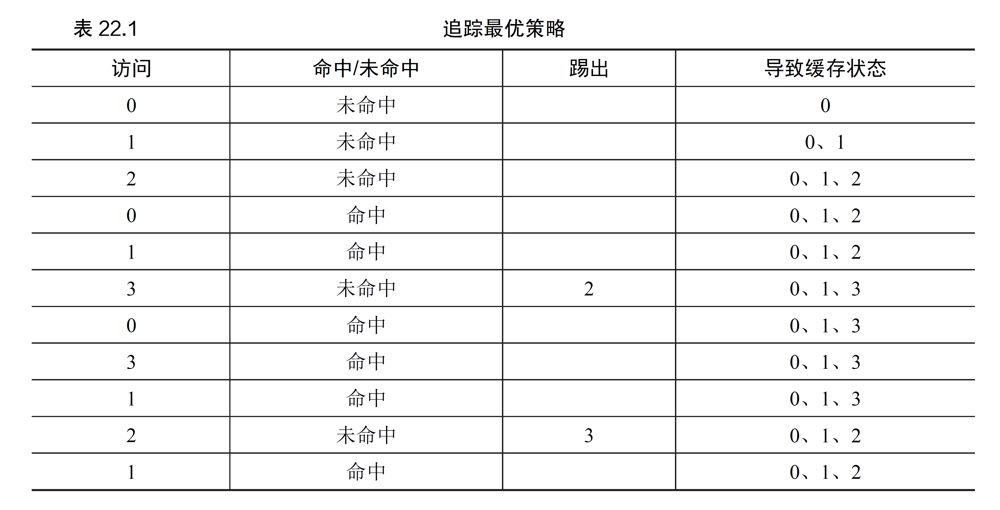

### **22.3 简单策略：FIFO**
#### **描述**
先入先出替换。

#### **详细说明**
- **机制**：用队列记录页面加载顺序。
- **问题**：忽略使用频率。例如，替换刚加载的活跃页面。
- **实际 application**：早期系统使用 FIFO，现代系统较少采用。

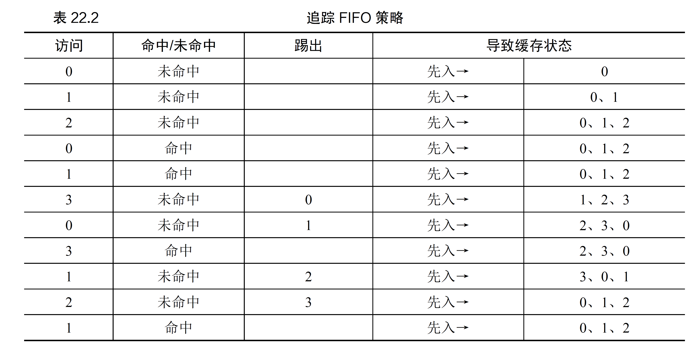

### **22.4 另一简单策略：随机**
#### **描述**
随机选择替换页面。

#### **详细说明**
- **优势**：实现简单，无需跟踪历史。
- **问题**：效果不稳定，可能替换活跃页面。
- **实际 application**：低负载场景可接受。

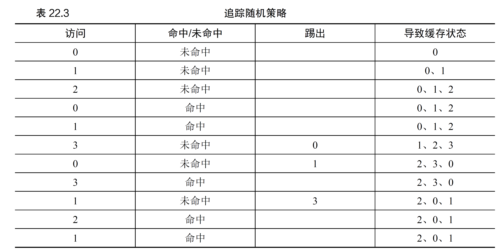

### **22.5 基于历史信息的算法**
#### **描述**
- **LRU**：替换最近最少使用页面。
- **LFU(least-frequently-used)**：替换使用频率最低页面。

#### **详细说明**
- **LRU**：利用时间局部性。例如，替换 5 分钟未用页面。
- **LFU**：适合稳定访问模式，但需维护频率计数。
- **挑战**：历史记录增加开销。
- **实际 application**：Linux 近似 LRU，优化替换效率。

### **22.6 利用历史数据：LRU**
#### **描述**
记录访问时间，近似如时钟算法。

#### **详细说明**
- **精确 LRU**：维护时间戳，开销大。
- **时钟算法**：用引用位模拟，指针循环检查：
  - 引用位为 1：清 0，跳过。
  - 引用位为 0：替换。
- **实际 application**：Linux 的时钟算法（CLOCK-Pro）高效实现 LRU。

### **22.7 工作负载示例**
#### **描述**
程序访问具局部性，LRU 利用此特性。

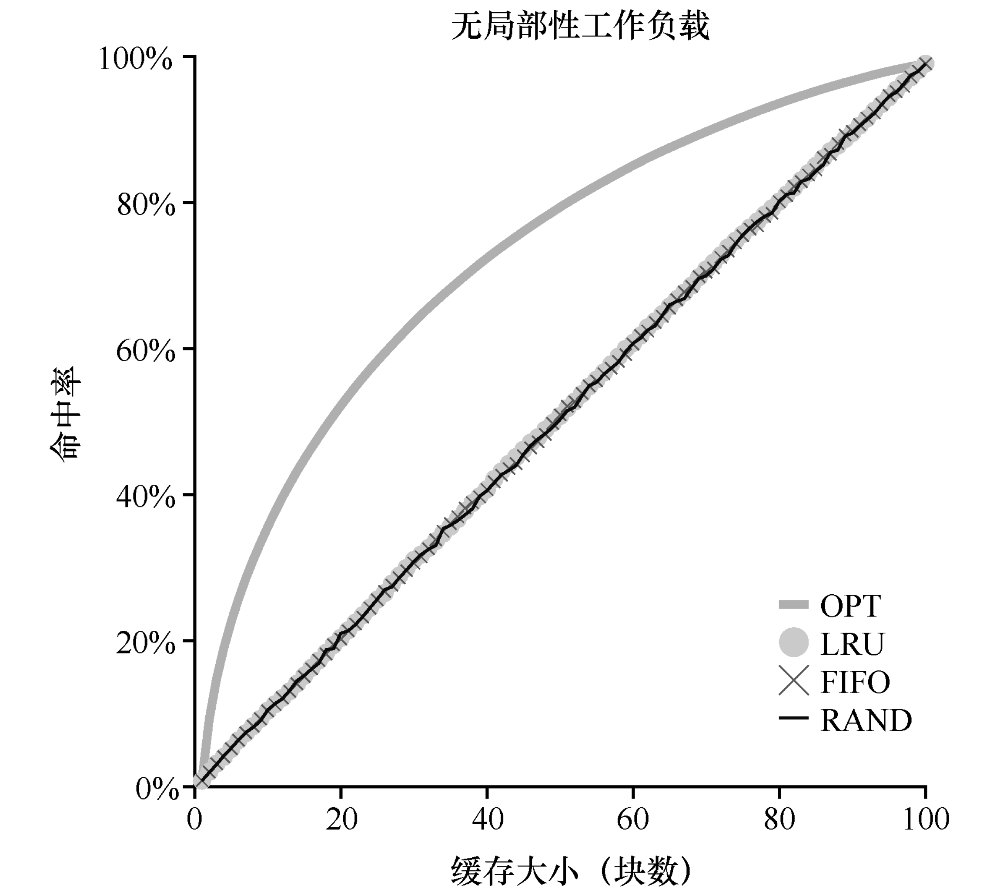

#### **详细说明**
- **时间局部性**：最近访问页面易再访问。例如，循环变量。
- **空间局部性**：相邻页面常一起访问。例如，数组遍历。
- **示例**：顺序访问数组，LRU 保留活跃页面，减少页错误。
- **实际 application**：数据库优化访问模式以提高局部性。

### **22.8 考虑脏页**
#### **描述**
脏页（已修改）替换需写回磁盘，优先替换干净页面。

#### **详细说明**
- **优化**：干净页面直接覆盖，减少 I/O。
- **脏位**：PTE 标记修改状态。例如，脏位为 1 表示需写回。
- **实际 application**：Linux 优先替换干净页面，优化交换性能。

### **22.9 基于近似 LRU 的实现**
#### **描述**
时钟算法用引用位模拟 LRU。

#### **详细说明**
- **机制**：访问时置引用位为 1，替换时清 0 或替换。
- **优势**：硬件支持简单，效率高。
- **实际 application**：Linux 的页面替换算法基于时钟变种。

### **22.10 其他虚拟内存策略**
#### **描述**
- **预取**：提前加载页面。
- **群集**：加载多个相关页面。

#### **详细说明**
- **预取**：预测未来访问。例如，顺序访问时加载下一页面。
- **群集**：一次性加载相邻页面。例如，加载 4KB 页面组。
- **实际 application**：Linux 的 readahead 机制实现预取。

### **22.11 抖动**
#### **描述**
内存压力下频繁交换，导致性能下降。

#### **详细说明**
- **原因**：工作集超出物理内存。例如，运行多个大型程序。
- **预防**：
  - 限制进程数量。
  - 增加物理内存。
  - 调整调度策略。
- **实际 application**：Linux 的 OOM（Out-Of-Memory）杀手终止进程以防抖动。

### **22.12 小结**
页面替换策略影响虚拟内存性能。LRU 结合预取优化大多数场景。例如，Linux 的缓存管理平衡命中率和 I/O 开销。

**思考问题**：
- 如何检测和预防抖动？
- LRU 与 LFU 在何种场景下更优？

**参考资料**：
- Linux 页面替换算法文档。
- 《Computer Architecture》 by Hennessy & Patterson。

---

## **第 23 章 VAX/VMS 虚拟内存系统**

### **23.1 背景**
#### **描述**
VAX/VMS 是 DEC 公司开发的操作系统，展示虚拟内存应用。

#### **详细说明**
- **历史**：20 世纪 70-80 年代开发，运行于 VAX 架构，影响现代系统（如 Windows NT）。
- **特点**：支持多用户、虚拟内存和可靠性。
- **实际 application**：用于企业计算和科学计算。

### **23.2 内存管理硬件**
#### **描述**
采用段页式管理，多级页表。

#### **详细说明**
- **机制**：虚拟地址先分段生成线性地址，再分页。
- **结构**：两级页表（页目录 + 页表）。
- **优势**：灵活性和效率兼顾，段支持逻辑划分，页消除碎片。
- **实际 application**：VAX 的段页式设计影响 x86 保护模式。

### **23.3 一个真实的地址空间**
#### **描述**
分为系统空间和用户空间（P0、P1 段）。

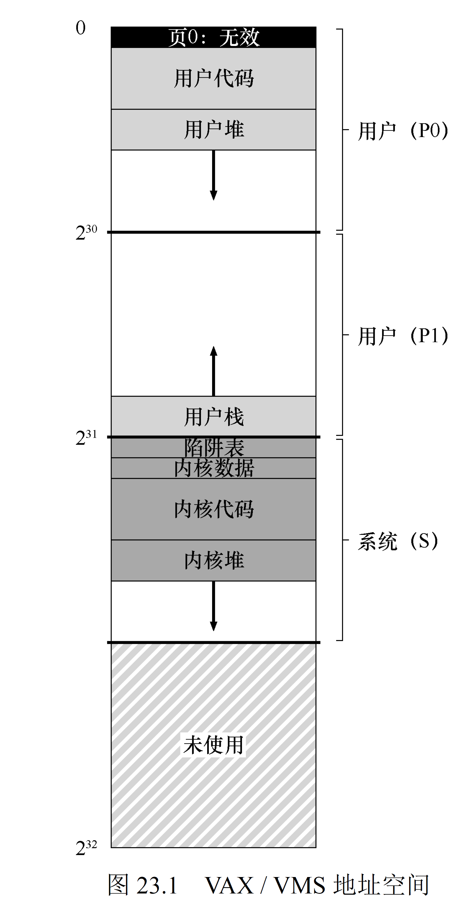

#### **详细说明**
- **系统空间**：存放内核代码、数据和共享库。
- **用户空间**：
  - P0 段：代码、数据、堆（低地址向高地址增长）。
  - P1 段：栈（高地址向低地址增长）。
- **示例**：P0 段基址 `0x0000`，P1 段基址 `0x7FFF`，支持动态堆栈增长。
- **实际 application**：VMS 地址空间布局优化多任务。

### **23.4 页替换**
#### **描述**
FIFO 结合“第二次机会”，维护工作集。

#### **详细说明**
- **第二次机会**：类似时钟算法，检查引用位：
  - 引用位为 1：清 0，跳过。
  - 引用位为 0：替换。
- **工作集**：进程的活跃页面集合，决定内存分配。
- **实际 application**：VMS 动态调整工作集大小，优化页面保留。

### **23.5 其他虚拟内存技巧**
#### **描述**
- **预取**：加载相邻页面。
- **页面锁定**：防止关键页面交换。

#### **详细说明**
- **预取**：顺序访问时加载下一页面，减少页错误。
- **页面锁定**：内核或关键用户页面常驻内存。例如，锁定驱动程序页面。
- **实际 application**：VMS 的预取机制提高 I/O 效率。

### **23.6 小结**
VAX/VMS 展示复杂虚拟内存实现。其段页式设计和替换策略影响了现代操作系统。例如，Windows 的内存管理借鉴了 VMS 的工作集概念。

**思考问题**：
- VMS 的工作集如何适应动态负载？
- 段页式与纯分页相比有何优劣？

**参考资料**：
- VAX/VMS 技术文档。
- 《VMS Internals and Data Structures》 by Goldenberg。

---

## **第 24 章 内存虚拟化总结对话**

### **内容概述**
通过对话回顾内存虚拟化的关键概念：地址空间、分页、分段、TLB、页面替换等，强调其对现代操作系统的重要性。

### **详细说明**
- **重要性**：
  - **隔离性**：通过独立地址空间保护进程。例如，Linux 防止进程 A 访问进程 B 的内存。
  - **效率**：分页和交换支持多任务。例如，Windows 运行多个大型应用程序。
  - **灵活性**：透明地址空间简化开发。例如，C 程序无需关心物理内存。
- **现代优化**：
  - **TLB**：缓存 PTE，减少查询延迟。
  - **多级页表**：节省内存，支持大地址空间。
  - **大页**：降低 TLB 压力。
- **挑战**：页错误和抖动需优化。例如，Linux 的 kswapd 和 OOM 机制管理内存压力。
- **实际 application**：云服务器依赖虚拟内存支持高并发虚拟机。

**思考问题**：
- 虚拟内存如何支持容器技术（如 Docker）？
- 未来内存虚拟化技术可能如何演进？

**参考资料**：
- 《Operating Systems: Three Easy Pieces》完整版。
- Linux 内核源代码（mm/ 目录）。

---

## **总结**
第 12-24 章全面介绍了内存虚拟化的核心概念，从地址空间抽象到页面替换策略：
- **地址空间**：提供透明性、效率和保护。
- **分页和分段**：支持灵活分配和隔离。
- **TLB**：优化地址转换性能。
- **交换和替换**：扩展内存，优化缓存。
- **VAX/VMS**：展示复杂实现，影响现代系统。

这些机制是现代操作系统的基石，广泛应用于 Linux、Windows 等。例如，Linux 的 4 级页表和 TLB 缓存支持高效内存管理，满足高性能需求。理解这些内容有助于掌握操作系统设计和优化。

**参考资料**：
- 《Operating Systems: Three Easy Pieces》 by Arpaci-Dusseau。
- Linux 内核文档（内存管理）。
- Intel/ARM 架构手册。

---