# 附录 B: 逻辑设计基础 (The Basics of Logic Design)

本附录深入讲解了构建现代计算机硬件所依赖的数字逻辑基本原理。理解这些基础对于掌握计算机如何执行计算、存储数据以及控制操作至关重要。

## B.1 引言 (Introduction)
本节首先强调了数字逻辑作为计算机硬件基础的地位。它解释了为什么即使是高级的软件操作最终也必须转化为硬件能够理解和执行的基本逻辑门操作。引言部分旨在建立读者对逻辑设计重要性的认识，并概述本附录将要涵盖的关键主题，包括如何使用基本的逻辑门构建复杂的数字电路，以及如何描述和分析这些电路的行为。本节为后续深入学习数字逻辑概念奠定了基础。

## B.2 门、真值表和逻辑方程 (Gates, Truth Tables, and Logic Equations)
这是逻辑设计的最基础部分。

* **基本逻辑门**: 详细介绍了数字电路中最基本的构建单元：AND (与门)、OR (或门)、NOT (非门)。在此基础上，进一步引入了它们的组合形式，如 NAND (与非门) 和 NOR (或非门)，以及用于特定比较功能的 XOR (异或门) 和 XNOR (同或门)。对每个门，除了图形符号外，还会详细解释其功能，即输入与输出之间的逻辑关系。

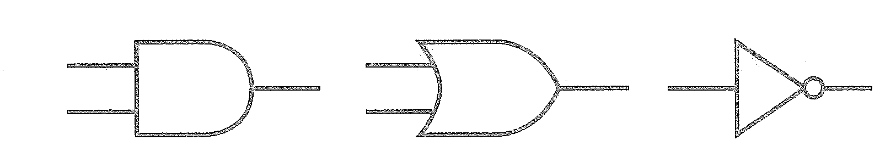

* **真值表 (Truth Tables)**: 真值表是描述逻辑门或逻辑电路功能的标准方法。对于具有 n 个输入的逻辑电路，真值表将列出所有 2^n 种可能的输入组合，以及每种输入组合对应的输出值。通过真值表，可以清晰、无二义地表示任何组合逻辑的功能。

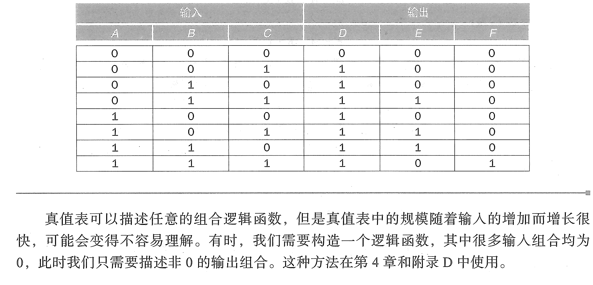

* **逻辑方程 (Logic Equations)**: 使用布尔代数表达式来表示逻辑功能是另一种重要方法。布尔代数提供了一套数学规则和符号来操作逻辑变量（通常表示为 0 和 1）。本节会介绍如何将真值表转换为逻辑方程（例如，使用最小项或最大项），以及如何使用布尔代数的规则来简化这些方程。简化的逻辑方程通常对应于更简单的、所需的逻辑门数量更少的电路实现，从而降低硬件成本和功耗。

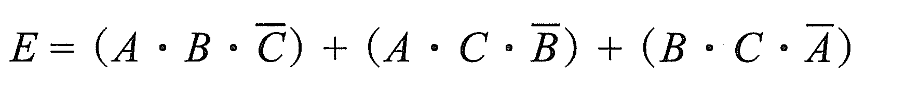

* **布尔代数 (Boolean Algebra)**: 详细阐述布尔代数的基本定律和定理，如交换律、结合律、分配律、德摩根定律等。这些定律是化简逻辑方程、优化逻辑电路的强大工具。掌握布尔代数是进行有效逻辑设计的基础。

## B.3 组合逻辑 (Combinational Logic)
本节从基本的逻辑门组合构建更复杂的组合逻辑电路。

* **定义**: 明确组合逻辑电路的特点：其输出在任何时刻只取决于该时刻的输入，不依赖于电路之前的状态。这与序贯逻辑（将在后续介绍）形成对比。

* **设计和分析方法**: 提供了设计组合逻辑电路的系统化步骤：从需求描述（例如，文本或功能规格）出发，转换为真值表，然后推导出逻辑方程。接着，重点介绍如何使用布尔代数或卡诺图等技术来化简逻辑方程，以获得最优的电路实现。最后，讨论如何分析一个已有的组合逻辑电路，即根据给定的电路图，推导出其逻辑方程和真值表，从而理解其功能。

* **常见组合逻辑电路**: 详细介绍计算机硬件中常用的组合逻辑模块。
  * **多路复用器 (Multiplexer - MUX)**: 解释 MUX 如何根据一个或多个选择输入信号，从多个数据输入中选取其中一个作为输出。这是数据选择和路由中的关键组件。
  
  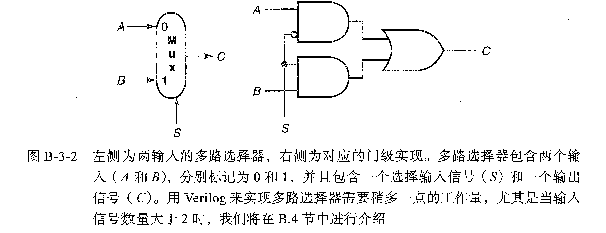
  
  * **解码器 (Decoder)**: 阐述解码器如何将一个二进制编码的输入信号转换为独热码输出，即只有一个输出是高电平（或低电平），对应于输入编码所表示的数值。解码器常用于地址译码和控制信号生成。
  
  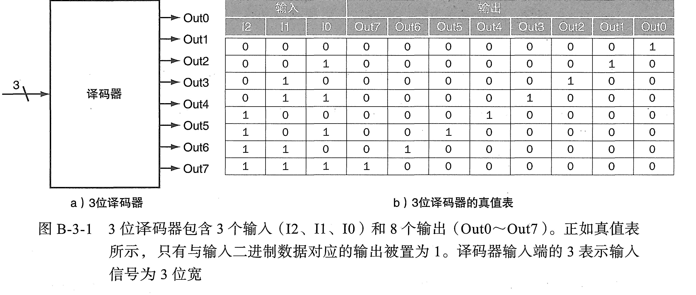
  
  * **编码器 (Encoder)**: 介绍编码器作为解码器的逆功能，如何将多个输入信号中的某一个激活信号转换为二进制编码输出。
  
  * **加法器 (Adders)**: 从半加器（处理两位输入并产生和及进位）到全加器（处理两位输入和一个进位输入，产生和及进位），再到多位加法器（通过级联全加器实现）。这是构建算术运算电路的基础。
  
  * **比较器 (Comparators)**: 解释比较器如何比较两个二进制数，并输出它们之间的大小关系（大于、小于或等于）。
  
  * **算术逻辑单元 (Arithmetic Logic Unit - ALU)**: 作为处理器核心部件之一，ALU 能够执行多种算术（如加法、减法）和逻辑（如 AND、OR、NOT）操作。本节会介绍如何将之前讨论的基本组合逻辑模块组合起来构建一个简单的 ALU，并说明如何使用功能选择信号来控制 ALU 执行不同的操作。
  
  * **可编程逻辑阵列(Pro grammable Logic Array, PLA)** :PLA 包含一组输入、输入取反的信号（通过反相器来实现）和两级逻辑。第一个逻辑是一个与门阵列，用来生成乘积项(product term) ［也称为最小项(minterm) ],每一个乘积项都由输入信号或对应的反向信号构成。第二级为一个或门阵列，每一个或门都生成任意数量的乘积匡项的逻辑和。
  
  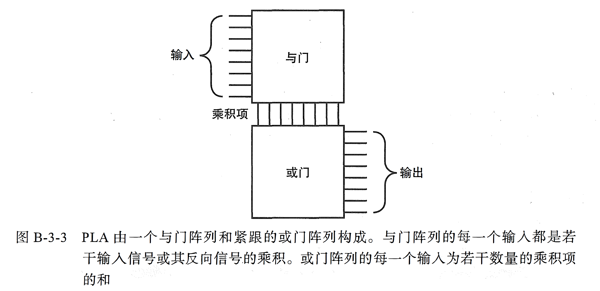

## B.4 使用硬件描述语言 (Using a Hardware Description Language)
本节引入了现代数字电路设计中不可或缺的工具——硬件描述语言 (HDL)。

* **硬件描述语言 (HDL)**: 重点介绍 Verilog 或 VHDL 等主流 HDL。阐述 HDL 的作用：它允许设计师使用类似编程语言的方式来描述数字电路的结构和行为，而不仅仅是绘制电路图。

* **描述电路**: 详细说明如何使用 HDL 描述组合逻辑和序贯逻辑电路，包括如何定义模块、输入输出端口、内部信号，以及如何使用赋值语句、逻辑运算符等来描述电路功能。

* **仿真和验证**: 强调 HDL 在电路设计流程中的重要性。使用 HDL 编写的设计可以在计算机上进行仿真，模拟电路在各种输入情况下的行为，从而在实际制造芯片之前发现并纠正设计错误，大大降低了设计风险和成本。

* **层次化设计**: 说明 HDL 如何支持层次化设计方法，允许将复杂的系统分解为多个较小的、易于管理的模块，然后通过实例化和连接这些模块来构建整个系统。这种模块化方法提高了设计的效率和可重用性。

## B.5 构建一个基本的算术逻辑单元 (Constructing a Basic Arithmetic Logic Unit)
本节是组合逻辑的应用实例，详细展示了如何从基本的逻辑门和加法器构建一个功能相对完善的 ALU。

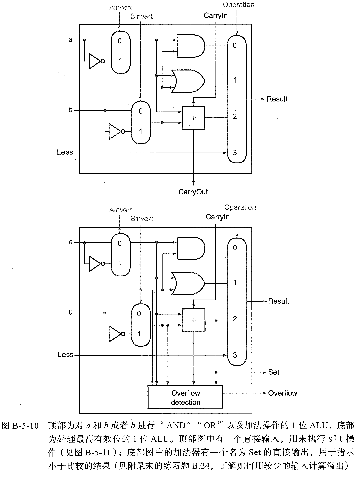

* **ALU 结构**: 介绍一个典型 ALU 的内部结构，包括输入操作数、操作选择信号、输出结果，以及可能的标志位输出。

* **功能实现**: 详细解释如何通过组合使用多路复用器、加法器、逻辑门等构建不同的功能单元（例如，一个用于逻辑操作的单元，一个用于算术操作的单元），然后使用操作选择信号来控制哪个功能单元的输出最终作为 ALU 的输出。

* **标志位 (Flags)**: 说明 ALU 如何生成标志位，如零标志 (Zero flag，表示运算结果是否为零)、进位标志 (Carry flag，表示算术运算是否产生进位或借位)、负标志 (Negative flag，表示结果是否为负) 等。这些标志位对于条件分支和后续运算非常重要。

## B.6 更快的加法：超前进位 (Faster Addition: Carry Lookahead)
本节讨论如何优化加法器的性能，突破纹波进位加法器的速度限制。

* **纹波进位加法器 (Ripple Carry Adder)**: 分析纹波进位加法器的缺点，即进位信号必须逐位向高位传播，导致加法时间随着位数增加而线性增加，成为性能瓶颈。

* **超前进位加法器 (Carry Lookahead Adder)**: 详细介绍超前进位加法器的原理。通过提前计算进位信号，而不是等待低位的进位传播过来。这涉及到“生成” (generate, $$G_i = A_i ⋅ B_i$$，表示本位产生进位) 和“传播” (propagate, $$P_i = A_i + B_i$$，表示本位将低位传来的进位向高位传播) 信号的概念。利用布尔代数，可以推导出任意位的进位信号的直接计算公式，从而实现并行计算进位。

* **性能提升**: 对比纹波进位加法器和超前进位加法器，说明超前进位加法器如何显著提高加法速度，使其延迟与位数呈对数关系而不是线性关系。

## B.7 时钟 (Clocks)
本节引入了数字电路中的时序概念，以及时钟的作用。

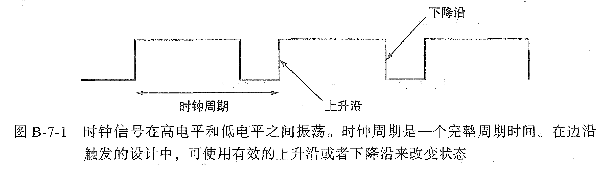

* **时钟信号 (Clock Signal)**: 解释时钟信号作为周期性脉冲序列的重要性，它是同步数字电路中各种操作的“心跳”。

* **时钟周期 (Clock Cycle)**: 定义时钟周期是时钟信号重复一次所需的时间，它决定了电路的最高工作频率。

* **时钟沿 (Clock Edge)**: 说明时钟信号的上升沿或下降沿是触发时序元件（如触发器）改变状态的关键时刻。大多数同步电路设计都依赖于时钟沿进行状态更新。

* **同步逻辑 (Synchronous Logic)**: 阐述同步逻辑设计范式，其中所有的状态变化都与同一个全局时钟信号同步发生。这种设计方法简化了电路的时序分析和设计。

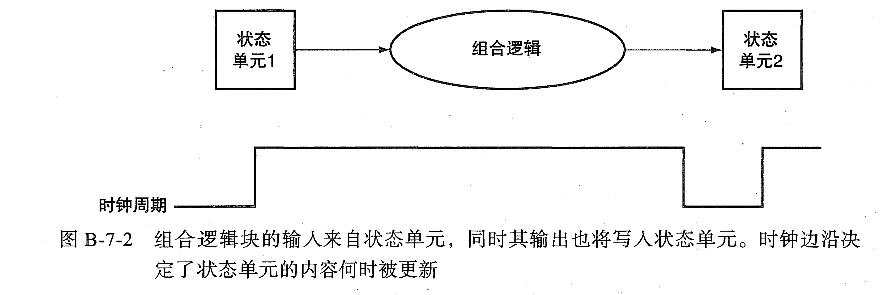

## B.8 存储元件：触发器、锁存器和寄存器 (Memory Elements: Flip-Flops, Latches, and Registers)
本节深入讲解能够存储信息的数字逻辑元件。

* **锁存器 (Latches)**: 介绍锁存器是电平敏感的存储元件，其输出在其使能信号有效期间跟随输入变化。例如，SR 锁存器和 D 锁存器。解释锁存器在某些设计中可能导致时序问题，因此在同步设计中较少直接使用，除非在特定情况下。

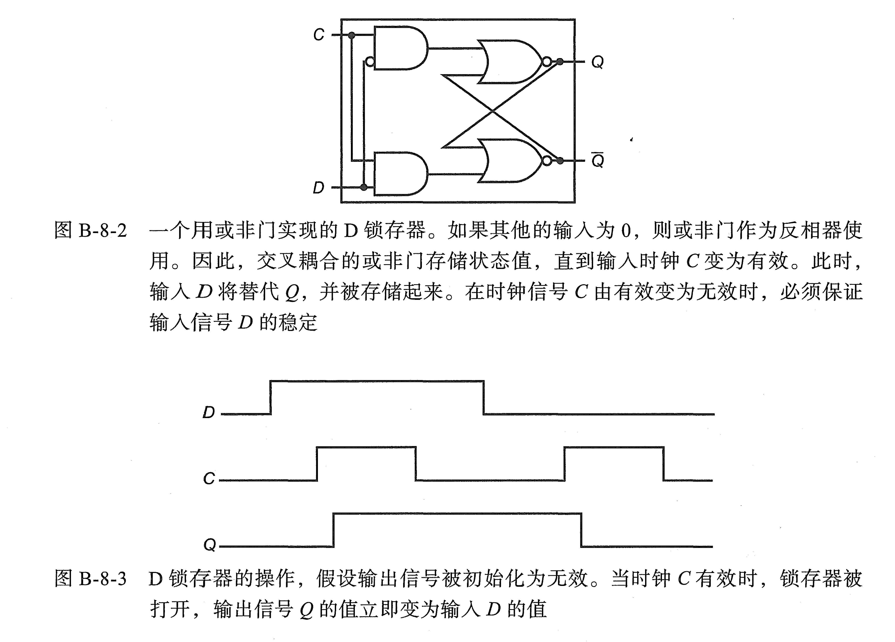

* **触发器 (Flip-Flops)**: 重点介绍触发器是边沿触发的存储元件，其输出仅在时钟信号的特定边沿发生改变。详细介绍 D 触发器的工作原理，它是同步设计中最常用的触发器，能够在时钟沿将输入数据锁存并保持。简要提及 JK 触发器和 T 触发器。

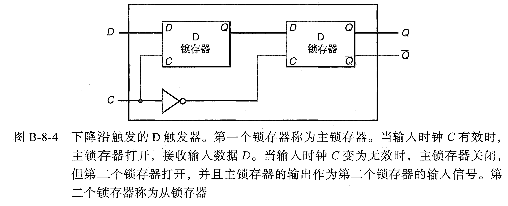

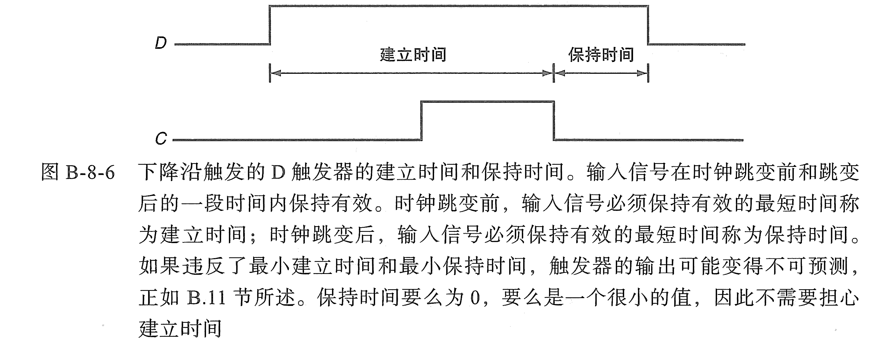

* **寄存器 (Registers)**: 解释寄存器是由多个触发器（通常是 D 触发器）并联组成的电路，用于同时存储多位二进制数据。说明寄存器如何在时钟控制下并行载入数据或执行移位操作。寄存器是处理器中用于存储数据和指令的关键组件。

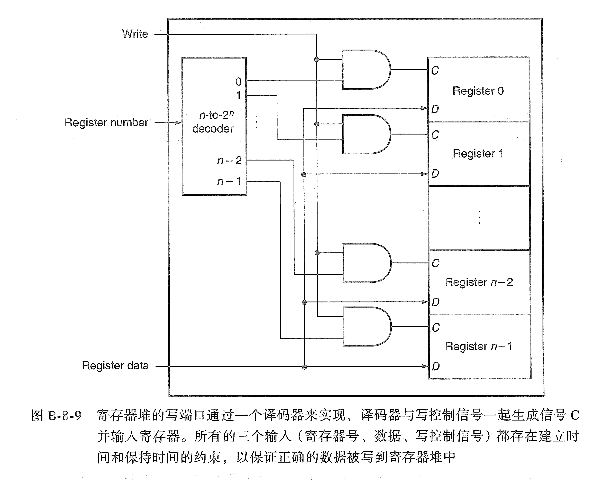

## B.9 存储元件：SRAM 和 DRAM (Memory Elements: SRAMs and DRAMs)
本节进一步探讨用于构建计算机存储系统的两种主要类型的存储元件。

* **SRAM (Static Random-Access Memory)**: 详细介绍 SRAM 的内部结构，通常使用六个晶体管组成的锁存电路来存储一个二进制位。解释 SRAM 的特点：速度快（因为不需要刷新），但由于每个存储单元需要较多晶体管，因此集成度相对较低，成本较高。说明 SRAM 主要用于构建对速度要求高的缓存存储器 (cache)。

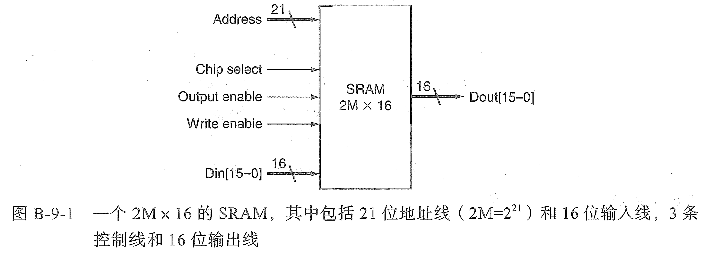

* **DRAM (Dynamic Random-Access Memory)**: 详细介绍 DRAM 的内部结构，每个存储单元通常由一个晶体管和一个电容器组成。数据存储在电容器上的电荷形式。解释 DRAM 的特点：由于电容器会漏电，因此需要定期进行刷新操作以保持数据；速度相对较慢（因为需要刷新和读写操作会干扰电荷）。然而，由于结构简单，DRAM 的集成度很高，成本较低。说明 DRAM 主要用于构建计算机的主存储器 (main memory)。

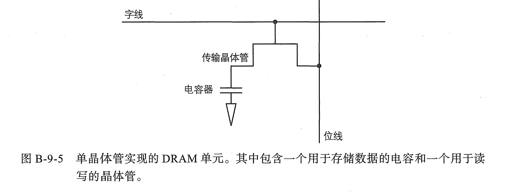

## B.10 有限状态机 (Finite-State Machines - FSMs)
本节介绍了设计具有记忆和控制功能的序贯逻辑电路的重要模型。

* **定义**: 引入有限状态机作为一种抽象模型，用于描述系统的行为，该系统在任何时刻都处于有限个可能的状态之一。系统的状态根据当前输入和当前状态发生转移，并产生相应的输出。

* **组成**: 阐述 FSM 的四个基本组成部分：状态集合、输入字母表、输出字母表和状态转移函数。状态转移函数根据当前状态和输入确定下一个状态和输出。

* **状态转移图 (State Transition Diagram)**: 介绍状态转移图作为可视化表示 FSM 行为的工具，图中节点代表状态，边代表状态转移，并标注输入和输出。

* **Mealy 机和 Moore 机**: 区分两种主要的 FSM 模型：Mealy 机的输出取决于当前状态和当前输入，而 Moore 机的输出仅取决于当前状态。理解这两种模型有助于选择适合特定设计需求的模型。

* **应用**: 说明 FSM 在计算机硬件设计中的广泛应用，特别是用于设计控制单元，负责根据指令和系统状态生成控制信号，协调数据通路的操作。

## B.11 时序方法 (Timing Methodologies)
本节深入讨论了确保同步数字电路正确工作的时序约束和分析方法。

​		$$T=t_{prop}+t_{combinational}+t_{setup}+t_{skew}$$

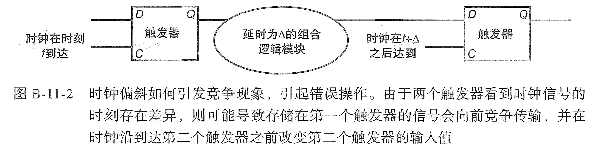

* **建立时间 (Setup Time)**: 解释建立时间是数据输入信号在时钟沿到来之前必须保持稳定的最短时间。如果数据变化太晚，触发器可能无法正确捕获数据。

* **保持时间 (Hold Time)**: 解释保持时间是数据输入信号在时钟沿到来之后必须保持稳定的最短时间。如果数据变化太早，触发器的新状态可能会被旧数据干扰。

* **时钟偏移 (Clock Skew)**: 讨论时钟信号到达电路中不同触发器的时间差异。时钟偏移可能导致时序违例（建立时间或保持时间不满足）。

* **临界路径 (Critical Path)**: 介绍临界路径是从一个时序元件的输出到另一个时序元件的输入之间延迟最大的路径。临界路径的总延迟决定了电路能够稳定工作的最高时钟频率。

* **时序分析**: 阐述如何通过计算电路中各个路径的延迟，并与触发器的建立时间和保持时间要求进行比较，来验证电路的时序是否正确。这是确保设计可靠性的关键步骤。

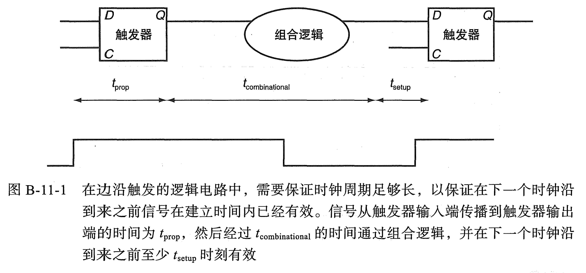

## B.12 现场可编程器件 (Field Programmable Devices - FPDs)
本节介绍了现代数字系统设计中广泛使用的可编程硬件技术。

* **定义**: 解释 FPD 是指在制造出芯片后，其功能可以通过用户配置来确定的集成电路。这与传统的固定功能逻辑芯片（如标准逻辑门芯片）形成对比。

* **FPGA (Field-Programmable Gate Array)**: 详细介绍 FPGA 的内部结构和工作原理。FPGA 主要由大量的可配置逻辑块 (CLBs) 和可编程的互连资源组成。CLBs 内部包含查找表 (LUT) 和触发器，可以实现各种逻辑功能。可编程互连资源允许用户根据需要连接这些逻辑块，形成任意复杂的数字电路。FPGA 提供了极大的灵活性，适用于原型验证、低/中等批量生产以及需要频繁修改设计的应用。

* **CPLD (Complex Programmable Logic Device)**: 简要介绍 CPLD，它通常比 FPGA 规模小，逻辑结构更简单，延迟可预测性更好，适用于控制逻辑等应用。

* **优势**: 讨论使用 FPDs 的优点，如开发周期短、灵活性高、可重构性强，以及较低的初始成本（相对于全定制或ASIC设计）。

## B.13 总结 (Concluding Remarks)
本节对整个附录 B 的内容进行概括总结，再次强调数字逻辑基础知识在计算机硬件领域的基石作用。鼓励读者进一步探索数字逻辑的更高级主题和实际应用。