## 第5章 大容量和高速度：开发存储器层次结构

### 5.1 引言
本章的核心目标是解决处理器日益增长的速度与相对较慢的主存储器之间的性能差距，即所谓的“存储墙 (Memory Wall)”。理想的存储器应兼具无限容量、无限速度且零成本，但这在现实中无法实现。因此，计算机设计者采用存储器层次结构 (memory hierarchy)。这一结构基于局部性原理 (principle of locality)，它包含两个方面：
- **时间局部性 (Temporal Locality)**: 如果一个数据项被访问，那么在不久的将来它很可能再次被访问（例如循环中的变量）。
- **空间局部性 (Spatial Locality)**: 如果一个数据项被访问，那么与它地址相近的数据项也很可能在不久的将来被访问（例如顺序执行的指令，数组元素）。

通过在靠近处理器的位置设置小而快速的存储器（称为高速缓存 Cache）来存放最近使用或预期会使用的数据和指令，可以显著提高平均访存速度，同时利用大而慢但便宜的存储器来保证容量。

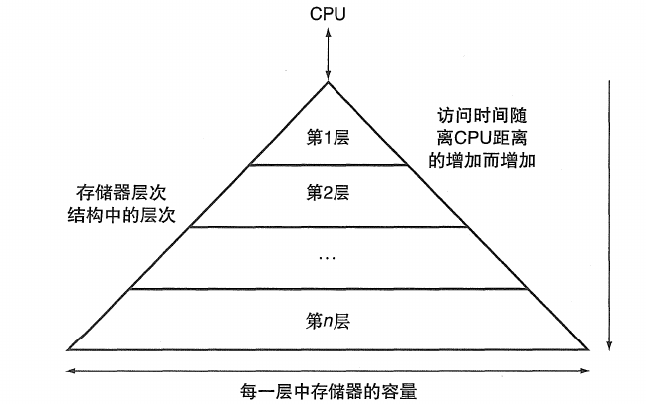

### 5.2 存储器技术
构成存储器层次结构的物理设备技术。

#### 5.2.1 SRAM技术 (Static Random Access Memory)
- **特点**: 访问速度极快（纳秒级，ns），只要供电就能保持数据，无需刷新。功耗相对较高（尤其在空闲时），每比特成本高，集成度较低。
- **原理**: 每个比特使用一对交叉耦合的反相器（形成锁存器，通常由4-6个晶体管构成，最常见的是6T单元）来存储状态。
- **用途**: 主要用于CPU的高速缓存 (L1, L2, 有时L3 Cache)，寄存器文件。

#### 5.2.2 DRAM技术 (Dynamic Random Access Memory)
- **特点**: 每比特成本低，集成度高（容量大），功耗相对较低。但速度慢于SRAM（几十纳秒级），且需要周期性刷新 (periodic refresh) 以维持数据。
- **原理**: 每个比特使用一个晶体管和一个电容器 (1T1C单元) 存储电荷。电容器会随时间漏电，因此必须在电荷消失前（通常是几十毫秒）读出并重写。
- **类型**:
  - **SDRAM (Synchronous DRAM)**: 与系统时钟同步，提高了性能。
  - **DDR SDRAM (Double Data Rate SDRAM)**: 在时钟的上升沿和下降沿都能传输数据，有效带宽加倍。后续发展出DDR2, DDR3, DDR4, DDR5等，每一代都在速度、带宽、功耗和密度上有所改进。
- **组织**: DRAM芯片内部组织为二维阵列，通过行地址选通 (RAS) 和列地址选通 (CAS) 访问。
- **用途**: 主存储器 (Main Memory)。

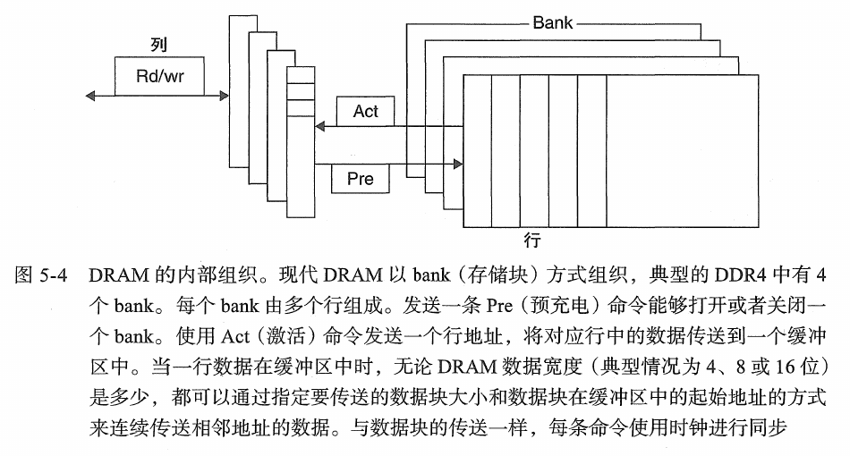

#### 5.2.3 闪存 (Flash Memory)
- **特点**: 非易失性 (non-volatile)，即断电后数据不丢失。读写速度介于DRAM和磁盘之间。有限的擦写次数 (endurance)。
- **原理**: 基于浮栅晶体管 (Floating Gate MOSFET)，通过在浮栅中存储电荷来表示0或1。擦除操作通常以块 (block) 为单位，写入操作以页 (page) 为单位。
- **类型**:
  - **NOR Flash**: 读速度快，支持按字节随机访问，适合存储代码（如BIOS）。擦写慢，成本高。
  - **NAND Flash**: 擦写速度快，密度高，成本低，适合大容量数据存储。读操作以页为单位，不支持字节级随机访问。需要更复杂的错误检测和纠正 (ECC) 机制以及损耗均衡 (wear leveling) 算法来延长寿命。
- **用途**: 固态硬盘 (Solid State Drives, SSDs)，U盘，存储卡，智能手机存储，嵌入式系统。

#### 5.2.4 磁盘存储器 (Disk Memory / Magnetic Disk)
- **特点**: 非易失性，容量极大，每比特成本最低。但由于是机械装置，访问速度最慢（毫秒级，ms）。
- **原理**: 数据存储在涂有磁性材料的盘片 (platters) 上。盘片高速旋转，磁头 (read/write heads) 在执行臂 (actuator arm) 的带动下在盘片半径方向上移动（寻道），进行数据的读写。
- **访问时间构成**:
  - **寻道时间 (Seek Time)**: 磁头移动到目标磁道所需的时间。
  - **旋转延迟 (Rotational Latency)**: 等待盘片旋转到目标扇区到达磁头下方所需的时间（平均为盘片旋转半周的时间）。
  - **传输时间 (Transfer Time)**: 数据从盘片传输到内存或反之所需的时间，取决于转速和数据量。
  - **控制器开销 (Controller Overhead)**: 控制器处理命令的时间。
- **用途**: 大容量数据存储（如HDD），备份。逐渐被SSD在许多应用中取代，但在成本敏感的大容量存储领域仍有地位。

### 5.3 Cache的基本原理
CPU Cache 是一个位于CPU和主存之间的小型、快速的SRAM存储器，用于减少CPU访问主存的平均时间。

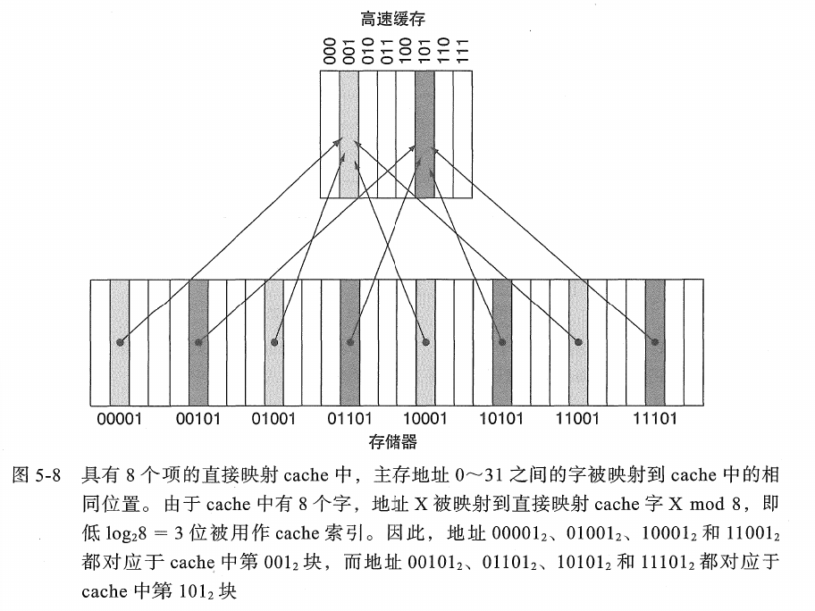

#### 5.3.1 Cache访问
- 当CPU需要访问内存数据时，它首先提供一个内存地址。
- Cache硬件检查该地址对应的数据是否已在Cache中。
- **Cache块 (Cache Block / Cache Line)**: Cache和主存之间数据传输的最小单位。典型大小为32, 64, 或128字节。
- **地址映射**: CPU发出的地址通常被分为三部分：
  - **标记 (Tag)**: 用于区分存储在同一个Cache索引位置的不同主存块。
  - **索引 (Index)**: 用于选择Cache中的某一行 (set)。
  - **块内偏移 (Block Offset / Byte Offset)**: 用于在Cache块中选择所需的字节。
- **Cache命中 (Cache Hit)**: 如果目标数据在Cache中（通过比较标记和有效位确认），则直接从Cache中读取数据或向Cache写入数据。Hit Time是访问Cache并获取数据的时间。
- **Cache缺失 (Cache Miss)**: 如果目标数据不在Cache中，则发生缺失。CPU必须等待数据从下一级存储器（如主存）加载到Cache中。

##### 示例：直接映射Cache的地址划分

假设一个直接映射Cache具有以下特性：

- **Cache容量**：1024字节 (1KB)
- **块大小**：64字节
- **主存地址位数**：32位

计算：

- Cache中的块数 = Cache容量 / 块大小 = \(1024 / 64 = 16\) 块。
- 块内偏移位数 $$(b = \log_2(\text{块大小}) = \log_2(64) = 6) 位$$。
- 索引位数$$ (i = \log_2(\text{Cache中的块数}) = \log_2(16) = 4)$$ 位。
- 标记位数 $$(t = \text{地址总位数} - i - b = 32 - 4 - 6 = 22) $$位。
- 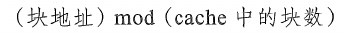

因此，一个32位地址会被这样解释：

``| 标记 (22位) | 索引 (4位) | 块内偏移 (6位) |``

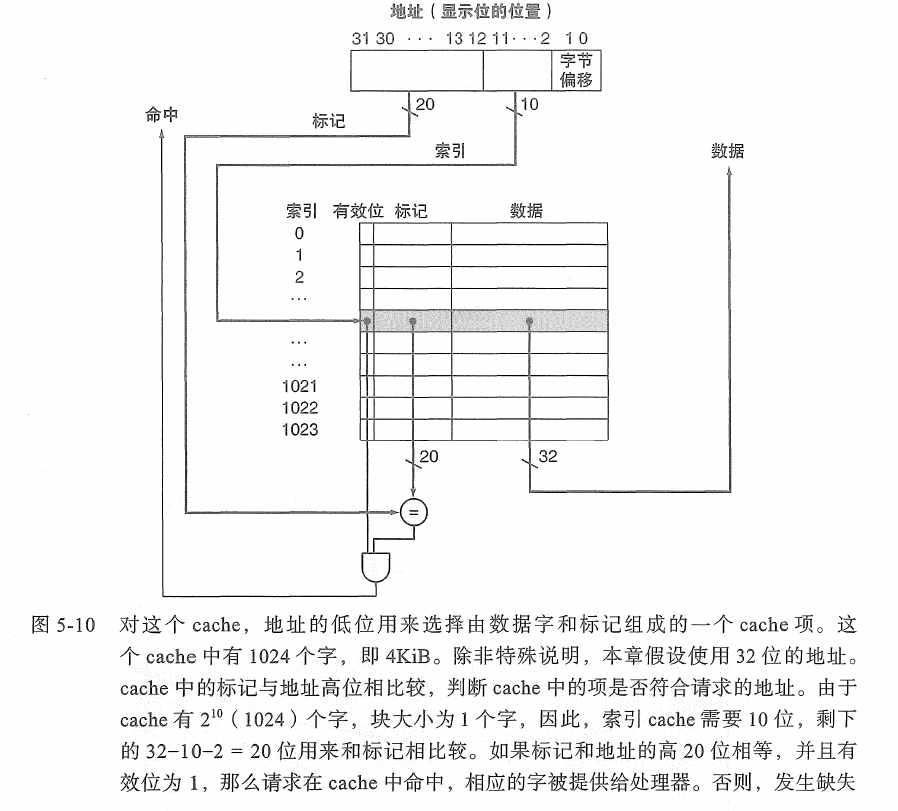

##### Cache命中 (Cache Hit)

- 使用地址中的索引字段选择Cache中的特定行。
- 读取该行的标记字段和有效位 (Valid bit)。
- 如果有效位为1，则将读取到的标记与CPU地址中的标记字段进行比较（通过比较器 Comparator）。
- 如果两个标记匹配，则发生Cache命中。
- 使用地址中的块内偏移字段从Cache行的数据部分选择所需的字节/字，并通过多路选择器 (Multiplexer) 发送给CPU。

**Hit Time (命中时间)**: 完成上述查找并返回数据给CPU所需的时间。对于L1 Cache，这通常是1到几个CPU周期。

##### Cache缺失 (Cache Miss)

如果有效位为0，或者标记不匹配，则发生Cache缺失。CPU必须从下一级存储器获取数据。

#### 5.3.2 Cache缺失处理
- **步骤**:
  1. CPU流水线暂停 (stall)。
  2. 向下一级存储器发出读取请求，请求包含缺失数据的整个块 (block)。
  3. 下一级存储器将数据块传输到Cache。
  4. Cache将该块存入一个合适的位置（可能需要替换一个现有的块，根据替换策略）。
  5. 将所需数据（通常是块中的一个字或字节）转发给CPU。
  6. CPU恢复执行。
- **缺失代价 (Miss Penalty)**: 从发出请求到数据返回给CPU并CPU恢复执行的总时间。这是影响性能的关键因素。
- **早期重启 (Early Restart)**: 一旦请求的字到达，就立即发送给CPU，允许CPU提前恢复执行，而块的剩余部分继续填充。
- **临界字优先 (Critical Word First)**: 请求的字优先从内存中获取并发送到Cache和CPU，然后填充块的其余部分。

#### 5.3.3 写操作处理
- 当CPU执行写指令（如 store）时，数据必须更新。
- **写命中 (Write Hit)**:
  - **写直通 (Write-Through)**: 数据同时写入Cache和主存（或下一级存储器）。
    - **优点**: 实现简单，主存数据始终最新（简化一致性）。
    - **缺点**: 每次写操作都会访问主存，速度较慢。通常配合写缓冲器 (Write Buffer) 使用，CPU将数据写入写缓冲器后即可继续执行，写缓冲器负责异步将数据写入主存，以减少CPU等待。但写缓冲器满了也会导致CPU暂停。
  - **写回 (Write-Back / Copy-Back)**: 数据仅写入Cache块，并将该块标记为“脏 (dirty bit / modified bit)”。脏块只有在被替换出Cache时才写回主存。
    - **优点**: 写操作速度快（只访问Cache），多次写入同一块只需一次主存写回，减少总线流量。
    - **缺点**: 实现复杂，主存数据可能不是最新的（需要处理一致性问题），发生替换时若块是脏的，则需要两次内存访问（写回旧块，读入新块）。
- **写未命中 (Write Miss)**:
  - **写分配 (Write Allocate / Fetch on Write)**: 先将缺失的块从主存读入Cache，然后如同写命中一样处理（通常与写回策略配合使用）。利用了写的空间局部性。
  - **非写分配 (No-Write Allocate / Write Around)**: 数据直接写入主存，不将块调入Cache。通常与写直通策略配合使用。适用于不常被后续读写的数据。

#### 5.3.4 Cache实例：Intrinsity FastMATH处理器
这类处理器通常针对数字信号处理 (DSP) 或特定计算任务优化。其Cache设计可能包括：
- 分离的L1指令Cache和数据Cache (哈佛结构)。
- 特定大小、相联度和块大小，以平衡命中率和访问延迟。
- 可能包含特殊的内存访问指令或Scratchpad Memory (一种由软件管理的快速片上内存，不是传统意义上的Cache)。

#### 5.3.5 小结
Cache通过利用局部性原理，在CPU和主存之间提供了一个快速的数据通路。其基本操作涉及命中/缺失判断、缺失处理以及写策略的选择。这些设计决策对系统性能有重大影响。

### 5.4 Cache性能的评估和改进
主要目标是降低平均访存时间 (Average Memory Access Time, AMAT)。


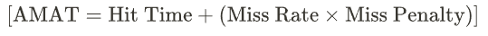

其中：
- **Hit Time**: Cache命中所需时间（包括判断是否命中的时间）。
- **Miss Rate**: 访问Cache时发生缺失的比例 (Misses / Total Accesses)。
- **Miss Penalty**: 处理一次Cache缺失所需的额外时间。

改进Cache性能可从三方面入手：1. 降低缺失率；2. 降低缺失代价；3. 降低命中时间。

#### 5.4.1 通过更灵活地放置块来减少Cache缺失 (Reducing Miss Rate with More Flexible Block Placement)
- **直接映射 (Direct Mapped)**:
  - **映射规则**: 主存中的每个块只能映射到Cache中的一个固定行。Cache Index = (Block Address) MOD (Number of Cache Blocks)。
  - **查找**: 只需检查一个Cache行的标记。
  - **优点**: 硬件简单，命中时间短（无需选择），成本低。
  - **缺点**: 冲突缺失率高。如果程序交替访问多个映射到同一Cache行的主存块，即使Cache远未存满，也会频繁发生替换。例如，若两个常用数组A和B的起始地址模Cache大小后相同，访问 A[i] 和 B[i] 将导致持续冲突。
  
- **全相联 (Fully Associative)**:
  - **映射规则**: 主存中的任何块可以放置在Cache中的任何位置。相当于只有一个组，该组包含Cache中所有的块。
  - **查找**: 需要并行比较地址标记与Cache中所有行的标记。通常使用内容可寻址存储器 (Content-Addressable Memory, CAM) 来实现这种并行比较。
  - **优点**: 冲突缺失最少（仅当Cache完全满了才会发生替换，此时发生的缺失是容量缺失或强制性缺失）。
  - **缺点**: 硬件成本极高，查找功耗大，速度相对较慢。因此，通常只用于非常小的Cache，如TLB中的少数条目，或某些特殊用途的小型数据Cache。
  
- **N路组相联 (N-way Set Associative)**:
  - **映射规则**: Cache被划分为若干组 (sets)，每组包含N个块位置（称为“路”，ways）。主存块首先映射到一个特定的组 Set Index = (Block Address) MOD (Number of Sets)，然后可以放置在该组的N个位置中的任何一个。
  - **查找**: 使用索引字段找到正确的组。然后，并行地读取该组中N个块的标记，并与地址中的标记进行比较（需要N个比较器）。如果任一匹配且有效，则命中。一个N路选择器会从N个数据路中选出命中的数据。
  - **示例 (2路组相联)**: 一个块可以放在组内的两个位置之一。替换时，只需从这两个位置中选择一个。
  - **优点**: 相比直接映射，显著降低冲突缺失。N越大，冲突越少。
  - **缺点**: 硬件比直接映射复杂（需要N个比较器和1个N选1多路选择器），命中时间可能略长，功耗也更高。

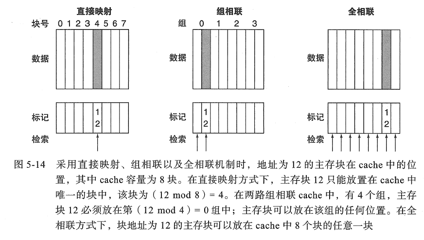

#### 5.4.2 在Cache中查找块 (Finding a Block in the Cache)
- 对于直接映射，使用地址中的索引部分找到Cache行，然后比较该行的标记和地址中的标记部分。
- 对于N路组相联，使用地址中的索引部分找到Cache组，然后并行比较该组中N个块的标记与地址中的标记。如果任一匹配且有效位为1，则命中。通常需要N个比较器。
- 对于全相联，需要并行比较Cache中所有块的标记。
- **有效位 (Valid Bit)**: 每个Cache行都有一个有效位，指示该行中的数据是否有效。初始化时或Cache行被替换后，有效位清零。

#### 5.4.3 替换块的选择 (Choosing Which Block to Replace on a Miss)
当Cache发生缺失且目标组/Cache已满时，需要选择一个块进行替换。
- **随机 (Random)**: 随机选择组中的一个块。实现简单，不需要额外的状态位。性能通常略逊于LRU，但在高度相联的Cache中表现尚可。
- **最近最少使用 (Least Recently Used, LRU)**: 替换掉组中最长时间未被访问的块。
  - **原理**: 基于时间局部性，认为最近最少使用的块在将来也最不可能被访问。
  - **实现**: 真正的LRU对于N>2路组相联来说硬件实现复杂。例如，对于4路组相联，每个组需要维护4个块的访问顺序，可能需要多个计数器或状态位以及复杂的更新逻辑。

- **近似LRU (Pseudo-LRU)**: 教科书中常介绍一种基于每块一个引用位 (reference bit) 的近似方案。当块被访问时，其引用位置1。替换时，控制器可能扫描组内的块，寻找引用位为0的块作为牺牲者。如果所有引用位都为1，则可能将它们全部清0，然后随机选择一个或按特定顺序（如FIFO）选择。另一种树型伪LRU (tree-based pseudo-LRU) 使用一组方向位来指向下一个可能的牺牲者。

- **先进先出 (First-In, First-Out, FIFO / Round Robin)**: 替换最早进入该组的块。使用一个简单的循环指针或队列实现。简单，但可能替换掉仍被频繁使用的“老”块（称为Belady异常的一种表现，尽管Belady异常特指页替换）。

#### 5.4.4 使用多级Cache结构减少缺失代价 (Reducing Miss Penalty with Multilevel Caches)
现代处理器通常采用2到3级Cache：
- **L1 Cache**: 最小（几十KB到几百KB），最快（SRAM），直接集成在CPU核心内。通常分为指令Cache (L1I) 和数据Cache (L1D)（哈佛结构）。命中时间短，对整体AMAT贡献大。
- **L2 Cache**: 比L1大（几百KB到几MB），稍慢，可能在核心内或核心外但在同一芯片上。作为L1缺失的后备。
- **L3 Cache**: 比L2更大（几MB到几十MB），更慢，通常由多个核心共享。作为L2缺失的后备，有助于减少访问主存的次数。

**工作原理**: CPU先访问L1。若L1缺失，则访问L2。若L2缺失，则访问L3（如果有）。若L3也缺失，才访问主存。

- **局部缺失率 (Local Miss Rate)**: 该级Cache的缺失次数 / 到达该级Cache的访问次数。
- **全局缺失率 (Global Miss Rate)**: 该级Cache的缺失次数 / CPU发出的总访问次数。

- **AMAT (多级)**:
$$[
\text{AMAT} = \text{Hit Time}_{\text{L1}} + \text{Miss Rate}_{\text{L1}} \times (\text{Hit Time}_{\text{L2}} + \text{Miss Rate}_{\text{L2-local}} \times \text{Miss Penalty}_{\text{L2}})
]$$
(对于两级Cache，Miss Penalty<sub>L2</sub> 是访问主存的时间)

- **包含策略 (Inclusion Policy)**:
  - **Inclusive**: 上一级Cache中的内容必须是下一级Cache内容的子集。简化一致性，但浪费空间。
  - **Exclusive**: 上一级Cache中的内容不能在下一级Cache中。最大化利用Cache空间，但管理复杂。
  - **Non-inclusive**: 内容之间没有严格的包含关系。

#### 5.4.5 小结
提高Cache性能是一个复杂的权衡过程，涉及Cache大小、块大小、相联度、替换策略和写策略的选择。多级Cache是平衡命中时间、缺失率和缺失代价的有效手段。

#### 5.4.6 通过分块进行软件优化 (Software Optimization via Blocking/Tiling)
程序员可以通过改变代码的数据访问模式来提高Cache的利用率，特别是针对具有大量数据重用的算法（如矩阵运算、图像处理）。

- **分块 (Blocking / Tiling)**: 将大的数据集划分为能在Cache中容纳的小块进行处理。这样可以最大化对已加载到Cache中的数据的重用，减少容量缺失和冲突缺失。
- **示例 (矩阵乘法)**: 对于 \( C = A * B \)，标准的三重循环会导致对A的行和B的列的重复扫描，如果矩阵很大，会造成Cache的反复换入换出。通过分块，可以将A、B、C的子矩阵读入Cache并完成子矩阵的乘积累加，然后再处理下一组子矩阵。

### 5.5 可信存储器层次 (Dependable Memory Hierarchy)
确保存储器系统即使在出现硬件故障时也能可靠地工作。

#### 5.5.1 失效的定义 (Fault, Error, Failure)
- **故障 (Fault)**: 硬件的物理缺陷（如芯片制造缺陷、宇宙射线导致的位翻转）或软件的设计错误。
- **错误 (Error)**: 故障在系统内部状态上的体现，即系统内部的某个值与正确值不符。
- **失效 (Failure)**: 当错误传播到系统外部，导致系统提供的服务偏离其预期规范时，即为失效。
- **目标**是通过容错 (fault tolerance) 机制防止故障演变成失效。

#### 5.5.2 汉明编码 (Hamming Code) (SEC/DED)
- 汉明码是一种线性纠错码，广泛用于检测和纠正内存中的单位错误，并检测双位错误。

  #### 原理

  为 \( m \) 位数据增加 \( p \) 个校验位 (parity bits)。这些校验位的值由数据位的特定子集通过异或 (XOR) 运算决定。

  - **SEC (Single Error Correction)**: 要能纠正一位错误，校验位数 \( p \) 必须满足不等式：
    $[
    2^p \ge m + p + 1
    ]$
    这个不等式确保了 \( 2^p \) 种可能的校验子组合足以覆盖“无错误”状态以及“数据位中任何一位出错”或“校验位中任何一位出错”的所有状态。

  #### 汉明距离 (Hamming Distance)

  两个等长码字之间对应位置上不同符号的个数。汉明码通过精心设计使得任意两个有效码字之间的汉明距离至少为3，这使得它能纠正1位错误并检测2位错误。

  #### 示例：(7,4)汉明码

  假设4位数据为 \( D_3, D_2, D_1, D_0 \)，3位校验位为 \( P_2, P_1, P_0 \)。

  **码字位置 (1到7)**：

  | 位置 | 7         | 6         | 5         | 4         | 3         | 2         | 1         |
  | ---- | --------- | --------- | --------- | --------- | --------- | --------- | --------- |
  | 内容 | \( D_3 \) | \( D_2 \) | \( D_1 \) | \( P_2 \) | \( D_0 \) | \( P_1 \) | \( P_0 \) |

  **校验位计算规则 (偶校验，也可采用奇校验)**：

  - \( P_0 \) 校验位 1, 3, 5, 7: \( P_0 = D_0 $\oplus D_1 $ $\oplus$ D_3 \)
  - \( P_1 \) 校验位 2, 3, 6, 7: \( P_1 = D_0 $\oplus D_2 $ $\oplus$ D_3 \)
  - \( P_2 \) 校验位 4, 5, 6, 7: \( P_2 = D_1 $\oplus D_2 $ $\oplus$ D_3 \)

  假设数据为 \( 1011 \) (即 \( D_3=1, D_2=0, D_1=1, D_0=1 \))：

  - \( P_0 = 1 $\oplus 1 $ $\oplus 1$ = 1 \)
  - \( P_1 = 1 $\oplus 0 $ $\oplus 1$ = 0 \)
  - \( P_2 = 1 $\oplus 0 $ $\oplus 1$ = 0 \)

  发送的码字为 \( 1010101 \)。

  #### 错误检测与纠正

  接收端重新计算校验位，得到 \( P'_2, P'_1, P'_0 \)。然后计算校验子 (Syndrome) \( S_2, S_1, S_0 \)：

  - \( S_0 = P_0 $\oplus$ P'_0 \)
  - \( S_1 = P_1 $\oplus$ P'_1 \)
  - \( S_2 = P_2 $\oplus$ P'_2 \)

  校验子 \( (S_2 S_1 S_0)_2 \) 的二进制值直接指示了错误位的位置。如果为000，则无错误。

  例如，如果接收到的码字第5位 (即 \( D_1 \)) 发生翻转，从 \( 1010101 \) 变为 \( 1000101 \) (错误在 \( D_1 \))。接收到的数据部分为 \( D'_3=1, D'_2=0, D'_1=0, D'_0=1 \)。

  - \( P'_0 = D'_0 $\oplus$ D'_1 $\oplus$ D'_3 = 1 $\oplus$ 0 $\oplus$ 1 = 0 \)
  - \( P'_1 = D'_0 $\oplus$ D'_2 $\oplus$ D'_3 = 1 $\oplus$ 0 $\oplus$ 1 = 0 \)
  - \( P'_2 = D'_1 $\oplus$ D'_2 $\oplus$ D'_3 = 0 $\oplus$ 0 $\oplus$ 1 = 1 \)

  接收到的校验位是 \( P_2=0, P_1=0, P_0=1 \)（假设校验位未出错）。

  - \( S_0 = P_0 $\oplus$ P'_0 = 1 $\oplus$ 0 = 1 \)
  - \( S_1 = P_1 $\oplus$ P'_1 = 0 $\oplus$ 0 = 0 \)
  - \( S_2 = P_2 $\oplus$ P'_2 = 0 $\oplus$ 1 = 1 \)

  校验子为 \( (101)_2 = 5 \)，指示第5位出错。由于第5位是 \( D_1 \)，将其翻转即可纠正。

### 5.6 虚拟机 (Virtual Machines, VMs)
虚拟机技术允许在单个物理硬件平台上创建和运行一个或多个独立的、隔离的执行环境，每个环境（客户机操作系统及其应用程序）都认为自己独占硬件。

#### 5.6.1 虚拟机监视器 (Virtual Machine Monitor, VMM) / Hypervisor 的必备条件
VMM是实现虚拟化的核心软件层。根据Popek和Goldberg的经典定义，一个VMM必须满足三个特性：
- **等效性/保真度 (Equivalence/Fidelity)**: 客户机程序在VM中执行的行为应与在同等裸机上执行时基本一致（除了性能差异或资源限制）。
- **资源控制/安全性 (Resource Control/Safety)**: VMM必须完全控制所有物理资源（CPU、内存、I/O），并能安全地将这些资源分配给各个VM，确保VM之间的隔离。
- **效率/性能 (Efficiency/Performance)**: 客户机操作系统中绝大多数的非特权指令应该由物理硬件直接执行，而不需要VMM的介入和模拟，以获得可接受的性能。

#### 5.6.2 指令集体系结构 (ISA) 对虚拟机的支持
- **传统虚拟化 (Trap-and-Emulate)**:
  - **敏感指令 (Sensitive Instructions)**: 改变或查询处理器模式或物理资源的指令。
  - **特权指令 (Privileged Instructions)**: 只能在特定处理器模式（如内核模式）下执行的指令。
  - 如果一个ISA的所有敏感指令都是特权指令，那么它是可虚拟化 (virtualizable) 的。当客户机OS试图执行这样的指令时，会产生陷阱 (trap) 进入VMM，VMM模拟该指令的效果，然后返回客户机。
  - 早期的x86 ISA存在一些敏感但非特权的指令，给虚拟化带来困难，需要更复杂的技术如二进制翻译 (binary translation)。

- **硬件辅助虚拟化 (Hardware-assisted Virtualization)**:
  - 现代ISA（如Intel VT-x 和 AMD-V）提供了硬件支持，简化VMM设计并提高性能。
  - **特性包括**:
    - 新的CPU操作模式 (如Intel的VMX root/non-root operation)，允许VMM在更高权限下运行，客户机OS在受限模式下运行。
    - 硬件控制的指令陷阱，精确指定哪些指令或事件会导致从客户机退出 (VM Exit) 到VMM。
    - 扩展页表 (EPT) / 嵌套页表 (NPT): 硬件支持两级地址转换（客户虚拟地址 -> 客户物理地址 -> 主机物理地址），避免了VMM进行影子页表的复杂管理。
    - 虚拟化中断处理。

#### 5.6.3 保护和指令集体系结构
- ISA提供的保护机制（如用户模式/内核模式、内存保护单元MPU、内存管理单元MMU）是操作系统正确运行的基础。
- VMM利用这些机制来保护自身不受客户机OS的干扰，并保护客户机OS之间相互隔离。
- 例如，VMM运行在最高特权级，客户机OS的内核运行在次一级，客户机应用程序运行在最低特权级。

### 5.7 虚拟存储器 (Virtual Memory)
虚拟存储器是一种内存管理技术，它为每个进程提供了一个独立的、连续的、巨大的虚拟地址空间 (Virtual Address Space, VAS)，而物理内存可能是不连续且有限的。它有三个主要目的：

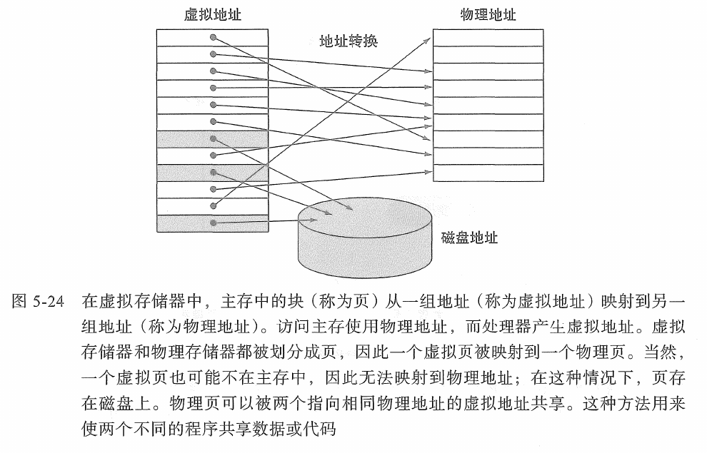

- 允许多个进程安全地共享主存：每个进程有自己的私有地址空间，操作系统负责映射到物理内存，防止进程间干扰。
- 提供比物理内存更大的地址空间：通过将部分不常用的虚拟地址空间内容存放在磁盘（称为交换空间 (swap space) 或分页文件 (paging file)）上，实现按需调页 (demand paging)。
- 简化内存管理：程序员不必关心物理内存的实际布局和大小。

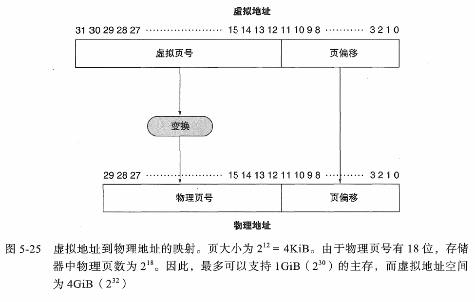

#### 5.7.1 页的存放和查找 (Page Placement and Finding)
- **虚拟地址 (Virtual Address, VA)**: CPU（进程）发出的地址。
- **物理地址 (Physical Address, PA)**: 实际在主存中使用的地址。
- **页 (Page)**: 虚拟地址空间被划分为固定大小的块。典型大小为4KB, 8KB, 或更大。
- **页帧 (Page Frame)**: 物理内存被划分为与页大小相同的块。
- **页表 (Page Table)**: 由操作系统为每个进程维护的数据结构，存储虚拟页号 (VPN) 到物理页帧号 (PFN) 的映射关系。每个条目称为页表项 (Page Table Entry, PTE)。
  - **PTE内容**: PFN, 有效位 (valid bit) (指示该页是否在物理内存中), 访问权限位 (protection bits) (读/写/执行), 修改位 (dirty bit), 存在位 (present bit), 访问位 (accessed bit) 等。
- **地址转换**: VA通常分为虚拟页号 (VPN) 和页内偏移 (Page Offset)。VPN用于索引页表找到PTE，如果有效位为1，则取出PFN，与页内偏移组合形成PA。PA = PFN | Page Offset。

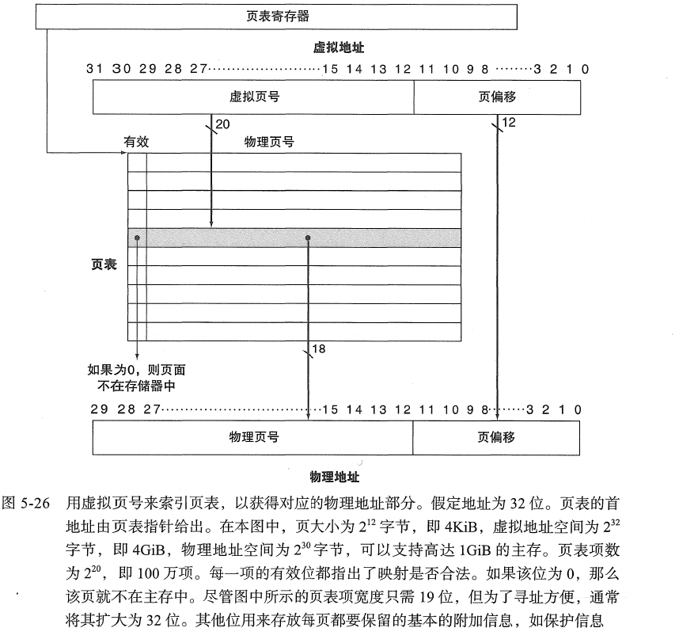

- **页表结构**:
  - **线性页表**: 简单，但如果虚拟地址空间大，页表本身可能非常大。
  - **多级页表 (Hierarchical Page Table)**: 如二级或三级页表，通过将页表分级来减少页表所占空间（只有实际使用的部分才需要分配页表页）。x86-64使用四级页表。
  - **倒排页表 (Inverted Page Table)**: 系统中只有一个页表，按物理页帧索引，存储占用该页帧的<进程ID, 虚拟页号>。查找较慢，通常配合哈希表。
- **页表基址寄存器 (Page Table Base Register, PTBR)**: CPU中的一个特殊寄存器，指向当前进程活动页表的起始物理地址。

#### 5.7.2 缺页故障 (Page Fault)
- 当进程访问一个虚拟页，而其对应的PTE中的有效位/存在位为0（表示该页不在物理内存中，可能在磁盘上或尚未分配）时，发生缺页故障 (硬件异常)。
- **处理过程 (由操作系统处理)**:
  1. 硬件捕获缺页，将控制权转交给操作系统内核的缺页处理程序。
  2. 保存出错进程的状态。
  3. 操作系统检查PTE以确定原因（例如，页在磁盘上）。
  4. 在磁盘上定位该页（通常在交换空间）。
  5. 如果物理内存已满，选择一个牺牲页 (victim page)（根据页面替换算法），如果该牺牲页是“脏”的（被修改过），则将其写回磁盘。
  6. 将所需的页从磁盘读入一个空闲的或刚腾出的物理页帧。
  7. 更新该页的PTE（设置PFN，有效位为1，清空修改位等）。
  8. 恢复出错进程的状态，并重新执行导致缺页的指令。
  
- **按需调页 (Demand Paging)**: 只有在实际访问某页时才将其调入内存。

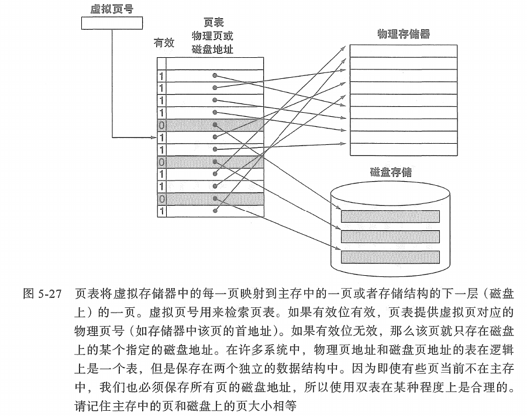

#### 5.7.3 关于写操作 (Handling Writes)
- 当对一个在物理内存中的页进行写操作时，硬件会设置PTE中的修改位 (Dirty Bit / Modified Bit)。
- 这对于页面替换非常重要：如果一个页被选为牺牲页，操作系统会检查其修改位。如果修改位为1，则该页必须写回磁盘以保存更改；如果为0，则可以直接丢弃（因为磁盘上的副本仍然是最新的）。这避免了不必要的磁盘写操作。

#### 5.7.4 加快地址转换：TLB (Translation Lookaside Buffer)
- **问题**: 每次内存访问（指令或数据）都可能需要进行地址转换，而访问页表本身也需要读内存（对于多级页表甚至是多次读内存），这会极大地降低性能。
- **TLB**: 是页表项 (PTEs) 的一个专用硬件Cache，位于CPU内部。它存储了最近使用过的VPN到PFN的映射。
- **TLB结构**: 通常是小型、高度相联（甚至是全相联）的Cache。每个条目包含VPN, PFN, 有效位, 保护位, 修改位等。
- **TLB访问**: 当CPU生成一个VA时，VPN会并行地发送给TLB和Cache（对于某些Cache设计）。
  - **TLB命中 (TLB Hit)**: VPN在TLB中找到，并且有效。PFN从TLB中快速获取，用于形成PA。地址转换非常快（通常1个时钟周期）。
  - **TLB缺失 (TLB Miss)**: VPN不在TLB中。这时需要访问内存中的页表（称为页表遍历 Page Table Walk）。
    
    - **硬件管理TLB (Hardware-Managed TLB)**: 如x86，硬件负责遍历页表，找到PTE并将其加载到TLB中。如果PTE指示缺页，则产生缺页异常。
    - **软件管理TLB (Software-Managed TLB)**: 如MIPS, RISC-V，TLB缺失会产生一个特殊的TLB缺失异常，由操作系统内核的专用处理程序负责查找页表并将PTE加载到TLB中。这提供了灵活性，但处理速度可能较慢。
    
    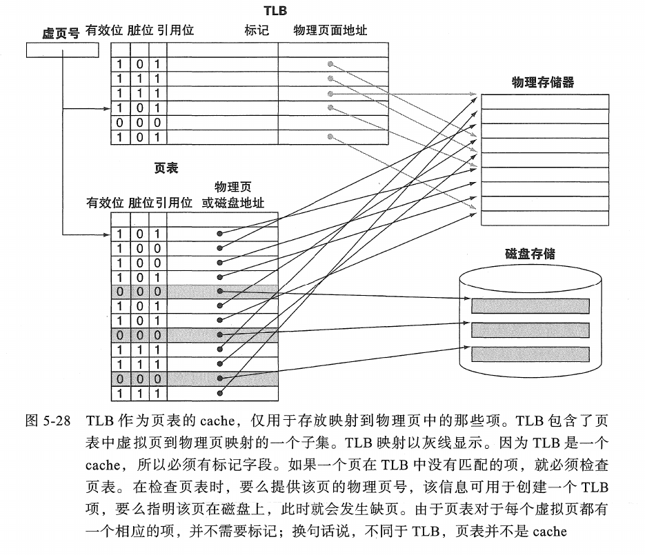

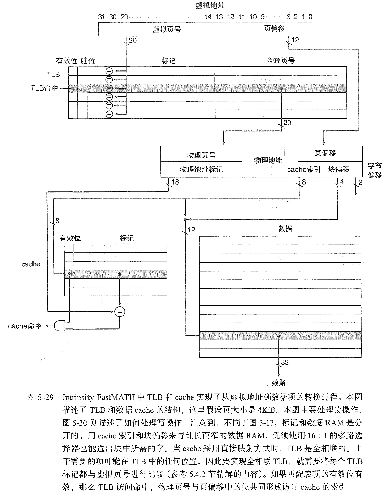

#### 5.7.5 集成虚拟存储器、TLB和Cache (Integrating VM, TLB, and Cache)

CPU发出的虚拟地址如何与TLB和Cache协同工作：
- **物理寻址Cache (Physically Addressed, Physically Tagged - PIPT)**:
  - VA -> TLB -> PA
  - PA -> Cache (索引和标记都用PA)
  - **优点**: 简单，无歧义 (aliasing) 问题。
  - **缺点**: TLB查找和Cache访问串行，命中时间较长。

- **虚拟寻址Cache (Virtually Addressed, Virtually Tagged - VIVT)**:
  - VA -> Cache (索引和标记都用VA)
  - 同时 VA -> TLB (用于权限检查等，如果命中Cache)
  - **优点**: Cache访问可以与TLB查找并行，速度快。
  - **缺点**:
    - **歧义问题 (Aliasing/Synonyms)**: 不同的虚拟地址可能映射到同一个物理地址（例如共享内存或不同进程的相同物理页）。如果这些不同的VA都映射到Cache的不同位置但内容相同，会浪费Cache空间并可能导致一致性问题。如果它们映射到Cache的同一位置，则需要额外的处理。
    - **上下文切换**: 进程切换时，由于虚拟地址空间改变，VIVT Cache可能需要刷新 (flush) 或使用地址空间标识符 (ASID) 来区分不同进程的条目。

- **虚拟索引、物理标记Cache (Virtually Indexed, Physically Tagged - VIPT)**:
  - VA的索引部分 -> Cache (用于选择Cache组/行)
  - 同时 VA的VPN -> TLB -> PFN
  - PA的标记部分 (来自PFN) 与Cache行的物理标记比较。
  - **优点**: 结合了PIPT和VIVT的优点。Cache索引和TLB查找可以并行进行。由于标记是物理的，避免了歧义问题（只要Cache索引位数 + 块内偏移位数 \( \leq \) 页大小位数）。
  - **缺点**: 如果Cache索引位数大于页大小的索引位数，可能仍有部分歧义问题，需要特殊处理。

- 这是现代处理器中常见的Cache设计。

#### 5.7.6 虚拟存储器中的保护 (Protection in Virtual Memory)
- 通过PTE中的保护位 (R/W/X - Read/Write/Execute) 实现。
- 每次地址转换时，硬件（MMU）会检查PTE中的保护位与当前操作类型（读、写、执行指令）以及处理器模式（用户/内核）是否匹配。
- 如果不匹配（如用户试图写入只读页，或执行不可执行页），则产生保护性故障 (Protection Fault) 或段错误 (Segmentation Fault) 异常，由操作系统### 5.4.6 通过分块进行软件优化 (Software Optimization via Blocking/Tiling)
程序员可以通过改变代码的数据访问模式来提高Cache的利用率，特别是针对具有大量数据重用的算法（如矩阵运算、图像处理）。
- **分块 (Blocking / Tiling)**: 将大的数据集划分为能在Cache中容纳的小块进行处理。这样可以最大化对已加载到Cache中的数据的重用，减少容量缺失和冲突缺失。
- **示例 (矩阵乘法)**: 对于 \( C = A \times B \)，标准的三重循环会导致对 \( A \) 的行和 \( B \) 的列的重复扫描，如果矩阵很大，会造成Cache的反复换入换出。通过分块，可以将 \( A \)、\( B \)、\( C \) 的子矩阵读入Cache并完成子矩阵的乘积累加，然后再处理下一组子矩阵。

```c
for (ii = 0; ii < N; ii += NB)
    for (jj = 0; jj < N; jj += NB)
        for (kk = 0; kk < N; kk += NB)
            // Mini-MMM on blocks of size NBxNB
            for (i = ii; i < min(ii + NB, N); i++)
                for (j = jj; j < min(jj + NB, N); j++)
                    for (k = kk; k < min(kk + NB, N); k++)
                        C[i][j] += A[i][k] * B[k][j];
```

### 5.8 存储器层次结构的一般框架
存储器层次结构的设计可以通过回答以下四个基本问题来统一理解，这些问题适用于层次结构中的每一级（如Cache, 虚拟内存/主存, 主存/磁盘）。

#### 5.8.1 问题1：块放在何处 (Where can a block be placed in the upper level?)
- 决定了块的放置灵活性，影响冲突缺失。
- **Cache**:
  - **直接映射**: 固定位置。
  - **组相联**: N个可能位置之一。
  - **全相联**: 任何位置。
  
- **虚拟存储器 (主存作为磁盘的Cache)**: 通常是全相联的。任何虚拟页可以放置在任何可用的物理页帧中。操作系统通过软件管理这种灵活性。

#### 5.8.2 问题2：如何找到块 (How is a block found if it is in the upper level?)
- 涉及地址划分和比较逻辑。
- **Cache**: 通过索引查找行/组，然后比较标记。硬件实现。
- **虚拟存储器**:
  - **TLB**: 硬件Cache，并行查找VPN。
  - **页表**: 软件或硬件遍历数据结构，查找VPN。

#### 5.8.3 Cache缺失时替换哪一块 (Which block should be replaced on a miss?)
- 当上一级存储已满时，需要选择一个块被替换出去。
- **Cache**:
  - **LRU (Least Recently Used)**: 性能好，实现复杂。
  - **FIFO (First-In, First-Out)**: 实现简单。
  - **Random**: 实现简单，性能尚可。
  
- **虚拟存储器 (页面替换算法)**: 由操作系统实现，目标是替换未来最不可能被访问的页。
  - LRU近似算法: 如时钟算法 (Clock Algorithm / Second Chance) 或Not Recently Used (NRU)，因为纯LRU对所有页跟踪成本太高。

#### 5.8.4 写操作如何处理 (What happens on a write?)
- 确保写入的数据最终能正确反映到较低层级的存储器中。
- **Cache**:
  - **写直通 (Write-Through)**: 同时写Cache和主存。
  - **写回 (Write-Back)**: 只写Cache，使用修改位，替换时写回。
  
- **虚拟存储器**: 几乎总是写回。PTE中的修改位指示页是否被修改，缺页替换时脏页需要写回磁盘。

#### 5.8.5 3C模型：理解存储器层次结构行为 (The 3Cs Model for Cache Misses)
这是一个将Cache缺失分类以帮助理解其来源的模型，对于全相联或组相联Cache：
- **强制性缺失 (Compulsory Misses / Cold Start Misses)**: 第一次访问一个块时发生的缺失。即使有无限大的Cache也无法避免。可以通过增大块大小（利用空间局部性）或预取来减少其影响。
- **容量缺失 (Capacity Misses)**: 当Cache无法容纳程序在特定时间段内需要访问的所有块（即工作集大于Cache容量）时发生的缺失。即使是全相联Cache也会发生。只能通过增大Cache容量来减少。
- **冲突缺失 (Conflict Misses / Collision Misses)**: 在直接映射或组相联Cache中，由于多个块竞争同一个Cache位置（索引或组）而导致的缺失。即使Cache整体有空闲空间，也可能因为映射冲突而发生。可以通过提高相联度或改进哈希函数（用于索引）来减少。

（对于直接映射Cache，冲突缺失是主要考虑因素，容量缺失的定义是基于全相联Cache的）

### 5.9 使用有限状态机控制简单Cache (Finite State Machine for a Simple Cache Controller)
Cache控制器负责处理CPU的读写请求，与Cache存储体（标记和数据阵列）以及下一级存储器交互。其行为可以用有限状态机 (FSM) 来描述。

#### 5.9.1 一个简单的Cache (Example: Direct-Mapped, Write-Through Cache)
- **组件**: CPU接口，Cache数据RAM，Cache标记RAM，比较器，主存接口。
- **信号**: CPU地址，CPU读/写信号，CPU数据（用于写），Cache数据（用于读），主存地址，主存读/写信号，主存数据。

#### 5.9.2 有限状态机 (Finite State Machine, FSM)
- **定义**: 一个抽象机器，有有限数量的状态 (States)。在任何给定时间，它只能处于一种状态。它可以从一个状态转换到另一个状态以响应输入 (Inputs) 和/或条件。转换时可能产生输出 (Outputs)。
- **组成**: 当前状态寄存器，组合逻辑（计算下一状态和输出）。

#### 5.9.3 简单Cache控制器的有限状态机实现
一个典型的FSM用于直接映射Cache的读操作可能包含以下状态：
- **空闲 (Idle)**: 等待CPU请求。
  - **输入**: CPU请求 (读/写，地址)。
  - **动作**: 接收地址。
  - **下一状态**: 比较标记。

- **比较标记 (Compare Tag)**:
  - **动作**: 用地址索引Cache，读取标记和数据。比较地址标记和Cache标记，检查有效位。
  - **下一状态**:
    - 如果命中且是读操作: 发送数据给CPU (Send Data to CPU)。
    - 如果命中且是写操作: 写Cache和主存 (Write Cache & Memory) (对于写直通)。
    - 如果缺失: 分配/从主存读取 (Allocate / Read from Memory)。

- **发送数据给CPU (Send Data to CPU)** (读命中时):
  - **动作**: 将Cache中的数据发送给CPU，发出"完成"信号。
  - **下一状态**: 空闲。

- **分配/从主存读取 (Allocate / Read from Memory)** (缺失时):
  - **动作**:
    - 向主存发送读请求（地址为缺失块的地址）。
    - 等待主存响应 (Memory Ready信号)。
  - **下一状态**: 写Cache块 (Write Cache Block)。

- **写Cache块 (Write Cache Block)** (数据从主存返回后):
  - **动作**: 将从主存读取的数据写入Cache数据阵列，更新标记，设置有效位。
  - **下一状态**: 比较标记 (重新检查，或直接发送数据)。

写操作和写回策略会引入更多状态（如处理脏块写回，管理写缓冲器）。

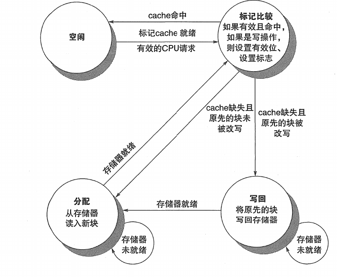

### 5.10 并行与存储器层次结构：Cache一致性 (Parallelism and Memory Hierarchy: Cache Coherence)
在多处理器系统 (Multiprocessor Systems) 中，每个处理器通常拥有自己的私有Cache。如果多个处理器Cache了同一内存块的副本，并且至少有一个处理器修改了该副本，就可能导致不同处理器对该内存位置看到不同的值，这就是Cache一致性问题 (Cache Coherence Problem)。

- **一致性 (Coherence)** 定义: 确保所有处理器对任何内存位置的读操作都能获得该位置最近写入的值。
- **一致性与同步 (Consistency)**: 一致性关注单个内存位置的值，而存储器连贯性模型（Consistency Model）定义了不同内存位置的写操作相对于其他处理器而言变得可见的顺序。

#### 5.10.1 实现一致性的基本方案 (Basic Schemes for Enforcing Coherence)
- **目录协议 (Directory-based Coherence)**:
  - 一个集中的目录 (directory) 结构（通常分布在主存控制器中）跟踪每个内存块的状态以及哪些Cache拥有该块的副本。
  - 当一个处理器需要访问一个块时，它会查询目录。目录协调不同Cache之间的操作（如发送无效或更新消息）。
  - **优点**: 可扩展性好，适用于大规模多处理器系统（如NUMA架构）。
  - **缺点**: 目录本身可能成为瓶颈，延迟较高。

- **监听协议 (Snooping Coherence)**:
  - 所有Cache控制器都监视（"snoop" on）一个共享的互连介质（通常是总线或交换网络），观察所有内存事务。
  - 当一个Cache控制器检测到可能影响其Cache块一致性的事务时，它会采取相应动作（如使其副本无效或更新其副本）。
  - **优点**: 实现相对简单，延迟较低（对于总线系统）。
  - **缺点**: 总线带宽会成为瓶颈，不适合大规模系统。

#### 5.10.2 监听协议 (Snooping Protocols)
每个Cache块都有一个状态。当处理器或总线发生事件时，根据当前状态和事件类型转换到新状态。
- **写无效协议 (Write-Invalidate Protocols)**:
  - 当一个处理器要写入一个共享块时，它首先在总线上广播一个无效 (invalidate) 信号。其他所有持有该块副本的Cache在收到此信号后，会将其副本标记为无效。
  - 写入处理器然后可以修改其本地副本。
  - 这是最常用的监听协议类型。

- **写更新协议 (Write-Update / Write-Broadcast Protocols)**:
  - 当一个处理器写入一个共享块时，它将新数据广播到总线上。其他所有持有该块副本的Cache会用新数据更新其副本。
  - **缺点**: 如果数据被频繁写入但很少被其他处理器读取，会产生大量不必要的总线流量。

- **MESI协议 (Modified, Exclusive, Shared, Invalid)**: 一种常见的写无效监听协议。每个Cache块可以处于以下四种状态之一：
  - **Modified (M)**: 该Cache块已被修改（脏），内存中的副本是过时的。该处理器是此块的唯一拥有者。如果其他处理器请求此块，该Cache必须先将数据写回内存。
  - **Exclusive (E)**: 该Cache块与内存副本一致，且没有其他Cache持有此块的副本（干净的独占副本）。可以直接写入而无需通知其他Cache（状态变为M）。
  - **Shared (S)**: 该Cache块与内存副本一致，但可能有其他Cache也持有此块的副本（干净的共享副本）。读取是允许的。写入前必须先发送无效信号，使其他副本变为I，本副本变为M或E（取决于实现）。
  - **Invalid (I)**: 该Cache块中的数据无效（或不存在）。

- **状态转换**: 基于处理器操作 (PrRd - Processor Read, PrWr - Processor Write) 和总线操作 (BusRd - Bus Read, BusRdX - Bus Read Exclusive/Invalidate, BusUpd - Bus Update)。例如：
  - 一个处于Shared状态的块，当本地处理器执行PrWr时，会发出BusRdX（或BusUpgr）信号，使其他S副本变为I，本副本变为M。
  - 一个处于Invalid状态的块，当本地处理器执行PrRd时，会发出BusRd信号。如果其他Cache有M副本，它会响应并将数据写回内存，所有副本（包括请求者）变为S。如果没有M副本，则从内存读取，变为E（如果无其他分享者）或S（如果有其他分享者）。

### 5.11 并行与存储器层次结构：廉价冗余磁盘阵列（RAID）
(Redundant Array of Inexpensive/Independent Disks)
RAID是一种将多个独立的磁盘驱动器组合成一个逻辑单元的技术，旨在提高I/O性能、数据冗余或两者兼备。

- **RAID 0 (Striping - 分条)**:
  - **原理**: 数据被分成条带，交错存储在多个磁盘上。
  - **最小磁盘数**: 2。
  - **容量**: \($ N \times \text{最小磁盘容量}$ \) (N为磁盘数)。
  - **容错性**: 无。任何一个磁盘故障都会导致所有数据丢失。
  - **性能**: 读写吞吐量近似提高N倍（并行访问）。
  - **用途**: 对性能要求高但对数据丢失不敏感的应用（如视频编辑的临时存储）。

- **RAID 1 (Mirroring - 镜像)**:
  - **原理**: 数据完全复制到两个（或更多）磁盘上。
  - **最小磁盘数**: 2。
  - **容量**: 单个磁盘的容量 ($( N/2 \times \text{磁盘容量}$ \)，如果N个磁盘两两镜像)。
  - **容错性**: 高。可以容忍一个磁盘（在一对镜像中）故障。
  - **性能**: 读性能可能提高（可以从任一磁盘读），写性能与单个磁盘相当或稍差（需写入两个磁盘）。
  - **用途**: 对可靠性要求高的应用（如操作系统盘，数据库）。

- **RAID 3 (Bit-interleaved Parity - 位交叉奇偶校验)**:
  - **原理**: 数据按位或字节分条存储在数据磁盘上，一个专用磁盘存储所有数据磁盘对应位的奇偶校验信息。
  - **最小磁盘数**: 3。
  - **容量**: $( (N-1) \times \text{磁盘容量} )$。
  - **容错性**: 可以容忍一个磁盘故障。
  - **性能**: 对于大块顺序读写性能好。小块随机写性能差（校验盘成为瓶颈）。已较少使用。

- **RAID 4 (Block-interleaved Parity - 块交叉奇偶校验)**:
  - **原理**: 数据按块分条，一个专用磁盘存储奇偶校验块。
  - **最小磁盘数**: 3。
  - **容量**: \( $(N-1) \times \text{磁盘容量}$ \)。
  - **容错性**: 可以容忍一个磁盘故障。
  - **性能**: 随机读性能好。小块随机写仍有校验盘瓶颈（每次写数据块都要更新校验块）。

- **RAID 5 (Block-interleaved Distributed Parity - 分布式奇偶校验)**:
  - **原理**: 类似于RAID 4，但奇偶校验块交错分布在所有磁盘上，而不是集中在一个专用校验盘上。
  - **最小磁盘数**: 3。
  - **容量**: \( $(N-1) \times \text{磁盘容量}$ \)。
  - **容错性**: 可以容忍一个磁盘故障。
  - **性能**: 随机读写性能均较好，克服了RAID 4的校验盘瓶颈。但写操作仍有写惩罚 (write penalty)：更新一个数据块需要读旧数据块、读旧校验块、计算新校验块、写新数据块、写新校验块（优化后可能为2读2写）。
  - **用途**: 广泛用于需要性能、容量和一定冗余的企业存储。

- **RAID 6 (P+Q Redundancy / Dual Parity - 双校验)**:
  - **原理**: 采用两种独立的奇偶校验方案（如Reed-Solomon码），奇偶校验块也分布式存储。
  - **最小磁盘数**: 4。
  - **容量**: \( $(N-2) \times \text{磁盘容量}$ \)。
  - **容错性**: 非常高。可以容忍任意两个磁盘同时故障。
  - **性能**: 读性能好，写惩罚比RAID 5更高。
  - **用途**: 对数据冗余和可用性要求极高的关键应用。

- **嵌套RAID (Nested RAID / Hybrid RAID)**:
  - **RAID 1+0 (RAID 10)**: 先镜像再分条 (Stripe of Mirrors)。高性能和高冗余。最小4个盘。
  - **RAID 0+1**: 先分条再镜像 (Mirror of Stripes)。不如RAID 10常用，因为单个磁盘故障会使整个条带失效，降低冗余性。

### 5.12 高级内容：实现Cache控制器
这部分会深入探讨Cache控制器的具体实现逻辑，可能包括：
- **流水线化的Cache访问 (**Pipelined Cache Access)**: 将Cache访问（如地址解码、标记比较、数据读取）分解为多个流水线阶段，以提高吞吐量和时钟频率。

- **非阻塞Cache (Non-Blocking Caches / Lockup-free Caches)**:
  - **Hit-under-miss**: 允许在处理一次Cache缺失（访问主存）的同时，继续处理后续的Cache命中请求。
  - **Miss-under-miss (Multiple outstanding misses)**: 允许Cache处理多个并发的缺失请求，进一步减少CPU等待时间。需要**MSHR (Miss Status Holding Registers)** 来跟踪每个未完成的缺失。

- **硬件预取 (Hardware Prefetching)**: Cache控制器根据历史访问模式（如流式访问）预测未来可能需要的数据块，并提前将其从主存调入Cache。
  - **流缓冲器 (Stream Buffers)**: 检测顺序访问流。

- **写缓冲器 (Write Buffer)** 的深度管理。

- **与总线接口和仲裁逻辑的交互**。

- **错误检测和处理逻辑 (ECC in Cache)**。

### 5.13 实例分析
分析具体商用处理器的存储器层次结构设计。

#### ARM Cortex-A53的存储器层次结构 (Example Features)
- **L1 Cache**: 通常是分离的指令Cache (I-Cache) 和数据Cache (D-Cache)。例如，每核心32KB I-Cache 和 32KB D-Cache，4路组相联，64字节块大小。VIPT。
- **L2 Cache**: 可选的、统一的L2 Cache，由集群内的多个核心共享（如512KB - 2MB，8路或16路组相联）。通常是PIPT。
- **TLB**: 每核心分离的指令TLB和数据TLB，例如主TLB（如48项全相联）和微型TLB（更小但更快）。硬件页表遍历。
- **Cache一致性**: 支持MESI协议，用于多核集群内的一致性。
- **特性**: 面向低功耗和面积效率。

#### Intel Core i7的存储器层次结构 (Example Features - Broadwell/Skylake era)
- **L1 Cache**: 每核心32KB 8路组相联指令Cache (VIPT) 和 32KB 8路组相联数据Cache (VIPT, 写回)。64字节块。
- **L2 Cache**: 每核心256KB 8路组相联统一Cache (PIPT)。
- **L3 Cache (Last Level Cache, LLC)**: 由所有核心共享，例如8MB 16路组相联 (PIPT)。通常是Inclusive或Non-Inclusive，取决于具体微架构。采用复杂的环形总线 (Ring Bus) 或网状互连 (Mesh Interconnect) 连接核心与L3。
- **TLB**: 多级TLB结构。例如，L1 DTLB (如64项4路)，L1 ITLB，共享的L2 TLB (如1536项，12路)。
- **Cache一致性**: 先进的MESI/MESIF/MOESI变种协议，通过监听和目录（在L3/内存控制器中）结合的方式实现，支持QPI/UPI互连。包含Snoop Filter 来减少不必要的监听流量。
- **预取器 (Prefetchers)**: L1和L2中复杂的硬件预取机制。

### 5.14 加速技术
- **Cache分块和矩阵乘法优化 (Cache Blocking and Matrix Multiply Optimization)**:
  - **回顾**: 矩阵乘法 \( C[i][j] += A[i][k] * B[k][j] \)。
  - **问题**: 若矩阵太大，内层循环访问 \( B \) 的一列会导致Cache行被反复替换（如果 \( B \) 是行主序存储）。访问 \( A \) 的一行则有较好的空间局部性。
  - **分块策略**: 将 \( A \)、\( B \)、\( C \) 矩阵逻辑上划分为 \( N_B \times N_B \) 的子块 (tiles)，使得三个子块 (A的一个子块, B的一个子块, C的一个累加子块) 能够同时放入Cache中。
  - **循环变换**: 改变循环顺序并引入新的分块循环。例如，将原来的三层循环 \( i,j,k \) 改为六层循环，外三层控制块的选择 \( ii, jj, kk \)，内三层在块内进行计算 \( i, j, k \)。

```c
for (ii = 0; ii < N; ii += NB)
    for (jj = 0; jj < N; jj += NB)
        for (kk = 0; kk < N; kk += NB)
            // Mini-MMM on blocks of size NBxNB
            for (i = ii; i < min(ii + NB, N); i++)
                for (j = jj; j < min(jj + NB, N); j++)
                    for (k = kk; k < min(kk + NB, N); k++)
                        C[i][j] += A[i][k] * B[k][j];
```

- **效果**: 显著提高Cache命中率，减少访存次数，从而大幅提升性能。\( NB \) 的选择依赖于Cache大小和块大小。
- **其他软件优化**: 数据结构对齐、循环展开、数据布局变换 (如Z-Morton序) 等。

### 5.15 谬误与陷阱 (Fallacies and Pitfalls)
在设计、使用或评估存储器层次结构时常见的错误观念和需要注意的问题。

- **谬误1**: 增加Cache大小总是能线性提高性能。
  - **真相**: 性能提升遵循收益递减规律。当Cache大到能容纳大部分工作集后，进一步增大带来的性能提升会变小，但成本和功耗会增加。还可能增加命中时间。

- **谬误2**: 程序员可以忽略Cache的存在，编译器会自动优化。
  - **真相**: 虽然编译器会做一些优化，但对于复杂的访存模式，程序员对数据结构和算法的精心设计（如分块）能带来编译器难以企及的性能提升。

- **谬误3**: AMAT (平均访存时间) 是衡量Cache性能的唯一指标。
  - **真相**: 虽然AMAT很重要，但功耗、面积、带宽、以及对特定工作负载的适应性也是关键。例如，低缺失率但命中时间很长的Cache可能不如一个命中时间短但缺失率稍高的Cache。

- **谬误4**: 写直通Cache由于其简单性总是比写回Cache差。
  - **真相**: 对于写操作不密集或需要强一致性的场景，配合高效的写缓冲器，写直通可以表现良好，且实现更简单，恢复更快。

- **陷阱1**: 过分关注缺失率而忽略命中时间或缺失代价。
  - 例如，极高相联度的Cache可能降低冲突缺失，但会增加命中时间和硬件复杂度。

- **陷阱2**: 假设LRU总是最佳替换策略且易于实现。
  - 完美LRU硬件开销大，实际多用近似算法。某些特定访问模式下，LRU甚至不如FIFO或随机。

- **陷阱3**: 在虚拟寻址Cache中忽略歧义 (aliasing) 问题。
  - 可能导致数据不一致或安全漏洞。VIPT设计需要小心确保Cache索引不跨越页边界。

- **陷阱4**: 忘记TLB的存在或其对性能的影响。
  - TLB缺失代价虽小于页错误，但仍可观。TLB的覆盖范围（TLB Reach = TLB条目数 * 页大小）对处理大数据集很重要。

- **陷阱5**: 为所有类型的缺失（3C）采用同一种优化策略。
  - 强制性缺失需要预取或增大块。容量缺失需要增大Cache。冲突缺失需要提高相联度或改进映射。

### 5.16 本章小结
本章深入探讨了存储器层次结构的设计原理和实现技术。从SRAM, DRAM, Flash, Disk等基础存储技术出发，详细介绍了Cache的基本工作原理（访问、缺失处理、写策略）、性能评估与改进方法（降低缺失率、缺失代价、命中时间，如多级Cache、各种映射和替换策略）。进一步讨论了虚拟存储器机制（页表、TLB、缺页处理、保护），并将其纳入存储器层次结构的通用框架。最后，还涉及了存储系统的可靠性（ECC）、并行环境下的Cache一致性（监听协议、MESI）、磁盘阵列（RAID）以及软件优化技术（分块）。理解存储器层次是理解现代计算机系统性能的关键。

### 5.17 历史观点和拓展阅读
- **历史**:
  - 早期计算机没有Cache，CPU直接访问主存。
  - IBM System/360 Model 85 (1968) 是最早引入Cache的商用计算机之一。
  - 虚拟存储器的概念可以追溯到Atlas计算机 (1962)。
  - 多级Cache、TLB、硬件预取等技术是逐步发展和完善的。

- **拓展阅读**:
  - 经典论文：Smith的Cache综述，Popek和Goldberg的虚拟机论文。
  - 更高级的Cache一致性协议 (如MOESI, MESIF)。
  - 非易失性内存 (NVM) 如PCM, ReRAM, STT-MRAM 作为新兴存储层次成员。
  - 内存压缩技术。

### 5.18 自学
- 研究特定现代处理器（如最新Intel/AMD/ARM芯片）的详细存储器层次结构参数和特性。
- 探索不同操作系统如何实现页面替换算法。
- 了解不同类型的SSD控制器及其对性能和寿命的影响。
- 研究新兴存储技术（如相变存储器PCM、磁阻随机存取存储器MRAM）及其在存储层次中的潜在角色。

### 5.19 练习题
本章练习题会围绕以下方面设计：
- 计算AMAT。
- Cache地址映射与查找（给定地址，判断命中/缺失，找出标记/索引/偏移）。
- 不同Cache组织（直接映射、组相联、全相联）的比较。
- 替换策略的行为分析。
- 虚拟地址到物理地址的转换过程（使用页表和TLB）。
- 缺页和TLB缺失的处理。
- RAID级别的性能和可靠性分析。
- Cache一致性协议的状态转换。
- 基于3C模型分析Cache行为。
